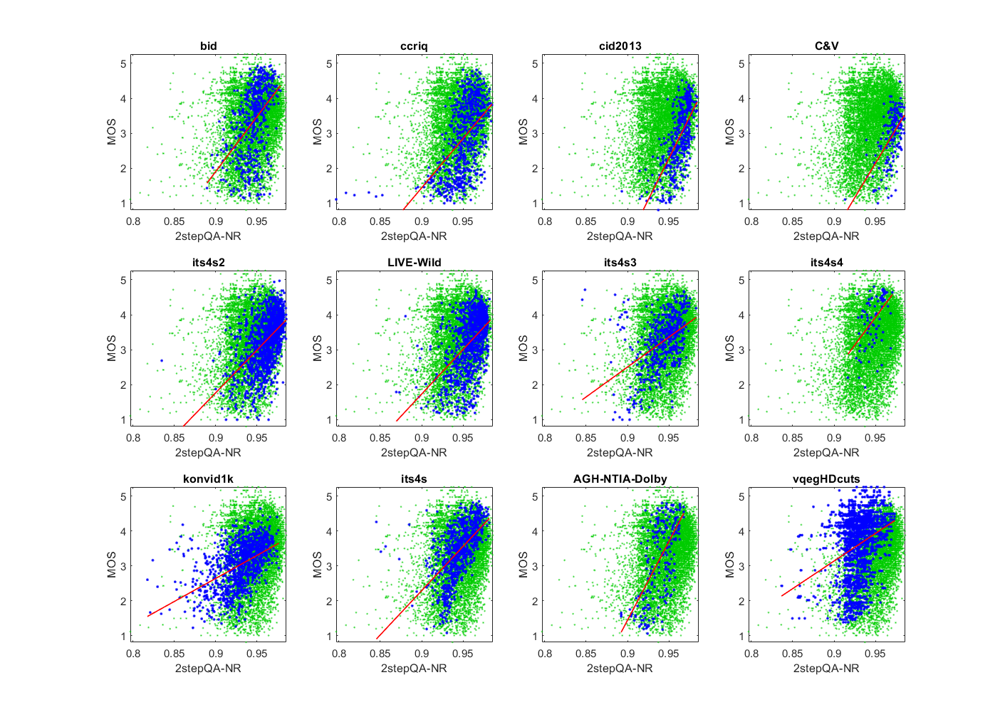

# Report on Two Step Quality Assurance, NR Constrained (2stepQA-NR)

_Go to [Report.md](Report.md) for an introduction to this series of NR metric reports, including their purpose, important warnings, the rating scale, and details of the statistical analysis._ 

Function `nrff_2stepQA.m` implements the two step quality assurance (2stepQA) metric, as presented in [[13]](Publications.md), but with the assumption that all impairments stem from the original (reference) image. This constraint changes 2stepQA from a hybrid NR / reduced reference (RR) metric to a pure NR metric. To differentiate from 2stepQA as presented in [[13]](Publications.md), [[14]](Publications.md), and [[15]](Publications.md), we will refer to this as 2stepQA-NR. 

Goal | Metric Name|Rating
-----|------------|------
MOS  | 2stepQA-NR | :star: :star: 

__R&D Potential__: 
- The author's premise has potential: use an NR metric as the "reference" side of a reduced reference or full reference metric. 
- 2stepQA-NR produces invalid results and outliers for some media. These issues prevent a :star: :star: :star: rating.  

## Algorithm Summary
Conventionally, full reference (FR) and RR metrics for image quality analysis require a high quality original image or video in addition to the processed image to be evaluated. The 2stepQA algorithm eliminates this constraint by combining an NR metric, which is applied to the original image in step 1, with an RR metric that compares the original and processed image in step 2. Thus, step 1 analyzes impairments in the original image, while step 2 analyzes impairments added by the system under test (e.g., compression). 
Function `nrff_2stepQA.m` uses the same image for both the original and processed image in step 2.  Thus, our implementation of 2stepQA-NR is an NR metric. 

The 2stepQA algorithm requires previously computed Natural Scene Statistics (NSS) parameters and uses portions of the [NIQE](ReportNiqe.md) and Structural Similarity Index Measure (SSIM) metrics. See [[13]](Publications.md) for details.

## Speed and Conformity
2stepQA-NR took __5×__ as long to run as the benchmark metric, [nrff_blur.md](ReportBlur.md). 

In terms of Big-O notation, the algorithm runs in O(n) where 'n' is the number of pixels in the image. NIQE and SSIM calculations filter the image a set number of times depending on user preference.  

In terms of conformity, the only two noticeable changes are the transition from RR+NR to NR (i.e., use the same image as both original and processed) and the addition of a try-catch block around the code that calls the helper functions. This try-catch block was added as a precaution for images in the CID2013 dataset that caused the helper functions code to produce errors. 

## Analysis
[[14]](Publications.md) claims that 2stepQA algorithm (NR + RR) yields Pearson correlation of 0.9311 for the LIVE Wild Compressed Picture Quality Database [[16]](Publications.md). Performance statistics for 2stepQA-NR are not reported. 

The accuracy of 2stepQA-NR is promising but inferior to a one person ad-hoc test [[7]](Publications.md). The scatter plots for 2stepQA-NR show a loose distribution of points around a fit line that is fairly consistent across the diverse datasets. Compare the scatter of blue dots (for the current dataset) with the green dots (that show the overall response of all datasets). We expect this shape when an impairment is a major factor for all datasets.

The 2stepQA-NR scatter plots contain several outliers that fall significantly below typical values. Most of these outliers are associated with video datasets (ITS4S3, ITS4s4, Konvid1K, AGH-NTIA-Dolby, and ITS4S). Further investigation is recommended to identify the cause of these outliers. 

The statistics below include not-a-number (NaN), because 2stepQA-NR produced invalid results for some media.
```
1) 2stepQA-NR 
bid              corr =  0.47  rmse =  0.90  percentiles [ 0.89, 0.94, 0.95, 0.96, 0.98]
ccriq            corr =  0.55  rmse =  0.85  percentiles [ 0.80, 0.94, 0.95, 0.96, 0.98]
cid2013          corr =  0.68  rmse =  0.66  percentiles [ 0.89, 0.96, 0.97, 0.97,  NaN]
C&V              corr =  0.57  rmse =  0.59  percentiles [ 0.91, 0.97, 0.97, 0.98, 0.98]
its4s2           corr =  0.52  rmse =  0.63  percentiles [ 0.83, 0.95, 0.96, 0.97, 0.99]
LIVE-Wild        corr =  0.49  rmse =  0.71  percentiles [ 0.87, 0.95, 0.96, 0.97, 0.98]
its4s3           corr =  0.45  rmse =  0.67  percentiles [ 0.85, 0.93, 0.95, 0.96,  NaN]
its4s4           corr =  0.50  rmse =  0.62  percentiles [ 0.92, 0.95,  NaN,  NaN,  NaN]
konvid1k         corr =  0.50  rmse =  0.55  percentiles [ 0.82, 0.92, 0.93, 0.95, 0.98]
its4s            corr =  0.58  rmse =  0.63  percentiles [ 0.85, 0.93, 0.95, 0.96,  NaN]
AGH-NTIA-Dolby   corr =  0.64  rmse =  0.87  percentiles [ 0.89, 0.93, 0.94, 0.95,  NaN]
vqegHDcuts       corr =  0.31  rmse =  0.85  percentiles [ 0.84, 0.92, 0.93, 0.94,  NaN]

average          corr =  0.52  rmse =  0.71
pooled           corr =  0.28  rmse =  0.84  percentiles [ 0.80, 0.93, 0.95, 0.96,  NaN]
```


