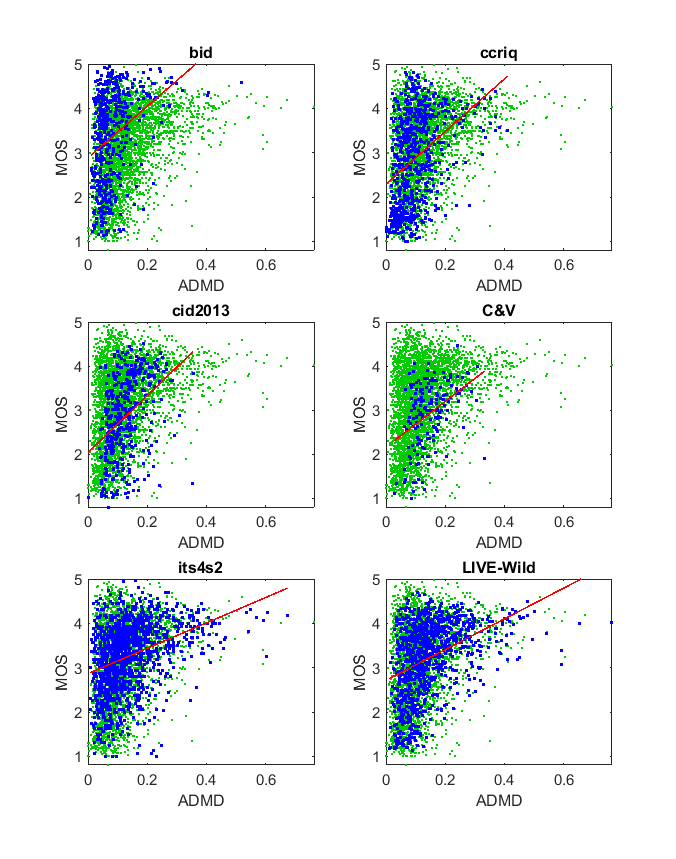

# Report on Assessment of Dermoscopy Images with Multiple Distortions (ADMD) 

_Go to [Report.md](Report.md) for an introduction to this series of NR metric reports, including their purpose, important warnings, the rating scale, and details of the statistical analysis._ 

Function `nrff_admd.m` implements assessment of dermoscopy images with multiple distortions (ADMD) metric, as presented in [[2]](Publications.md). ADMD assesses whether an image contains uneven illumination, using the average gradient magnitude of the illumination component (AGIC) function. Our analysis indicates that ADMD does not detect uneven illumination impairments. 

Goal|Metric Name|Rating
----|-----------|------
RCA|ADMD|:star:

__R&D Potential__: ADMD may detect a characteristic of some but not all high quality images (:star: :star:). 

## Algorithm Summary
The authors claim (correctly, we believe) that metrics that deal with uneven illumination are rare. We have not found many pure metrics developed to measure whether an image has uneven illumination. The authors immediately transition into describing the kind of curve fitting they did and why they opted to choose ADMD as their metric to evaluate whether an image is unevenly illuminated. They then show a graph of the dimension of the feature relative to ADMD that shows an increasing trend as illumination varies. 

The algorithm uses the average gradient magnitude of the illumination component to determine if a certain block of the image is unevenly illuminated. Block values are averaged across the entire image to estimate whether the entire image is unevenly illuminated.

The ADMD algorithm runs from pixel to pixel. Each pixel checks the absolute value of the difference between itself and the surrounding pixels (3 in the corners, 5 on the edges, and 8 everywhere else) and is divided by the central pixel value to generate a summing term. The sum of these for each and every pixel in a block is the ADMD for that block. The average ADMD of all blocks is taken and then used to evaluate the image as a whole.

## Speed and Conformity
ADMD took __4×__ as long to run as the benchmark metric, [nrff_blur.m](ReportBlur.md). With proper matrix math, this algorithm should run much closer to the speed of the benchmark metric.

The suggested Big-O notation of this algorithm is modeled as O(nm) where n is the number of rows and m is the number of columns of pixels in the image. O(nm) is self-derived from the code used in `nrff_admd.m` since the code centers around a nested for loop that traverses every pixel of the image. Our processing time reflects our inefficient implementation rather than the algorithm's potential speed. 

In terms of conformity, the algorithm provided in [[2]](Publications.md) to calculate ADMD was perfectly followed; it did not have to be manipulated to fit into our framework. 

## Analysis
In [[2]](Publications.md), the authors train ADMD with a dataset that contains dermoscopy images with simulated impairments. The authors report 0.9740 Pearson correlation between ADMS and MOS for this dataset. The authors then test the ADMD model using a ground-truth dataset with real distored dermoscopy images and report 0.8415 Pearson correlation. As a side note, the authors note a 0.1859 Pearson correlation between [NIQE](ReportNiqe.md) and the latter dataset, noting that NIQE is ineffective on images that contain uneven illumination. 

ADMD is evaluated using six image quality datasets that contain camera impairments. Dataset CCRIQ has uneven illumination from camera flashes, so we know our test data includes appropriate media.

If this metric were detecting uneven illumination, we would expect a lower triangle shape (i.e., narrow range of values for high quality, wide range of values for low quality). Instead, the uneven illumination scatter plots form an upper triangle shape (i.e., wide range of values for high quality, narrow range of values for low quality). This indicates that the metric detects a feature of some but not all high quality images.  

Therefore, we conclude that this algorithm does not detect uneven illumination impairments. 
```
1) ADMD
ccriq            corr =  0.39  rmse =  0.94  percentiles [ 0.00, 0.05, 0.09, 0.13, 0.41]
C&V              corr =  0.41  rmse =  0.65  percentiles [ 0.03, 0.10, 0.14, 0.17, 0.33]
LIVE-Wild        corr =  0.07  rmse =  0.82  percentiles [ 0.01, 0.08, 0.12, 0.19, 0.76]
bid              corr =  0.34  rmse =  0.95  percentiles [ 0.01, 0.04, 0.06, 0.10, 0.52]
cid2013          corr =  0.40  rmse =  0.83  percentiles [ 0.00, 0.09, 0.12, 0.16, 0.36]
its4s2           corr =  0.35  rmse =  0.70  percentiles [ 0.01, 0.08, 0.12, 0.18, 0.67]

average          corr =  0.33  rmse =  0.81
pooled           corr =  0.26  rmse =  0.85  percentiles [ 0.00, 0.07, 0.11, 0.16, 0.76]
```


