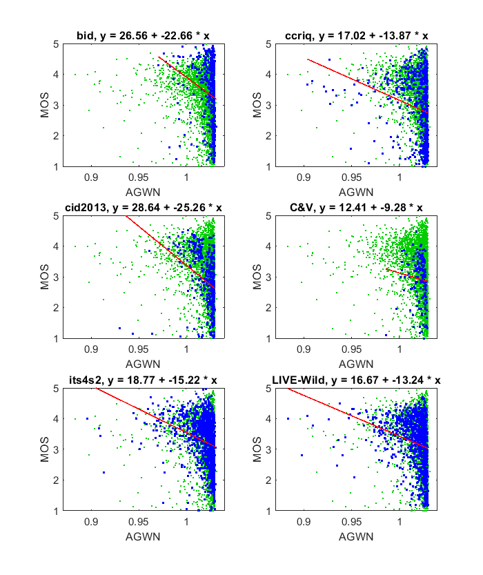

# Report on Additive Gaussian White Noise (AGWN)

_Go to [Report.md](Report.md) for an introduction to this series of NR metric reports, including their purpose, important warnings, the rating scale, and details of the statistical analysis._ 

Function `nrff_agwn.m` implements the algorithms presented in [[6]](Publications.md). This algorithm was designed to assess Additive Gaussian White Noise (AGWN). It is not suitable for detecting noise from consumer camera capture. 

Goal|Metric Name|Rating
----|-----------|------
MOS|AGWN|:star:

## Algorithm Summary

Lim [[6]](Publications.md) establishes a simple, elegant relationship between additive Gaussian white noise and the AGWN metric. Lim [[6]](Publications.md) calculates the standard deviation of a sub-sampled image and divides it by the standard deviation of the image at full resolution. This quantity is calculated for three image planes (red, green, and blue) and combined as per the weights when calculating luma (Y) from the red, green, and blue color planes. 

## Speed and Conformity

The ```nrff_agwn.m``` algorithm runs very quickly: O(n) where *n* is the number of pixels. AGWN took 1.5 times as long to run as [nrff_blur.m](ReportBlur.md). Expected code conformity is high: the paper is clearly written and the algorithms are simple.

Lim [[6]](Publications.md) refers to this no-reference (NR) metric as "proposed." For clarity, we assigned the name AGWN from the paper title. 

## Analysis 

AGWN is evaluated using six image quality datasets that contain camera impairments. These datasets include images with camera capture noise, which typically depict low-light conditions and have low MOSs. Our datasets exclude additive Gaussian white noise, upon which this metric was trained.

If this metric were detecting noise we would expect a lower triangle shape scatter plot (i.e., narrow range of values for high quality, wide range of values for low quality). Instead, the scatter plots show an upper triangle shape (i.e., wide range of values for high quality, narrow range of values for low quality). This indicates that the metric detects a feature of some but not all high quality images. However, camera noise is more prevalent in low-quality media (MOS < 3). 

We see no evidence that the AGWN metric detects camera noise.
This algorithm may be detecting fine details rendered by high-quality cameras. This would explain the wide spread of values we see for MOSs between four and five. AGWN demonstrates the problem with using simulated impairments to train NR metrics. 

```[inline]
1) AGWN
bid              corr =  0.20  rmse =  0.99  percentiles [ 0.97, 1.02, 1.03, 1.03, 1.03]
ccriq            corr =  0.24  rmse =  0.99  percentiles [ 0.90, 1.02, 1.03, 1.03, 1.03]
cid2013          corr =  0.33  rmse =  0.85  percentiles [ 0.93, 1.02, 1.02, 1.03,  NaN]
C&V              corr =  0.09  rmse =  0.71  percentiles [ 0.99, 1.02, 1.02, 1.03, 1.03]
its4s2           corr =  0.30  rmse =  0.71  percentiles [ 0.90, 1.02, 1.02, 1.03, 1.03]
LIVE-Wild        corr =  0.27  rmse =  0.79  percentiles [ 0.88, 1.01, 1.02, 1.03, 1.03]

average          corr =  0.24  rmse =  0.84
pooled           corr =  0.25  rmse =  0.85  percentiles [ 0.88, 1.02, 1.02, 1.03,  NaN]
```
