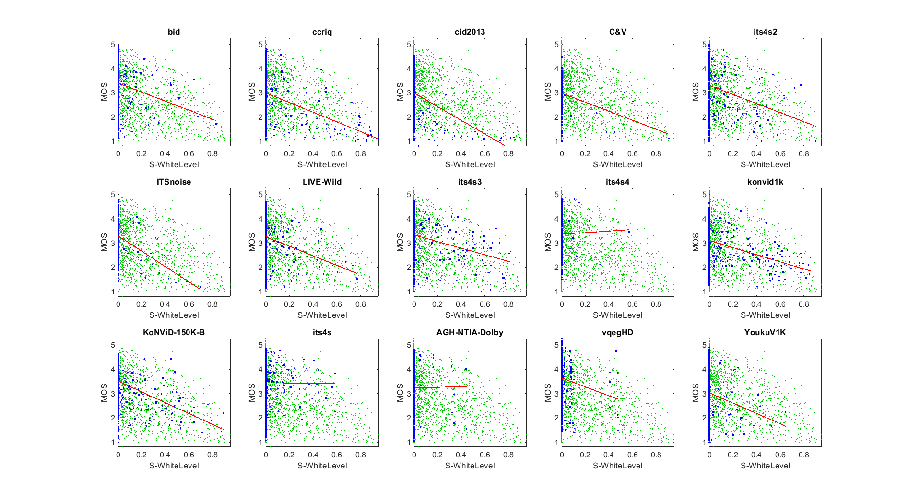
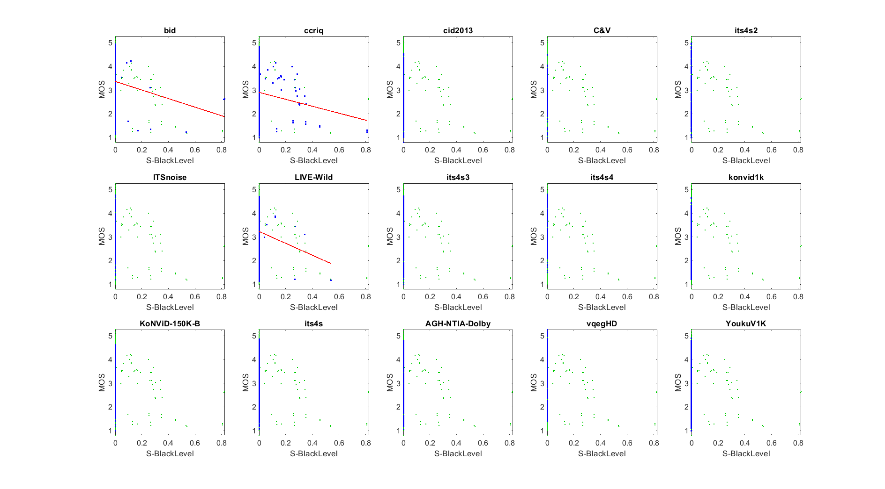

# Report S-WhiteLevel and S-BlackLevel, from the Auto Enhancement Group

_This is a self-assessment._

_Go to [Report.md](Report.md) for an introduction to this series of NR metric reports, including their purpose, important warnings, the rating scale, and details of the statistical analysis._ 

Function `nrff_auto_enhancement.m` provides RCA inspired by image auto-enhancement. They are accurate enough to be included in NR Metric [Sawatch](ReportSawatch.md). 

Goal|Metric Name|Rating
----|-----------|------
RCA|S-WhiteLevel|:star: :star: :star:
RCA|S-BlackLevel|:star: :star:

## Algorithm Summary

Function `nrff_auto_enhancement.m` calculates two values: S-WhiteLevel and S-BlackLevel.

**S-WhiteLevel** considers only the luma plane (Y) and only penalizes media when the 98th percentile drops below 150, when pixel values range from 0 to 255. This threshold was chosen based on [subjective datasets](SubjectiveDatasets.md) BID, CCRIQ, CID2013_dataset, ITS4S2, ITS4S3, and Live Wild.

**S-BlackLevel** estimates whether the black level is too high, based on the standard deviation of the luma image. This parameter is only calculated when the mean image value is above mid level grey (128). 

These RCA metrics are scaled onto [0..1], where zero indicates no impairment and one is the maximum expected impairment. 

## Speed and Conformity
Auto Enhancement took __2×__ as long to run as the benchmark metric, [nrff_blur.m](ReportBlur.md).

In Big-O notation, Auto Enhancement is O(n). 

Function `nrff_auto_enhancement.m` was initially provided by this repository, so conformity is ensured. 

## Analysis

This analysis uses three types of datasets:
* Image quality datasets with camera impairments (BID, CCRIQ, CID2013, C&V, ITS4S2, ITSnoise, and LIVE-Wild)
* Video quality datasets with camera impairments (ITS4S3, ITS4S4, KonViD-1K, and KoNViD-150K-B)
* Video quality datasets with broadcast content and compression (ITS4S, AGH-NTIA-Dolby, vqegHD, and YoukuV1K) 

### S-WhiteLevel

The S-WhiteLevel scatter plots have a lower triangle shape (i.e., narrow range of values for high quality, wide range of values for low quality). We expect this shape when an impairment occurs sporadically. This meets our expectations for white level problems. 

The S-WhiteLevel scatter plots show a consistent response for these diverse datasets. Compare the scatter of blue dots (for the current dataset) with the green dots (that show the overall response of all datasets). While some datasets do not fully express the lower triangle shape, their data falls within the lower triangle shape described by all datasets.   

The low correlations are likewise appropriate for a sporadic impairment. The zero correlation for ITS4S and ITS4S4 are appropriate, because these datasets do not contain white level problems. S-WhiteLevel works best for datasets that evaluate the performance of consumer cameras in a variety of environments (e.g., CCRIQ, CID2013, KoNViD-1k).

```text
1) S-WhiteLevel 
bid              corr =  0.158  rmse =  1.00  false decisions =  54%  percentiles [ 0.00, 0.00, 0.00, 0.00, 0.83]
ccriq            corr =  0.333  rmse =  0.96  false decisions =  58%  percentiles [ 0.00, 0.00, 0.00, 0.00, 0.95]
cid2013          corr =  0.482  rmse =  0.79  false decisions =  81%  percentiles [ 0.00, 0.00, 0.00, 0.00, 0.89]
C&V              corr =  0.316  rmse =  0.68  false decisions =  62%  percentiles [ 0.00, 0.00, 0.00, 0.00, 0.91]
its4s2           corr =  0.199  rmse =  0.73  false decisions =  50%  percentiles [ 0.00, 0.00, 0.00, 0.00, 0.90]
ITSnoise         corr =  0.398  rmse =  0.73  false decisions =  57%  percentiles [ 0.00, 0.00, 0.00, 0.00, 0.70]
LIVE-Wild        corr =  0.183  rmse =  0.80  false decisions =  53%  percentiles [ 0.00, 0.00, 0.00, 0.00, 0.77]
its4s3           corr =  0.311  rmse =  0.72  false decisions =  47%  percentiles [ 0.00, 0.00, 0.00, 0.00, 0.82]
its4s4           corr =  0.022  rmse =  0.88  false decisions =  33%  percentiles [ 0.00, 0.00, 0.00, 0.00, 0.57]
konvid1k         corr =  0.337  rmse =  0.60  false decisions =  54%  percentiles [ 0.00, 0.00, 0.00, 0.00, 0.86]
KoNViD-150K-B    corr =  0.349  rmse =  0.57  false decisions =  62%  percentiles [ 0.00, 0.00, 0.00, 0.00, 0.90]
its4s            corr =  0.003  rmse =  0.77  false decisions =  31%  percentiles [ 0.00, 0.00, 0.00, 0.00, 0.58]
AGH-NTIA-Dolby   corr =  0.010  rmse =  1.13  false decisions =  32%  percentiles [ 0.00, 0.00, 0.00, 0.00, 0.45]
vqegHD           corr =  0.146  rmse =  0.88  false decisions =  40%  percentiles [ 0.00, 0.00, 0.00, 0.00, 0.48]
YoukuV1K         corr =  0.116  rmse =  0.90  false decisions =  54%  percentiles [ 0.00, 0.00, 0.00, 0.00, 0.65]

average          corr =  0.224  rmse =  0.81
pooled           corr =  0.248  rmse =  0.81  percentiles [ 0.00, 0.00, 0.00, 0.00, 0.95]
```



### S-BlackLevel

The S-BlackLevel scatter plots show a lower triangle shape similar to what we saw with White Level. S-BlackLevel imbalances are fairly rare, so Black Level is equal to zero for most media and it is difficult to assess this metric. The correlation values are very low (0.07 to 0.11), but the fit lines are similar for the three datasets that contain this impairment (compare the red fit line for BID, CCRIQ, and LIVE-Wild). More training data would be needed to improve this parameter. 

```
2) S-BlackLevel 
bid              corr =  0.105  rmse =  1.01  false decisions =  58%  percentiles [ 0.00, 0.00, 0.00, 0.00, 0.82]
ccriq            corr =  0.097  rmse =  1.01  false decisions =  40%  percentiles [ 0.00, 0.00, 0.00, 0.00, 0.81]
cid2013          corr =    NaN  rmse =   Inf  false decisions = NaN%  percentiles [ 0.00, 0.00, 0.00, 0.00, 0.00]
C&V              corr =    NaN  rmse =   Inf  false decisions = NaN%  percentiles [ 0.00, 0.00, 0.00, 0.00, 0.00]
its4s2           corr =    NaN  rmse =   Inf  false decisions = NaN%  percentiles [ 0.00, 0.00, 0.00, 0.00, 0.00]
ITSnoise         corr =    NaN  rmse =   Inf  false decisions = NaN%  percentiles [ 0.00, 0.00, 0.00, 0.00, 0.00]
LIVE-Wild        corr =  0.073  rmse =  0.82  false decisions =  40%  percentiles [ 0.00, 0.00, 0.00, 0.00, 0.54]
its4s3           corr =    NaN  rmse =   Inf  false decisions = NaN%  percentiles [ 0.00, 0.00, 0.00, 0.00, 0.00]
its4s4           corr =    NaN  rmse =   Inf  false decisions = NaN%  percentiles [ 0.00, 0.00, 0.00, 0.00, 0.00]
konvid1k         corr =    NaN  rmse =   Inf  false decisions = NaN%  percentiles [ 0.00, 0.00, 0.00, 0.00, 0.00]
KoNViD-150K-B    corr =    NaN  rmse =   Inf  false decisions = NaN%  percentiles [ 0.00, 0.00, 0.00, 0.00, 0.00]
its4s            corr =    NaN  rmse =   Inf  false decisions = NaN%  percentiles [ 0.00, 0.00, 0.00, 0.00, 0.00]
AGH-NTIA-Dolby   corr =    NaN  rmse =   Inf  false decisions = NaN%  percentiles [ 0.00, 0.00, 0.00, 0.00, 0.00]
vqegHD           corr =    NaN  rmse =   Inf  false decisions = NaN%  percentiles [ 0.00, 0.00, 0.00, 0.00, 0.00]
YoukuV1K         corr =    NaN  rmse =   Inf  false decisions = NaN%  percentiles [ 0.00, 0.00, 0.00, 0.00, 0.00]

average          corr =  0.092  rmse =   Inf
pooled           corr =  0.060  rmse =  0.83  percentiles [ 0.00, 0.00, 0.00, 0.00, 0.82]
```

