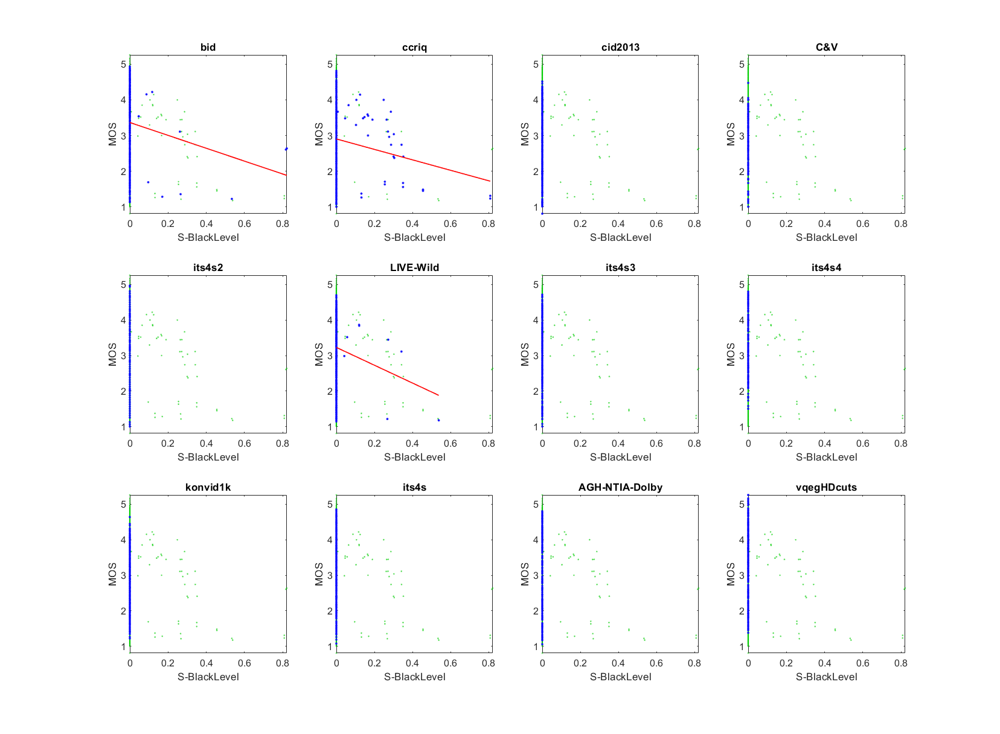

# Report on Auto Enhancement: White Level and Black Level

_This is a self-assessment._

_Go to [Report.md](Report.md) for an introduction to this series of NR metric reports, including their purpose, important warnings, the rating scale, and details of the statistical analysis._ 

Function `nrff_auto_enhancement.m` provides RCA inspired by image auto-enhancement. They are accurate enough to be included in NR Metric [Sawatch](ReportSawatch.md). 

Goal|Metric Name|Rating
----|-----------|------
RCA|White Level|:star: :star: :star:
RCA|Black Level|:star: :star:

## Algorithm Summary

Function `nrff_auto_enhancement.m` calculates two values: White Level and Black Level.

**White Level** considers only the luma plane (Y) and only penalizes media when the 98th percentile drops below 150, when pixel values range from 0 to 255. This threshold was chosen based on [subjective datasets](SubjectiveDatasets.md) BID, CCRIQ, CID2013_dataset, ITS4S2, ITS4S3, and Live Wild.

**Black Level** estimates whether the black level is too high, based on the standard deviation of the luma image. This parameter is only calculated when the mean image value is above mid level grey (128). 
 

## Speed and Conformity
Function `nrff_auto_enhancement.m` was initially provided by this repository, so conformity is ensured. Speed is O(n), which is as fast as can be expected of any NR metric. Auto Enhancement took twice as long to run as [nrff_blur.m](ReportBlur.md).

## Analysis

White Level and Black Level are evaluated using three types of datasets:
* Image quality datasets with camera impairments (BID, CCRIQ, CID2013, C&V, ITS4S2, and LIVE-Wild)
* Video quality datasets with camera impairments (ITS4S3, ITS4S4, and KonViD-1K)
* Simulated adaptive streaming, at broadcast bit-rates (ITS4S) 


### White Level

The White Level scatter plots have a lower triangle shape (i.e., narrow range of values for high quality, wide range of values for low quality). We expect this shape when an impairment occurs sporadically. This meets our expectations for white level problems. 

The White Level scatter plots show a consistent response for these diverse datasets. Compare the scatter of blue dots (for the current dataset) with the green dots (that show the overall response of all datasets). While some datasets do not fully express the lower triangle shape, their data falls within the lower triangle shape described by all datasets.   

The low correlations are likewise appropriate for a sporadic impairment. The zero correlation for ITS4S and ITS4S4 are appropriate, because these datasets do not contain white level problems. White Level works best for datasets that evaluate the performance of consumer cameras in a variety of environments (e.g., CCRIQ, CID2013, KoNViD-1k).

```text
1) white level 
bid              corr =  0.16  rmse =  1.00  percentiles [33.61,150.00,150.00,150.00,150.00]
ccriq            corr =  0.33  rmse =  0.96  percentiles [16.86,150.00,150.00,150.00,150.00]
cid2013          corr =  0.48  rmse =  0.79  percentiles [25.32,150.00,150.00,150.00,150.00]
C&V              corr =  0.32  rmse =  0.68  percentiles [22.99,150.00,150.00,150.00,150.00]
its4s2           corr =  0.20  rmse =  0.73  percentiles [23.85,150.00,150.00,150.00,150.00]
LIVE-Wild        corr =  0.18  rmse =  0.80  percentiles [41.82,150.00,150.00,150.00,150.00]
its4s3           corr =  0.31  rmse =  0.72  percentiles [35.54,150.00,150.00,150.00,150.00]
its4s4           corr =  0.02  rmse =  0.88  percentiles [69.85,150.00,150.00,150.00,150.00]
konvid1k         corr =  0.34  rmse =  0.60  percentiles [30.17,150.00,150.00,150.00,150.00]
its4s            corr =  0.00  rmse =  0.77  percentiles [68.22,150.00,150.00,150.00,150.00]

average          corr =  0.23  rmse =  0.79
pooled           corr =  0.26  rmse =  0.80  percentiles [16.86,150.00,150.00,150.00,150.00]
```


### Black Level

The Black Level scatter plots show a lower triangle shape similar to what we saw with White Level. Black level imbalances are fairly rare, so Black Level is equal to zero for most media and it is difficult to assess this metric. The correlation values are very low (0.07 to 0.11), but the fit lines are similar for the three datasets that contain this impairment (compare the red fit line for BID, CCRIQ, and LIVE-Wild). More training data would be needed to improve this parameter. 

```
2) black level 
bid              corr =  0.11  rmse =  1.01  percentiles [ 0.00, 0.00, 0.00, 0.00, 0.82]
ccriq            corr =  0.10  rmse =  1.01  percentiles [ 0.00, 0.00, 0.00, 0.00, 0.81]
cid2013          corr =   NaN  rmse =   Inf  percentiles [ 0.00, 0.00, 0.00, 0.00, 0.00]
C&V              corr =   NaN  rmse =   Inf  percentiles [ 0.00, 0.00, 0.00, 0.00, 0.00]
its4s2           corr =   NaN  rmse =   Inf  percentiles [ 0.00, 0.00, 0.00, 0.00, 0.00]
LIVE-Wild        corr =  0.07  rmse =  0.82  percentiles [ 0.00, 0.00, 0.00, 0.00, 0.54]
its4s3           corr =   NaN  rmse =   Inf  percentiles [ 0.00, 0.00, 0.00, 0.00, 0.00]
its4s4           corr =   NaN  rmse =   Inf  percentiles [ 0.00, 0.00, 0.00, 0.00, 0.00]
konvid1k         corr =   NaN  rmse =   Inf  percentiles [ 0.00, 0.00, 0.00, 0.00, 0.00]
its4s            corr =   NaN  rmse =   Inf  percentiles [ 0.00, 0.00, 0.00, 0.00, 0.00]

average          corr =   NaN  rmse =   Inf
pooled           corr =  0.07  rmse =  0.83  percentiles [ 0.00, 0.00, 0.00, 0.00, 0.82]
```

