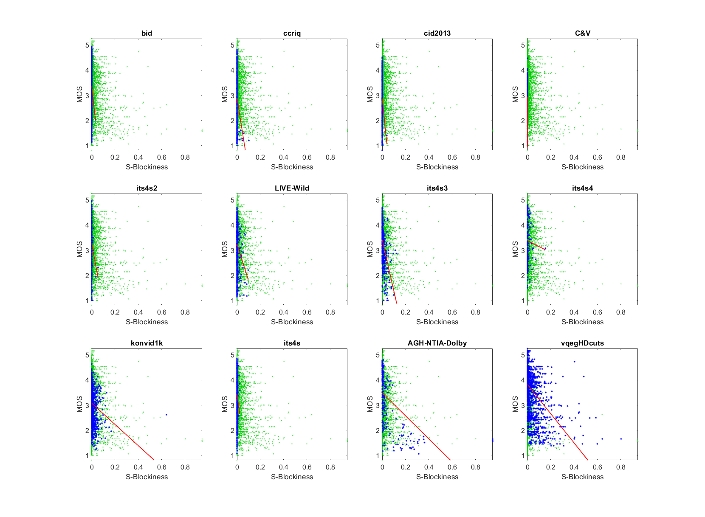

# Report on Blockiness

_This is a self-assessment._

_Go to [Report.md](Report.md) for an introduction to this series of NR metric reports, including their purpose, important warnings, the rating scale, and details of the statistical analysis._ 

Function `nrff_blockiness.m` assesses overall blockiness. This algorithm is accurate enough to be included in NR Metric [Sawatch](ReportSawatch.md). 

Goal|Metric Name|Rating
----|-----------|------
RCA|Blockiness|:star: :star:

## Algorithm Summary
Function `nrff_blockiness.m` analyzes the angle of small edges in the luma plane, using a (5×5) edge filter. The luma image is split into edges that are extremely close to horizontal or vertical (HV), and the remaining edges (HVbar). Put simply, blockiness triggers if the entire image has higher than expect HV edge energy, relative to the HVbar edge energy. There are correction factors to avoid falsely penalizing areas with low edge energy, intentional horizontal and vertical edges, and random fluctuations in edge angle.

The edge filter is a variant of the Sobel filter that was developed by NTIA to detect larger edges than the popular (3×3) edge filters (e.g., Sobel, Laplacian). See function `filter_si_hv_adapt.m`.

## Speed and Conformity

Blockiness runs roughly __1.15×__ slower than the benchmark metric, [nrff_blur.m](ReportBlur.md).

In Big-O notation, Blockiness is O(n). 

Function `nrff_blockiness.m` was initially provided by this repository, so conformity is ensured. 

## Analysis

This parameter is evaluated using four types of datasets:
* Image quality datasets with camera impairments (BID, CCRIQ, CID2013, C&V, ITS4S2, and LIVE-Wild)
* Video quality datasets with camera impairments (ITS4S3, ITS4S4, and KonViD-1K)
* Simulated adaptive streaming, at broadcast bit-rates (ITS4S) 
* Compression artifacts (AGH-NTIA-Dolby, vqegHDcuts) 

Blockiness emphasizes avoiding type 1 errors (false positives). Parameter levels are very low for all camera quality datasets and ITS4S, which do not contain blocking artifacts. The outlier in dataset KonViD-1K is computer generated abstract art that looks similar to blocking artifacts. The rate of type 2 errors (false negatives) is higher, so this RCA parameter may miss subtle blocking artifacts. 

Only datasets AGH-NTIA-Dolby and vqegHDcuts contain obvious blocking artifacts. Their blockiness scatter plots have a lower triangle shape (i.e., narrow range of values for high quality, wide range of values for low quality). We expect this shape when an impairment occurs sporadically. The wide spread of values for the vqegHDcuts dataset are probably caused by known problems with this artificial dataset. 

The overall performance is promising. More datasets with blocking artifacts would be needed to better assess performance. 
```text
1) blockiness 
bid              corr =  0.06  rmse =  1.01  percentiles [ 0.00, 0.00, 0.00, 0.00, 0.01]
ccriq            corr =  0.16  rmse =  1.01  percentiles [ 0.00, 0.00, 0.00, 0.00, 0.02]
cid2013          corr =  0.10  rmse =  0.90  percentiles [ 0.00, 0.00, 0.00, 0.00, 0.01]
C&V              corr =  0.25  rmse =  0.69  percentiles [ 0.00, 0.00, 0.00, 0.00, 0.00]
its4s2           corr =  0.07  rmse =  0.74  percentiles [ 0.00, 0.00, 0.00, 0.00, 0.01]
LIVE-Wild        corr =  0.15  rmse =  0.81  percentiles [ 0.00, 0.00, 0.00, 0.00, 0.02]
its4s3           corr =  0.45  rmse =  0.68  percentiles [ 0.00, 0.00, 0.00, 0.00, 0.03]
its4s4           corr =  0.04  rmse =  0.88  percentiles [ 0.00, 0.00, 0.00, 0.00, 0.03]
konvid1k         corr =  0.18  rmse =  0.63  percentiles [ 0.00, 0.00, 0.00, 0.00, 0.14]
AGH-NTIA-Dolby   corr =  0.54  rmse =  0.95  percentiles [ 0.00, 0.00, 0.00, 0.01, 0.21]
its4s            corr =  0.09  rmse =  0.77  percentiles [ 0.00, 0.00, 0.00, 0.00, 0.01]
vqegHDcuts       corr =  0.44  rmse =  0.80  percentiles [ 0.00, 0.00, 0.00, 0.01, 0.18]

average          corr =  0.21  rmse =  0.82
pooled           corr =  0.18  rmse =  0.86  percentiles [ 0.00, 0.00, 0.00, 0.00, 0.21]
```



