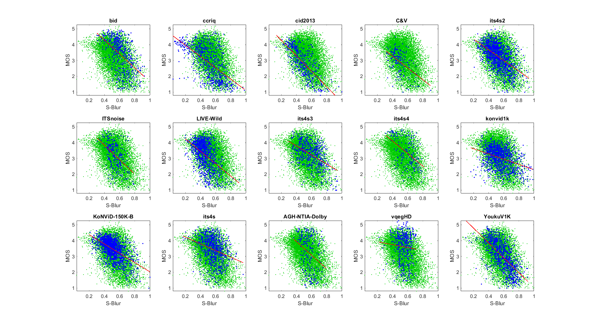
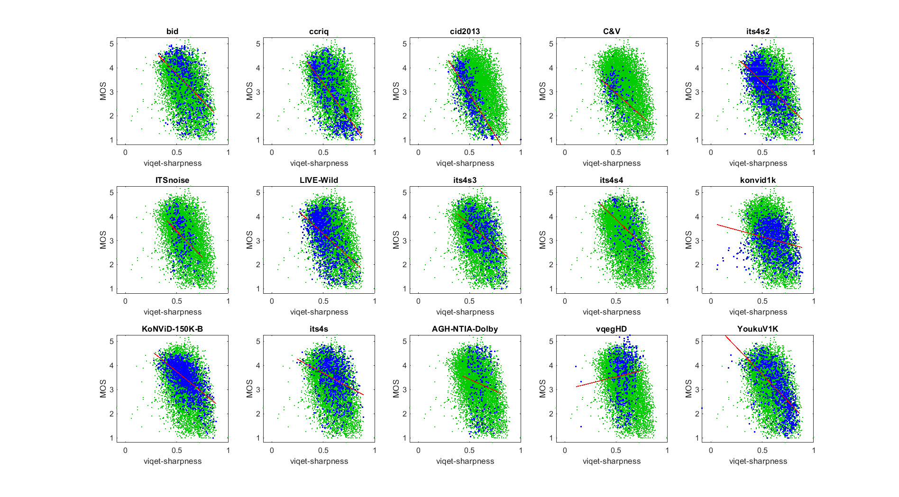

# Report on S-Blur and Viqet-Sharpness

_This is a self-assessment._

_Go to [Report.md](Report.md) for an introduction to this series of NR metric reports, including their purpose, important warnings, the rating scale, and details of the statistical analysis._ 

Function `nrff_blur.m` assesses the blurriness of the picture regions that are most in focus. This function includes two RCA metrics that use different techniques but perform similarly. Both are accurate enough to be included in NR Metric [Sawatch](ReportSawatch.md). 

Blurring is a complex impairment, and there is significant room for improvement.  

Goal|Metric Name|Rating
----|-----------|------
RCA|Unsharp|:star: :star: :star:
RCA|Viqet-Sharpness|:star: :star: :star:

## Algorithm Summary

### S-Blur
Inspired by the unsharp filter, this algorithm calculates the difference between the original image and the unsharp filtered image (i.e., the unsharp filter delta). This difference image is divided into [100 equal sized regions](Divide100Blocks.md). For each region, we compute a localized measure of the maximum adjustment that the unsharp filter would make (to sharpen the image) and normalize by the overall edge strength in this region. An overall estimate is computed by averaging the 10% largest values (pooling all blocks and all frames) with controls to avoid enhancing low level noise. Basically, the goal is to measure the sharpest areas in the image or video. 

### Viqet-Sharpness

Viqet-Sharpness is an improved version of a sharpness metric in NR metric [VIQET](https://github.com/VIQET). Since the perceptual quality difference between HD and 4K monitors is minimal, we begin by down-sampling 4K images to HD resolution. We then take the Laplacian filter of the luma plane, calculate the average of the top 1% of pixels, divide by the standard deviation of the Sobel filtered luma plane, and take the square root. There are controls to avoid dividing by values less than one. Dividing by the Sobel filtered image adjusts for the overall edge strength in the image. 

## Speed and Conformity

Blur is the benchmark metric.

In Big-O notation, Blur is O(n).

Function `nrff_blur.m` was initially provided by this repository, so conformity is ensured.   

## Analysis

This analysis uses three types of datasets:
* Image quality datasets with camera impairments (BID, CCRIQ, CID2013, C&V, ITS4S2, ITSnoise, and LIVE-Wild)
* Video quality datasets with camera impairments (ITS4S3, ITS4S4, KonViD-1K, and KoNViD-150K-B)
* Video quality datasets with broadcast content and compression (ITS4S, AGH-NTIA-Dolby, vqegHD, and YoukuV1K) 

### S-Blur

The S-Blur scatter plots show a fairly consistent response among datasets. Compare the scatter of blue dots (for the current dataset) with the green dots (that show the overall response of all datasets). 

The data are broadly scattered around a line. We expect this shape when RCA parameter detects a dominant factor (i.e., always relevant). The modest correlation values are encouraging. The reduced correlation for ITS4S is worth further investigation, because this dataset includes resolution sub-sampling. The reduced correlation for BID, a dataset that mainly focuses on image blur, indicates the need for more research to either replace or complement this algorithm.  

The overall performance is promising. 
```text
1) S-Blur 
bid              corr =  0.514  rmse =  0.87  false decisions =  52%  percentiles [ 0.30, 0.54, 0.60, 0.70, 0.93]
ccriq            corr =  0.610  rmse =  0.81  false decisions =  56%  percentiles [ 0.03, 0.39, 0.51, 0.64, 0.98]
cid2013          corr =  0.735  rmse =  0.61  false decisions =  59%  percentiles [ 0.13, 0.39, 0.48, 0.58, 1.00]
C&V              corr =  0.498  rmse =  0.62  false decisions =  43%  percentiles [ 0.32, 0.43, 0.48, 0.54, 0.90]
its4s2           corr =  0.551  rmse =  0.62  false decisions =  46%  percentiles [ 0.21, 0.44, 0.50, 0.60, 0.94]
ITSnoise         corr =  0.498  rmse =  0.69  false decisions =  48%  percentiles [ 0.31, 0.48, 0.53, 0.60, 0.79]
LIVE-Wild        corr =  0.488  rmse =  0.71  false decisions =  46%  percentiles [ 0.20, 0.39, 0.45, 0.52, 0.91]
its4s3           corr =  0.490  rmse =  0.66  false decisions =  45%  percentiles [ 0.29, 0.49, 0.59, 0.69, 0.94]
its4s4           corr =  0.508  rmse =  0.76  false decisions =  50%  percentiles [ 0.31, 0.50, 0.61, 0.67, 0.82]
konvid1k         corr =  0.352  rmse =  0.60  false decisions =  38%  percentiles [ 0.16, 0.45, 0.54, 0.64, 0.99]
KoNViD-150K-B    corr =  0.560  rmse =  0.50  false decisions =  41%  percentiles [ 0.20, 0.44, 0.50, 0.57, 1.00]
its4s            corr =  0.302  rmse =  0.73  false decisions =  41%  percentiles [ 0.17, 0.50, 0.57, 0.64, 0.97]
AGH-NTIA-Dolby   corr =  0.326  rmse =  1.07  false decisions =  47%  percentiles [ 0.36, 0.50, 0.56, 0.62, 0.79]
vqegHD           corr =  0.080  rmse =  0.89  false decisions =  35%  percentiles [ 0.22, 0.50, 0.55, 0.60, 0.72]
YoukuV1K         corr =  0.661  rmse =  0.68  false decisions =  58%  percentiles [ 0.10, 0.48, 0.58, 0.68, 0.92]

average          corr =  0.478  rmse =  0.72
pooled           corr =  0.443  rmse =  0.75  percentiles [ 0.03, 0.45, 0.53, 0.62, 1.00]
```



### Viqet-Sharpness

The Viqet-Sharpness scatter plots show a fairly consistent response among datasets. The performance is very similar to S-Blur, with all of the same strengths and weaknesses. However, Viqet-Sharpness has a few more undesirable outliers. 
```text
bid              corr =  0.466  rmse =  0.90  false decisions =  51%  percentiles [ 0.32, 0.51, 0.57, 0.65, 0.86]
ccriq            corr =  0.670  rmse =  0.76  false decisions =  58%  percentiles [ 0.34, 0.48, 0.58, 0.67, 0.88]
cid2013          corr =  0.738  rmse =  0.61  false decisions =  59%  percentiles [ 0.30, 0.44, 0.50, 0.56, 1.00]
C&V              corr =  0.464  rmse =  0.64  false decisions =  41%  percentiles [ 0.36, 0.45, 0.49, 0.56, 0.80]
its4s2           corr =  0.605  rmse =  0.59  false decisions =  48%  percentiles [ 0.29, 0.45, 0.52, 0.61, 0.89]
ITSnoise         corr =  0.396  rmse =  0.73  false decisions =  45%  percentiles [ 0.40, 0.49, 0.54, 0.59, 0.75]
LIVE-Wild        corr =  0.488  rmse =  0.71  false decisions =  46%  percentiles [ 0.26, 0.44, 0.50, 0.57, 0.86]
its4s3           corr =  0.505  rmse =  0.65  false decisions =  46%  percentiles [ 0.39, 0.54, 0.62, 0.70, 0.87]
its4s4           corr =  0.497  rmse =  0.76  false decisions =  50%  percentiles [ 0.34, 0.53, 0.64, 0.71, 0.82]
konvid1k         corr =  0.224  rmse =  0.63  false decisions =  36%  percentiles [ 0.06, 0.54, 0.61, 0.69, 0.89]
KoNViD-150K-B    corr =  0.591  rmse =  0.49  false decisions =  42%  percentiles [ 0.28, 0.51, 0.57, 0.65, 0.88]
its4s            corr =  0.302  rmse =  0.73  false decisions =  41%  percentiles [ 0.24, 0.53, 0.61, 0.68, 0.89]
AGH-NTIA-Dolby   corr =  0.130  rmse =  1.12  false decisions =  40%  percentiles [ 0.43, 0.55, 0.60, 0.65, 0.81]
vqegHD           corr =  0.091  rmse =  0.89  false decisions =  30%  percentiles [ 0.11, 0.52, 0.58, 0.63, 0.77]
YoukuV1K         corr =  0.621  rmse =  0.71  false decisions =  58%  percentiles [-0.09, 0.56, 0.66, 0.74, 0.86]

average          corr =  0.452  rmse =  0.73
pooled           corr =  0.427  rmse =  0.75  percentiles [-0.09, 0.49, 0.57, 0.66, 1.00]
```



