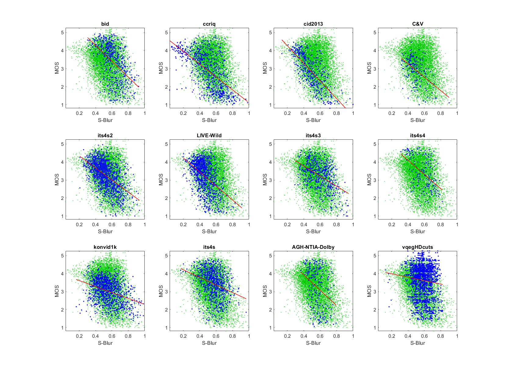

# Report on Blur

_This is a self-assessment._

_Go to [Report.md](Report.md) for an introduction to this series of NR metric reports, including their purpose, important warnings, the rating scale, and details of the statistical analysis._ 

Function `nrff_blur.m` assesses the blurriness of the picture regions that are most in focus. This function includes two RCA metrics that use different techniques but perform similarly. Both are accurate enough to be included in NR Metric [Sawatch](ReportSawatch.md). 

Blurring is a complex impairment, and there is significant room for improvement.  

Goal|Metric Name|Rating
----|-----------|------
RCA|Unsharp|:star: :star: :star:
RCA|Viqet-Sharpness|:star: :star: :star:

## Algorithm Summary

### Unsharp
Inspired by the unsharp filter, this algorithm calculates the difference between the original image and the unsharp filtered image (i.e., the unsharp filter delta). This difference image is divided into [100 equal sized regions](Divide100Blocks.md). For each region, we compute a localized measure of the maximum adjustment that the unsharp filter would make (to sharpen the image) and normalize by the overall edge strength in this region. An overall estimate is computed by averaging the 10% largest values (pooling all blocks and all frames) with controls to avoid enhancing low level noise. Basically, the goal is to measure the sharpest areas in the image or video. 

### Viqet-Sharpness

Viqet-Sharpness is an improved version of a sharpness metric in NR metric [VIQET](https://github.com/VIQET). Since the perceptual quality difference between HD and 4K monitors is minimal, we begin by down-sampling 4K images to HD resolution. We then take the Laplacian filter of the luma plane, calculate the average of the top 1% of pixels, divide by the standard deviation of the Sobel filtered luma plane, and take the square root. There are controls to avoid dividing by values less than one. Dividing by the Sobel filtered image adjusts for the overall edge strength in the image. 

## Speed and Conformity

Blur is the benchmark metric.

In Big-O notation, Blur is O(n).

Function `nrff_blur.m` was initially provided by this repository, so conformity is ensured.   

## Analysis

These parameters are evaluated using three types of datasets:
* Image quality datasets with camera impairments (BID, CCRIQ, CID2013, C&V, ITS4S2, and LIVE-Wild)
* Video quality datasets with camera impairments (ITS4S3, ITS4S4, and KonViD-1K)
* Simulated adaptive streaming, at broadcast bit-rates (ITS4S) 

### Unsharp

The Unsharp scatter plots show a fairly consistent response among datasets. Compare the scatter of blue dots (for the current dataset) with the green dots (that show the overall response of all datasets). 

The data are broadly scattered around a line. We expect this shape when RCA parameter detects a dominant factor (i.e., always relevant). The modest correlation values are encouraging. The reduced correlation for ITS4S is worth further investigation, because this dataset includes resolution sub-sampling. The reduced correlation for BID, a dataset that mainly focuses on image blur, indicates the need for more research to either replace or complement this algorithm.  

The overall performance is promising. 
```text
1) unsharp 
bid              corr =  0.51  rmse =  0.87  percentiles [ 0.70, 1.32, 1.60, 1.77, 2.42]
ccriq            corr =  0.61  rmse =  0.81  percentiles [ 0.55, 1.50, 1.84, 2.17, 3.16]
cid2013          corr =  0.73  rmse =  0.61  percentiles [ 0.00, 1.66, 1.93, 2.19, 2.88]
C&V              corr =  0.50  rmse =  0.62  percentiles [ 0.77, 1.75, 1.93, 2.07, 2.37]
its4s2           corr =  0.55  rmse =  0.62  percentiles [ 0.68, 1.60, 1.86, 2.05, 2.68]
LIVE-Wild        corr =  0.49  rmse =  0.71  percentiles [ 0.74, 1.82, 2.02, 2.19, 2.71]
its4s3           corr =  0.48  rmse =  0.66  percentiles [ 0.66, 1.34, 1.62, 1.90, 2.45]
its4s4           corr =  0.51  rmse =  0.76  percentiles [ 1.00, 1.40, 1.57, 1.84, 2.39]
konvid1k         corr =  0.35  rmse =  0.60  percentiles [ 0.54, 1.50, 1.77, 2.00, 2.80]
its4s            corr =  0.30  rmse =  0.73  percentiles [ 0.60, 1.47, 1.69, 1.88, 2.79]

average          corr =  0.50  rmse =  0.70
pooled           corr =  0.42  rmse =  0.75  percentiles [ 0.00, 1.53, 1.81, 2.05, 3.16]
```



### Viqet-Sharpness

The Viqet-Sharpness scatter plots show a fairly consistent response among datasets. The performance is very similar to Unsharp, with all of the same strengths and weaknesses. 
```text
2) viqet-sharpness 
bid              corr =  0.47  rmse =  0.90  percentiles [ 2.33, 4.29, 5.05, 5.64, 7.43]
ccriq            corr =  0.67  rmse =  0.76  percentiles [ 2.19, 4.13, 5.01, 5.95, 7.28]
cid2013          corr =  0.74  rmse =  0.61  percentiles [ 1.00, 5.20, 5.79, 6.35, 7.70]
C&V              corr =  0.46  rmse =  0.64  percentiles [ 2.94, 5.18, 5.89, 6.20, 7.12]
its4s2           corr =  0.61  rmse =  0.59  percentiles [ 2.09, 4.70, 5.54, 6.17, 7.73]
LIVE-Wild        corr =  0.49  rmse =  0.71  percentiles [ 2.32, 5.06, 5.73, 6.29, 7.99]
its4s3           corr =  0.50  rmse =  0.65  percentiles [ 2.28, 3.84, 4.57, 5.38, 6.82]
its4s4           corr =  0.50  rmse =  0.76  percentiles [ 2.67, 3.75, 4.43, 5.40, 7.27]
konvid1k         corr =  0.22  rmse =  0.63  percentiles [ 2.03, 3.90, 4.70, 5.41, 9.95]
its4s            corr =  0.30  rmse =  0.73  percentiles [ 2.01, 4.08, 4.74, 5.43, 8.18]

average          corr =  0.50  rmse =  0.70
pooled           corr =  0.43  rmse =  0.75  percentiles [ 1.00, 4.32, 5.20, 5.93, 9.95]
```


