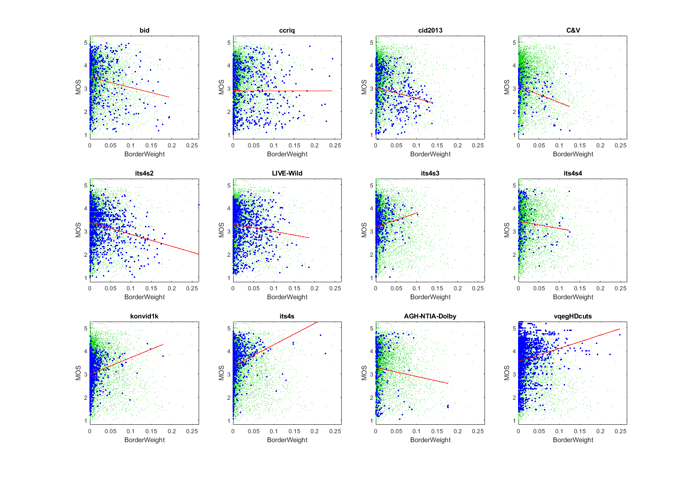

# Report BorderWeight, from the Border Group

_This is a self-assessment._

_Go to [Report.md](Report.md) for an introduction to this series of NR metric reports, including their purpose, important warnings, the rating scale, and details of the statistical analysis._

Function 'nrff_border.m` is a modified version of the Contrast Aware Multiscale Banding Index (CAMBI) [[50], [51]](Publications.md). 
CAMBI is intended to detect banding, a coding artifact that imposes lines across large regions with uniform colors (e.g., a sunset).
However, CAMBI does not include an algorithm that detects this special case (i.e., image content where banding may appear) and CAMBI was very sensitive to noise.
In response, we modified the algorithm and gave it a new name. 

Function `nrff_border.m` assesses border quantities independent of moderate noise. This function includes two metrics where the relative border score metric appears best across most datasets.  The relative all border score metric allows more noise by counting all detected adjacent and non-adjacent borders.
By "border" we mean the border between two image segments (e.g., between an orange object and a blue object). 

Border detection and noise removal are complex impairments, and there is significant room for improvement.

Goal|Metric Name|Rating
----|-----------|------
RCA|BorderWeight|:star: 
RCA|AllBorderWeight|:star: 

__R&D Potential:__ Some of the scatter plots for BorderWeight have distinct shapes that warrants further investigation.

## Algorithm Summary

Function `nrff_border.m` calculates two values: S-BorderWeight and S-AllBorderWeight.

**BorderWeight** considers only the luma plane (Y) and follows the below steps:

    1) Truncates luma plane (Y) into 16 equally spaced groups.
    2) Applies a circular bitmask (5x5) to the image.
    3) Computes the weighted luma gradient in this circular bitmask.
    4) Groups the image into sections based on an allowed 5% gradient deviation between adjacent pixels.
    5) Identifies large image sections which totaled are 75% of the image area.
    6) Pixels along borders of only adjacent large image sections are counted.
    7) Border pixel counts are then divided by their large section's area pixel count.
    8) Border weights are averaged for a value between 0 and 1.
        *** Blank image blocks are not included in final average
            where image is equally divided into 100 square blocks. ***

**AllBorderWeight** considers only the luma plane (Y) and follows the same steps as **BorderWeight** except step 6, border pixels of any large image section are counted.  These large section border pixels do not need to touch a different adjacent large section.

These RCA metrics are scaled onto [0..1], where zero indicates no significant indication of borders. 

## Speed and Conformity
Borders took between __5x__ and __20×__ as long to run as the benchmark metric, [nrff_blur.m](ReportBlur.md), depending on the image or video.

In Big-O notation, Border is O(n) where n is the number of pixels.

Function `nrff_border.m` was initially provided by this repository.
Conformity is poor, because we had to make some changes to the code, to get it to run on a large variety of media. 

## Analysis

These parameters are evaluated using three types of datasets:
* Image quality datasets with camera impairments (BID, CCRIQ, CID2013, C&V, ITS4S2, and LIVE-Wild)
* Video quality datasets with camera impairments (ITS4S3, ITS4S4, and KonViD-1K)
* Video quality datasets with broadcast content and compression (ITS4S, AGh-NTIA-Dolby, and vqegHDcuts) 

### BorderWeight

The BorderWeight scatter plots have various shapes depending on the dataset. 

KonViD-1K, ITS4S, and vqegHDcuts have a upper triangle shape (i.e., narrow range of values for low quality, wide range of values for high quality). 
We expect this shape when the NR metric detects some aspect of high quality media.  
This contradicts our expectations for contrast and border weight problems. 

C&V, ITS4S2 and LIVE-Wild have a lower triangle shape (i.e., narrow range of values for high quality, wide range of values for low quality). 
However, these lower triangle shapes are less well defined than the upper triangle shapes.
We expect a lower triangle shape when an impairment occurs sporadically. 
This meets our expectations for contrast border weight problems. 

These are contradictory patterns, as if BorderWeight is detecting two contradictory characteristics (e.g., one associated with high quality and another associated with low quality).
Further investigation would be needed to develop a reliable metric.
```text
1) BorderWeight
bid              corr =  0.16  rmse =  1.00  false decisions =  38%  percentiles [ 0.00, 0.00, 0.01, 0.03, 0.19]
ccriq            corr =  0.00  rmse =  1.02  false decisions =  34%  percentiles [ 0.00, 0.00, 0.01, 0.05, 0.24]
cid2013          corr =  0.19  rmse =  0.88  false decisions =  40%  percentiles [ 0.00, 0.00, 0.02, 0.06, 0.14]
C&V              corr =  0.28  rmse =  0.69  false decisions =  36%  percentiles [ 0.00, 0.00, 0.01, 0.03, 0.13]
its4s2           corr =  0.23  rmse =  0.72  false decisions =  36%  percentiles [ 0.00, 0.00, 0.01, 0.03, 0.27]
LIVE-Wild        corr =  0.12  rmse =  0.81  false decisions =  37%  percentiles [ 0.00, 0.00, 0.01, 0.03, 0.19]
its4s3           corr =  0.12  rmse =  0.75  false decisions =  25%  percentiles [ 0.00, 0.00, 0.00, 0.01, 0.10]
its4s4           corr =  0.10  rmse =  0.88  false decisions =  35%  percentiles [ 0.00, 0.00, 0.01, 0.02, 0.13]
konvid1k         corr =  0.17  rmse =  0.63  false decisions =  23%  percentiles [ 0.00, 0.00, 0.00, 0.01, 0.18]
its4s            corr =  0.25  rmse =  0.75  false decisions =  21%  percentiles [ 0.00, 0.00, 0.00, 0.01,  NaN]
AGH-NTIA-Dolby   corr =  0.09  rmse =  1.12  false decisions =  35%  percentiles [ 0.00, 0.00, 0.00, 0.01, 0.18]
vqegHDcuts       corr =  0.16  rmse =  0.88  false decisions =  27%  percentiles [ 0.00, 0.00, 0.01, 0.02, 0.25]

average          corr =  0.16  rmse =  0.84
pooled           corr =  0.04  rmse =  0.88  percentiles [ 0.00, 0.00, 0.01, 0.02,  NaN]
```



### AllBorderWeight

AllBorderWeight does not respond well to diverse content and camera impairments. 
The correlations are low and AllBorderWeight values for values between 0.2 and 0.4.
There is no indication that AllBorderWeight responds to contours. 

```
2) AllBorderWeight
bid              corr =  0.21  rmse =  0.99  false decisions =  29%  percentiles [ 0.00, 0.27, 0.36, 0.43, 0.59]
ccriq            corr =  0.29  rmse =  0.98  false decisions =  29%  percentiles [ 0.00, 0.27, 0.37, 0.46, 0.64]
cid2013          corr =  0.17  rmse =  0.89  false decisions =  34%  percentiles [ 0.00, 0.35, 0.43, 0.50, 0.58]
C&V              corr =  0.15  rmse =  0.71  false decisions =  28%  percentiles [ 0.00, 0.37, 0.42, 0.48, 0.60]
its4s2           corr =  0.01  rmse =  0.74  false decisions =  30%  percentiles [ 0.00, 0.19, 0.34, 0.46, 0.69]
LIVE-Wild        corr =  0.25  rmse =  0.79  false decisions =  26%  percentiles [ 0.01, 0.35, 0.43, 0.48, 0.61]
its4s3           corr =  0.38  rmse =  0.70  false decisions =  20%  percentiles [ 0.00, 0.09, 0.24, 0.38, 0.63]
its4s4           corr =  0.06  rmse =  0.88  false decisions =  33%  percentiles [ 0.02, 0.21, 0.33, 0.40, 0.66]
konvid1k         corr =  0.21  rmse =  0.63  false decisions =  23%  percentiles [ 0.00, 0.05, 0.19, 0.34, 0.61]
its4s            corr =  0.16  rmse =  0.76  false decisions =  27%  percentiles [ 0.00, 0.14, 0.30, 0.42,  NaN]
AGH-NTIA-Dolby   corr =  0.01  rmse =  1.13  false decisions =  37%  percentiles [ 0.02, 0.11, 0.23, 0.34, 0.54]
vqegHDcuts       corr =  0.18  rmse =  0.88  false decisions =  27%  percentiles [ 0.00, 0.14, 0.26, 0.38, 0.62]

average          corr =  0.17  rmse =  0.84
pooled           corr =  0.11  rmse =  0.87  percentiles [ 0.00, 0.18, 0.33, 0.43,  NaN]
```

