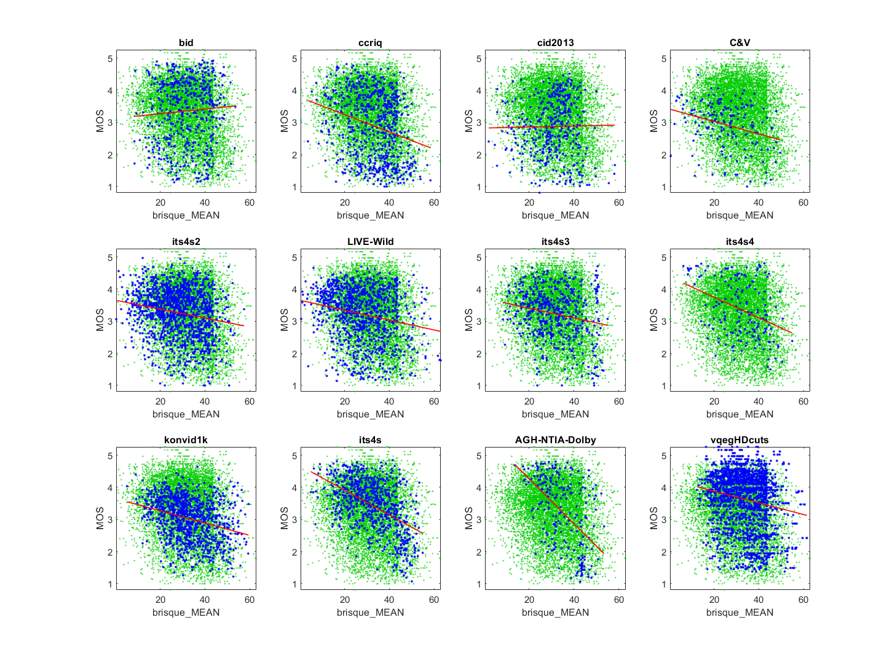

# Report on the Blind/Referenceless Image Spatial Quality Evaluator (BRISQUE)

_Go to [Report.md](Report.md) for an introduction to this series of NR metric reports, including their purpose, important warnings, the rating scale, and details of the statistical analysis._ 

Function `nrff_brisque.m` implements the Blind/Referenceless Image Spatial Quality Evaluator (BRISQUE), an image quality metric presented in [[8]](Publications.md). BRISQUE does not work reliably across a broad range of modern camera systems and video content. 

Goal|Metric Name|Rating
----|-----------|------
MOS|BRISQUE|:star:

__R&D Potential__: MATLAB® offers tools to retrain BRISQUE for a target application. Users must provide their own data (images with MOSs). 

## Algorithm Summary
Function `nrff_brisque.m` calls the MATLAB implementation of BRISQUE.

BRISQUE uses a support vector regression (SVR) model trained by MATLAB on an image database containing standard image distortions. If a distortion is not included in that dataset, BRISQUE will not be able to evaluate the quality of an image affected by it. BRISQUE calculates a nonnegative scalar in the range of [0,100] with lower scores reflecting a higher level of perceptual quality. The properties of the default model are listed in `nrff_brisque.m` and at the MathWorks® webpage (https://www.mathworks.com/help/images/ref/brisquemodel.html)

## Speed and Conformity
BRISQUE took __1.5×__ as long to run as the benchmark metric, [nrff_blur.md](ReportBlur.md). 

The MathWorks documentation does not describe the complexity of the algorithm, and [8] does not list computational complexity explicitly in terms of Big-O. 

Code is provided by MATLAB.

## Analysis
The authors report 0.9424 Pearson correlation between BRISQUE and MOS for the 2006 LIVE Image Quality Assessment Database [[31]](Publications.md), 

BRISQUE does not respond well to diverse content and camera impairments. The correlations are low and BRISQUE values above the 25th percentile are associated with the full range of MOSs. 
```
1) brisque_MEAN 
bid              corr =  0.07  rmse =  1.01  false decisions =  34%  percentiles [ 8.44,25.01,32.14,39.69,53.65]
ccriq            corr =  0.26  rmse =  0.98  false decisions =  44%  percentiles [ 3.56,26.42,34.77,40.58,58.44]
cid2013          corr =  0.02  rmse =  0.90  false decisions =  33%  percentiles [ 1.94,25.90,31.96,36.79,  NaN]
C&V              corr =  0.30  rmse =  0.69  false decisions =  38%  percentiles [ 0.61,18.19,24.39,33.44,49.67]
its4s2           corr =  0.19  rmse =  0.73  false decisions =  36%  percentiles [ 0.27,20.65,28.26,36.24,57.55]
LIVE-Wild        corr =  0.21  rmse =  0.80  false decisions =  39%  percentiles [ 0.58,19.90,27.24,35.61,63.03]
its4s3           corr =  0.21  rmse =  0.74  false decisions =  37%  percentiles [ 8.31,23.86,30.30,38.45,54.95]
its4s4           corr =  0.37  rmse =  0.82  false decisions =  45%  percentiles [ 6.26,25.20,32.42,39.77,54.98]
konvid1k         corr =  0.30  rmse =  0.61  false decisions =  38%  percentiles [ 5.14,25.54,31.62,39.39,59.55]
its4s            corr =  0.51  rmse =  0.66  false decisions =  47%  percentiles [ 4.84,24.59,32.46,40.34,54.94]
AGH-NTIA-Dolby   corr =  0.52  rmse =  0.96  false decisions =  53%  percentiles [13.68,28.12,33.93,42.97,53.37]
vqegHDcuts       corr =  0.18  rmse =  0.88  false decisions =  38%  percentiles [12.26,27.16,34.37,41.01,61.58]

average          corr =  0.26  rmse =  0.81
pooled           corr =  0.18  rmse =  0.86  percentiles [ 0.27,24.34,31.62,39.14,  NaN]
```

