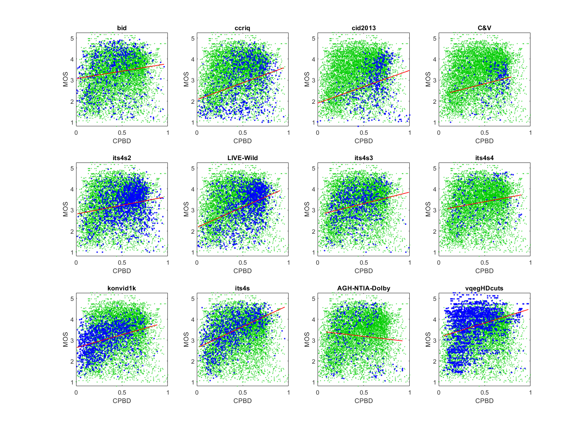

# Report on Cumulative Probability of Blur Detection (CPBD)

_Go to [Report.md](Report.md) for an introduction to this series of NR metric reports, including their purpose, important warnings, the rating scale, and details of the statistical analysis._ 

Function `nrff_CPBD.m` implements the cumulative probability of blur detection (CPBD) metric, as presented in [[18]](Publications.md). The goal is to detect blur and sharpness.  

Goal | Metric Name|Rating
-----|------------|------
RCA  | CPBD | :star: :star:

## Algorithm Summary
The algorithm performs edge detection and divides the image into blocks. Once the blocks are determined, the algorithm checks the number of edge pixels and determines if the block is a smooth block or an edge block. If it is a smooth block, the block is discarded and not processed, otherwise the block gets processed as follows. The overall contrast with just-noticeable-blur (JNB) is calculated. Each edge is then analyzed and a value for the edge width is generated. The blur probability for each is calculated by taking one minus e to the power of the negative value of edge width divided by the JNB width taken to the power of a predetermined constant beta. In the provided code, beta is defined as 3.6. Lastly, the CPBD sharpness metric is calculated by the sum of the blur probabilities that are less than the just-noticeable-blur probability.

## Speed and Conformity
CPBD took __3×__ as long to run as the benchmark metric, [nrff_blur.m](ReportBlur.md).

In Big-O notation, CPBD is O(n). 

In terms of conformity, the author's code is used with the exception of one area where the floor function is used to guarantee an integer for indexing purposes with `CPBD_compute.m`.

## Analysis
The authors report 0.9071 Pearson correlation between CPBD and MOS for a private image quality dataset. 

Our correlations are low but sufficiently high to be promising as an RCA parameter. However, the scatter plot distributions are fairly random with a mild positive trend. Compare the scatter of blue dots (for the current dataset) with the green dots (that show the overall response of all dataset). 
```
1) CPBD 
bid              corr =  0.15  rmse =  1.00  false decisions =  29%  percentiles [ 0.01, 0.23, 0.41, 0.54, 0.96]
ccriq            corr =  0.32  rmse =  0.97  false decisions =  27%  percentiles [ 0.01, 0.37, 0.53, 0.68, 0.95]
cid2013          corr =  0.27  rmse =  0.87  false decisions =  25%  percentiles [ 0.00, 0.54, 0.64, 0.71, 1.00]
C&V              corr =  0.24  rmse =  0.70  false decisions =  23%  percentiles [ 0.12, 0.52, 0.64, 0.70, 0.79]
its4s2           corr =  0.20  rmse =  0.73  false decisions =  25%  percentiles [ 0.01, 0.43, 0.57, 0.68, 0.95]
LIVE-Wild        corr =  0.41  rmse =  0.75  false decisions =  22%  percentiles [ 0.01, 0.43, 0.58, 0.68, 0.91]
its4s3           corr =  0.26  rmse =  0.73  false decisions =  23%  percentiles [ 0.08, 0.28, 0.42, 0.56, 0.99]
its4s4           corr =  0.20  rmse =  0.86  false decisions =  28%  percentiles [ 0.10, 0.25, 0.41, 0.65, 0.90]
konvid1k         corr =  0.36  rmse =  0.60  false decisions =  18%  percentiles [ 0.01, 0.16, 0.29, 0.45, 0.88]
its4s            corr =  0.52  rmse =  0.66  false decisions =  15%  percentiles [ 0.03, 0.24, 0.39, 0.55, 0.96]
AGH-NTIA-Dolby   corr =  0.09  rmse =  1.12  false decisions =  36%  percentiles [ 0.09, 0.25, 0.41, 0.57, 0.92]
vqegHDcuts       corr =  0.27  rmse =  0.86  false decisions =  24%  percentiles [ 0.05, 0.22, 0.33, 0.47, 0.98]

average          corr =  0.27  rmse =  0.82
pooled           corr =  0.19  rmse =  0.86  percentiles [ 0.00, 0.27, 0.45, 0.61, 1.00]
```

