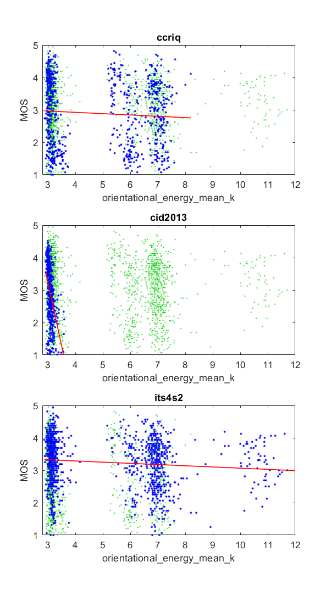
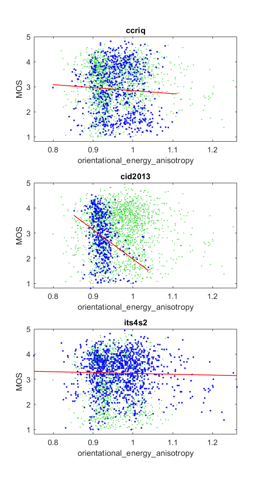
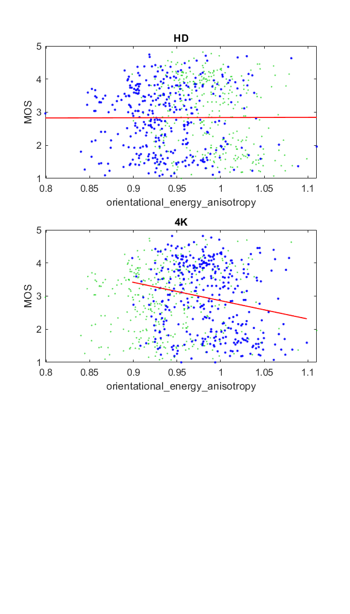

# Report on Curvelet QA

_Go to [Report.md](Report.md) for an introduction to this series of NR metric reports, including their purpose, important warnings, the rating scale, and details of the statistical analysis._ 

Function `nrff_curvelet_QA.m` implements four NR metrics that use the curvelet transform with Gaussian curve fitting and basic statistics, as presented in [[19]](Publications.md). 
The Curvelet QA algorithms had to be modified significantly to comply with our framework and produced invalid results for many images. CurveletQA does not work reliably across a broad range of modern camera systems and video content.

Goal | Metric Name|Rating
-----|------------|------
MOS  | gauss_fit | :question:
MOS  | orientational_energy_mean_k | :question:
MOS  | orientational_energy_anisotropy | :question:
MOS  | gauss_fit_ori_en_combo | :question:

__R&D Potential__: Our datasets contain unforeseen impairments that produced divergent metric offsets and scaling factors for some types of content. Curvelet QA cannot be used or properly analyzed until this issue is addressed.  

## Dependent Download

Function `nrff_curvelet_QA.m` calls functions that must be downloaded from the author's GitHub repository: https://github.com/utlive/CurveletQA

## Algorithm Summary
First, curvelet QA divides the image into 256 X 256 pixel blocks and analyzes each block. For each block, the algorithm performs a discrete curvelet transform, and, based on the transformed block of the image, performs curve fitting to a Gaussian normal model. After the fit, the algorithm takes the general statistics of the block, which is referred to as the orientational information. The overall features taken from this are the mean kurtosis between the halves of the block in question and the square root of the variance over the mean of the absolute values of the block, which is referred to as the anisotropy. The mean of the Gaussian curve fitting is then taken to isolate it into one value. The average kurtosis value is then isolated into a value as is the anisotropy value, and lastly a combination statistic between the curve fitting values and the orientational information is taken for experimental purposes.

## Speed and Conformity

Curvelet QA took more than __10×__ as long to run as the benchmark metric, [nrff_blur.md](ReportBlur.md). 
 
Our code does not fully conform to the publication. The following changes were required, either to fix software bugs or to conform with the NRMetricFramework: 

(1) We added a try-catch block, because the original code produced errors for many images. 

(2) The block division that we opted to use was implemented differently but was inherently the same as the author's intention. 

(3) Files like the fdct_usfft.m and SeparateScales.m had multiple areas that used a non integer as an array index. To work around this problem, we used MATLAB® function `floor.m` to convert the number to an integer.  

(4) We averaged over all blocks (in space and time). This seems to be in keeping with the author's intent. 

(5) Other images that produced errors were ignored (i.e., omitted from our analyses). We limited error investigations to the issues described above. 

## Analysis

The authors report 0.9328 Pearson correlation between CurveletQA and MOS for the LIVE Image Quality Assessment Database Release 2 [[30]](Publications.md). 

We only obtained viable data from three of the six image quality datasets. 
The curvelet QA scatter plots seem to contain the intended response and an unintended response, which greatly differs in magnitude. The CID2013 dataset has promising results and probably depicts the intended response. The CCRIQ and ITS4S2 datasets are uncorrelated to MOS and depict multiple distributions of values, overlaid. To understand the multiple distribution issue, see the third plot below, which splits the CCRIQ dataset by image resolution (HD vs 4K). 

No data could be obtained for the remaining parameters. 

Note that we omitted an outlier from the ITS4S2 dataset at orientational_energy_mean_k = 40.
```
1) gauss_fit 

average          corr =   NaN  rmse =   NaN

--------------------------------------------------------------
2) orientational_energy_mean_k 
ccriq            corr =  0.07  rmse =  1.01  percentiles [ 2.88, 3.10, 5.27, 6.76,  NaN]
cid2013          corr =  0.45  rmse =  0.80  percentiles [ 2.91, 3.03, 3.08, 3.15,  NaN]
its4s2           corr =  0.13  rmse =  0.74  percentiles [ 2.87, 3.19, 6.25, 7.23,  NaN]

average          corr =  0.21  rmse =  0.85
pooled           corr =  0.03  rmse =  0.88  percentiles [ 2.87, 3.11, 3.35, 6.93,  NaN]

--------------------------------------------------------------
3) orientational_energy_anisotropy 
ccriq            corr =  0.06  rmse =  1.02  percentiles [ 0.80, 0.93, 0.96, 0.99,  NaN]
cid2013          corr =  0.32  rmse =  0.85  percentiles [ 0.85, 0.91, 0.92, 0.93, 1.04]
its4s2           corr =  0.03  rmse =  0.74  percentiles [ 0.75, 0.93, 0.98, 1.03,  NaN]

average          corr =  0.14  rmse =  0.87
pooled           corr =  0.01  rmse =  0.88  percentiles [ 0.75, 0.92, 0.96, 1.01,  NaN]

--------------------------------------------------------------
4) gauss_fit_ori_en_combo 

average          corr =   NaN  rmse =   NaN

```







