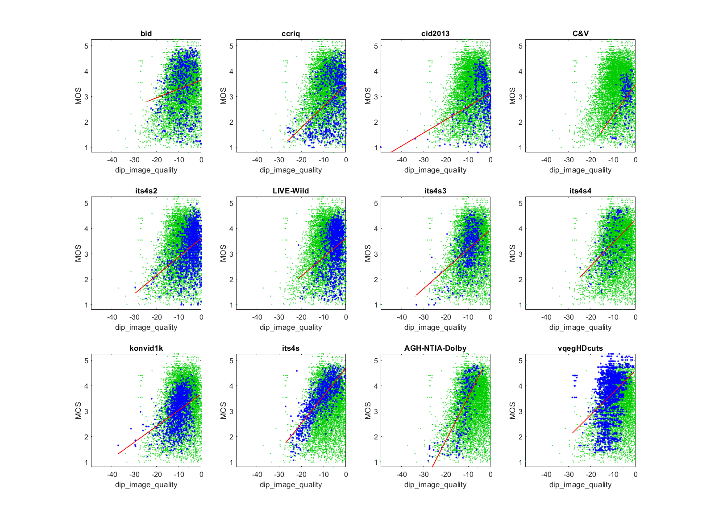

# Report on the quality-discriminable imagepairs inferred quality (dipIQ)

_Go to [Report.md](Report.md) for an introduction to this series of NR metric reports, including their purpose, important warnings, the rating scale, and details of the statistical analysis._ 

Function `nrff_dipIQ.m` implements quality-discriminable image pairs inferred quality (dipIQ) as presented in [[12]](Publications.md). This report compares dipIQ to the MOS using entire datasets, which is contrary to the metric's intended application.  
If dipIQ is used as intended, its accuracy may improve. 

dipIQ has improved performance if interpreted as an RCA metric that detects compression artifacts. [Sawatch Version 3](ReportSawatch.md) includes dipIQ in this capacity. 

Goal|Metric Name|Rating
----|-----------|------
ORD|dipIQ|:question: 
MOS|dipIQ|:star: :star: 
RCA|dipIQ|:star: :star: :star:

__R&D Potential__: 
- Instead of the traditional MOS training data, the dipIQ trained data uses another image quality metric to order images by quality ranking. This training method shows promise for training RCA parameters that detect compression artifacts.
- [[12]](Publications.md) proposes statistics that are suitable for metrics (like dipIQ) that order media by quality discriminability. 

## Algorithm Summary
DipIQ is an opinion-unaware blind image quality (OU-BIQA) metric. The idea is to predict MOS indirectly, using data from full reference (FR) metrics. The FR metric data was fed into a neural network that uses a pairwise learning to rank (L2R) algorithm. Pairwise L2R algorithms assume that the relative quality ranking of two media can be inferred (e.g., from resolution, encoding bit-rate, or in this case FR metric assessments). The training data was based on 840 images and multiple levels of JPEG compression, JPEG200 compression, Gaussian blur, and Gaussian noise. 

## Speed and Conformity

This code took __9×__ as long to run as the benchmark metric, [nrff_blur.m](ReportBlur.md). The number of datasets we analyzed was limited, due to this slow run speed.

In terms of conformity, the code was provided by the authors. 

## Analysis
The authors report 0.957 Pearson correlation between dipIQ and MOS and one of the LIVE datasets (although the authors do not provide a name or reference, this is probably the 2006 LIVE Image Quality Assessment Database [[31]](Publications.md)), 0.949 between dipIQ and MOS for CSIQ [[33]](Publications.md), and 0.894 between dipIQ and MOS for TID2013 [[34]](Publications.md).

The authors also propose criteria for evaluating the ability of a metric to order media by quality discriminability: 
- Pristine/distorted image discriminability test (D-test) 
- Listwise ranking consistency test (L-test)
- Pairwise preference consistency test (P-test). 

The authors provide these performance statistics for the Waterloo dataset [[35]](Publications.md). 

__This report compares dipIQ to the MOS using entire datasets, which is contrary to the metric's intended application.__

This report evaluates dipIQ using six image quality datasets that contain camera impairments. 
Most of the dipIQ scatter plots have a lower triangle shape (i.e., narrow range of values for 
high quality, wide range of values for low quality). We expect this shape when an impairment 
occurs sporadically. 
However, the ITS4S scatter plot describes a scattering of data around a linear fit line, with only a few outliers. Improved understanding of the superior response of dipIQ to the ITS4S dataset may provide valuable insights.  

The low correlations are appropriate for sporadic impairments, and the dipIQ scatter plots show a consistent response for these datasets. Compare the scatter of blue dots (for the current dataset) with the green dots (that show the overall response of all datasets). While some datasets do not fully express the lower triangle shape, their data falls within the lower triangle shape described by all datasets. The metric performance would might improve if it were clipped around -5 (e.g., add 5 and replace values above zero with zero).  

The dipIQ training technique is suitable for RCA parameter development (i.e., implement the dipIQ regimen with a single impairment). See the algorithm summary above for details.

```
bid              corr =  0.16  rmse =  1.00  percentiles [-24.10,-11.43,-8.30,-5.40, 0.00]
ccriq            corr =  0.44  rmse =  0.92  percentiles [-26.33,-9.48,-5.56,-2.91, 0.00]
cid2013          corr =  0.29  rmse =  0.86  percentiles [-49.35,-6.70,-3.96,-1.93, 0.00]
C&V              corr =  0.43  rmse =  0.65  percentiles [-15.56,-5.58,-4.11,-2.84, 0.00]
its4s2           corr =  0.38  rmse =  0.69  percentiles [-29.56,-6.18,-3.91,-2.39, 0.00]
LIVE-Wild        corr =  0.28  rmse =  0.79  percentiles [-21.30,-6.58,-4.84,-3.19, 0.00]
its4s3           corr =  0.43  rmse =  0.69  percentiles [-33.28,-11.12,-8.96,-6.94,-0.58]
its4s4           corr =  0.44  rmse =  0.79  percentiles [-24.76,-13.63,-10.93,-7.83,-0.46]
konvid1k         corr =  0.39  rmse =  0.59  percentiles [-37.17,-12.01,-9.80,-7.95,-0.60]
its4s            corr =  0.81  rmse =  0.46  percentiles [-27.08,-16.05,-11.10,-7.07,-0.13]
AGH-NTIA-Dolby   corr =  0.72  rmse =  0.78  percentiles [-27.97,-14.12,-11.25,-9.10,-3.51]
vqegHDcuts       corr =  0.36  rmse =  0.83  percentiles [-28.28,-13.50,-11.11,-8.98,-0.77]

average          corr =  0.43  rmse =  0.75
pooled           corr =  0.24  rmse =  0.85  percentiles [-49.35,-11.61,-8.26,-4.60, 0.00]
```
