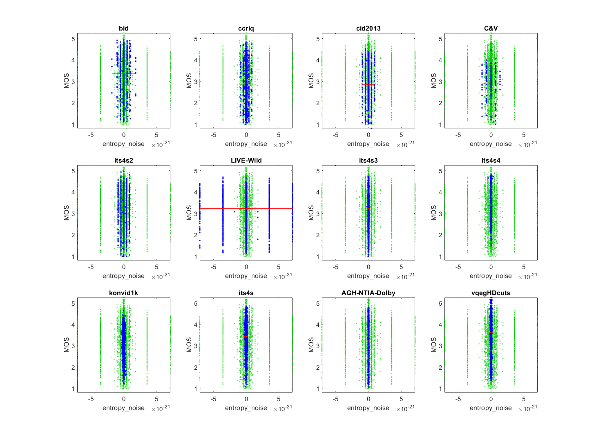

# Report on Entropy Noise

_Go to [Report.md](Report.md) for an introduction to this series of NR metric reports, including their purpose, important warnings, the rating scale, and details of the statistical analysis._ 

Function `nrff_entropy_noise.m` implements an algorithm parameter optimization of denoising algorithms, as presented in [[20]](Publications.md). The authors do not propose a name, so we refer to this algorithm as entropy noise. This algorithm does not work reliably across a broad range of modern camera systems and content. 

Goal | Metric Name|Rating
-----|------------|------
RCA  | entropy_noise | :star:

## Algorithm Summary
The algorithm applies a random scattering transform on each image multiple times. The paper does not propose a specific number of iterations, so we chose 10 iterations. The average entropy of the transformed images is calculated and used as an intermediate value. The other intermediate value is a blur factor, which is the sum of the natural logarithms of the image values plus one, multiplied by a constant whose value was never clearly revealed. We selected an arbitrary value, which may have caused problems. The overall score combines these two values and other ill defined constants.

We did not try other numbers of iterations.   

## Speed and Conformity
Entropy Noise took __8×__ as long to run as the benchmark metric, [nrff_blur.m](ReportBlur.md). 

The speed varies depending on how many times entropy is calculated, but overall it is O(n^2) due to the nested for loop within the transform causing the brunt of the work that the code performs, where n is the number of pixels in the image. 

Conformity of our code is poor. First, the paper scales and rescales images in a fashion that, unfortunately, could not be performed easily with the NRMetricFramework. This step was omitted. Second, the algorithm relies on constants that were either not provided or only partially defined. 

## Analysis
The authors do not provide clear performance claims in [[20]](Publications.md). 

Entropy Noise does not respond well to diverse content and camera impairments. The metric is uncorrelated to MOS. The scatter plots contain a fascinating pattern of extreme symmetry with vertical lines. Also notice that the numbers generated are very small (on the order of 10^-21 to be precise). The conformity issues described above may influence these results. 
```
NRFF Group entropy_noise

--------------------------------------------------------------
1) entropy_noise 
bid              corr = -0.00  rmse =  1.01  false decisions =  35%  percentiles [-0.00,-0.00, 0.00, 0.00, 0.00]
ccriq            corr =  0.00  rmse =  1.02  false decisions =  39%  percentiles [-0.00,-0.00, 0.00, 0.00, 0.00]
cid2013          corr =  0.00  rmse =  0.90  false decisions =  35%  percentiles [-0.00,-0.00, 0.00, 0.00, 0.00]
C&V              corr =  0.00  rmse =  0.72  false decisions =  30%  percentiles [-0.00,-0.00, 0.00, 0.00, 0.00]
its4s2           corr =  0.00  rmse =  0.74  false decisions =  31%  percentiles [-0.00,-0.00, 0.00, 0.00, 0.00]
LIVE-Wild        corr = -0.00  rmse =  0.82  false decisions =  32%  percentiles [-0.00,-0.00, 0.00, 0.00, 0.00]
its4s3           corr = -0.00  rmse =  0.76  false decisions =  32%  percentiles [-0.00,-0.00, 0.00, 0.00, 0.00]
its4s4           corr = -0.00  rmse =  0.88  false decisions =  35%  percentiles [-0.00,-0.00,-0.00, 0.00, 0.00]
konvid1k         corr = -0.00  rmse =  0.64  false decisions =  29%  percentiles [-0.00,-0.00,-0.00, 0.00, 0.00]
its4s            corr = -0.00  rmse =  0.77  false decisions =  33%  percentiles [-0.00,-0.00, 0.00, 0.00, 0.00]
AGH-NTIA-Dolby   corr =  0.00  rmse =  1.13  false decisions =  37%  percentiles [-0.00,-0.00,-0.00, 0.00, 0.00]
vqegHDcuts       corr = -0.00  rmse =  0.89  false decisions =  33%  percentiles [-0.00,-0.00, 0.00, 0.00, 0.00]

average          corr = -0.00  rmse =  0.86
pooled           corr = -0.00  rmse =  0.88  percentiles [-0.00,-0.00, 0.00, 0.00, 0.00]

```



