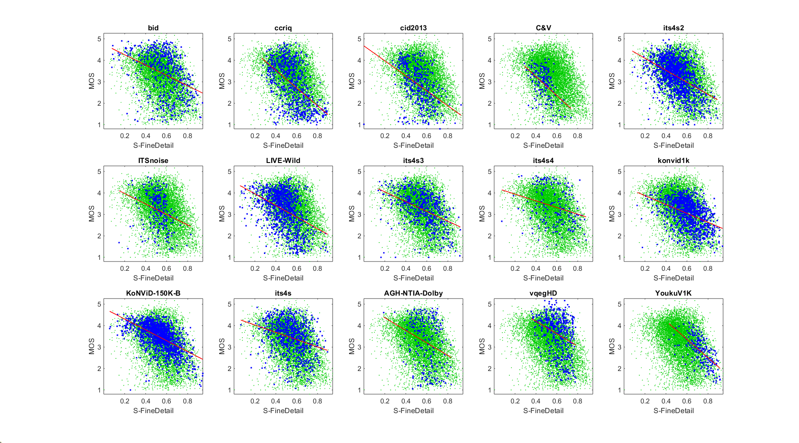
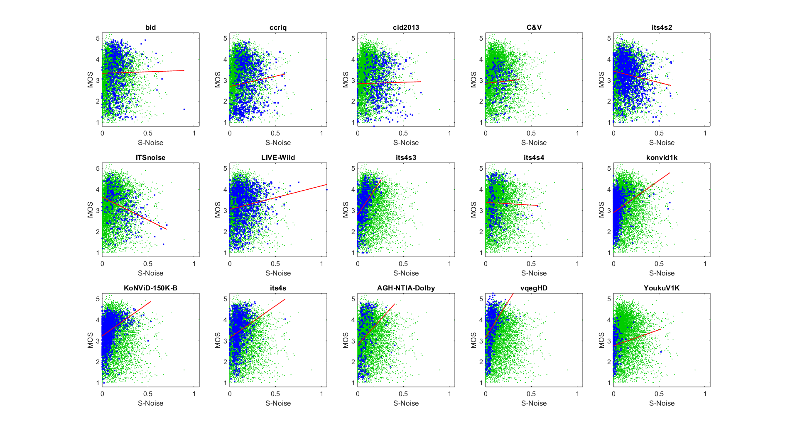
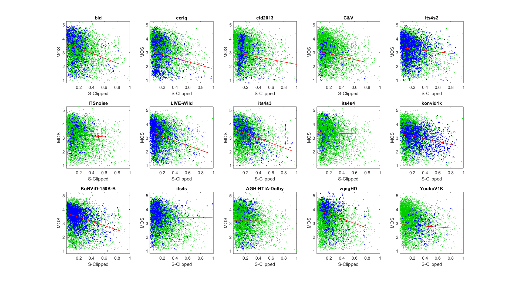
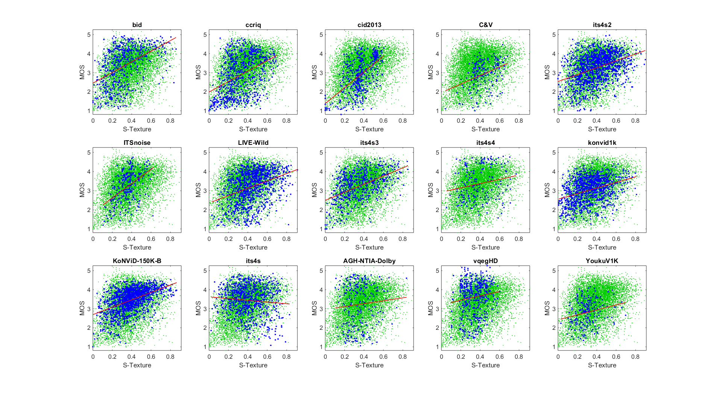

# Report on S-FineDetail

_This is a self-assessment._

_Go to [Report.md](Report.md) for an introduction to this series of NR metric reports, including their purpose, important warnings, the rating scale, and details of the statistical analysis._ 

Function `nrff_fine_detail.m` assesses impairments related to the lack of fine detail. The S-FineDetail metric is accurate enough to be included in NR Metric [Sawatch](ReportSawatch.md). 

Goal|Metric Name|Rating
----|-----------|------
RCA|S-FineDetail|:star: :star: :star:
RCA|S-Noise|:star: :star:
RCA|S-Clipped|:star: :star: :star:
RCA|S-Texture|:star: :star: :star:

## Algorithm Summary

Function `nrff_fine_detail.m` compares small edges in the luma plane with large edges in the luma plane. These edge filters are (5×5) and (15×15) respectively. 

S-FineDetail compares (5×5) and (15×15) edges using Pearson correlation. High values for this parameter (near one) indicate that all small edges are pieces of larger edges. This could indicate up-sampling, too aggressive noise filtering, or low bit-rate compression that erased fine details.
The edge filter is a variant of the Sobel filter that was developed by NTIA to detect larger edges than the popular (3×3) edge filters (e.g., Sobel, Laplacian). See function `filter_si_hv_adapt.m`.

S-Noise measures noise in the luma plane that is visible in very smooth areas of the image. 
S-Noise selects the 5% of pixels with lowest levels of (15×15) edge energy. These are the smoothest areas, with respect to large edges.
Because the smoothness of these areas differs among images, S-Noise includes a normalization factor based on average value of these (15×15) edges.
Using those pixels, S-Noise examines the average (5×5) edge envergy, divided by the average (15×15) edge envergy. 
To avoid divide by zero, the denominator is clipped at a minimum of 1.0.
The result is divided by 20 to put the RCA metric on a [0..1] scale, based on observed values from multiple datasets. 

S-Clipped measures the fraction of the image that is completely flat and featureless.
S-Clipped calculates the fraction of pixels here the these (15×15) edge energy is less than 1.0. 
The square root is taken to remove nonlinearities.
Like the Sobel filter, the (15×15) SI filter has a four times multiplier, so only extremely flat areas are detected. 

S-Texture is a heuristic based on the strength of large edges in images that receive high quality ratings. 
Histograms of camera impairment datasets indicate that high quality images have a high fraction of (5×5) edges with magnitudes between 64 and 128, and low quality images have lower fractions of such edges.
S-Texture calculates the fraction of pixels where the (5×5) edge energy is between 64 and 128.
The square root is taken to remove nonlinearities. The result is multiplied by two to put the value on a [0..1] scale. 
Unlike S-FineDetail, S-Noise, and S-Clipped, zero indicates low quality and one indicates high quality. Therefore, the weight in Sawatch is negative instead of positive. 

## Speed and Conformity
S-FineDetail runs __1×__ as long to run as the benchmark metric, [nrff_blur.m](ReportBlur.md).

Speed is constrained by the edge filter, which contains symmetries that enable faster calculation. Thus, Fine Detail is O(nm), where n is the number of pixels and m is the size of the larger edge filter (15). Investigations around 2005 concluded that the (13×13) filter could be implemented in real time.  

Function `nrff_fine_detail.m` was initially provided by this repository, so conformity is ensured. 

## Analysis

This analysis uses three types of datasets:
* Image quality datasets with camera impairments (BID, CCRIQ, CID2013, C&V, ITS4S2, ITSnoise, and LIVE-Wild)
* Video quality datasets with camera impairments (ITS4S3, ITS4S4, KonViD-1K, and KoNViD-150K-B)
* Video quality datasets with broadcast content and compression (ITS4S, AGH-NTIA-Dolby, vqegHD, and YoukuV1K) 

The S-FineDetail scatter plots show a loose distribution of points around a fit line that is fairly consistent across the diverse datasets. Compare the scatter of blue dots (for the current dataset) with the green dots (that show the overall response of all datasets). We expect this shape when an impairment is a major factor for all datasets.

```text
1) S-FineDetail 
bid              corr =  0.378  rmse =  0.94  false decisions =  49%  percentiles [ 0.08, 0.48, 0.58, 0.68, 0.94]
ccriq            corr =  0.534  rmse =  0.86  false decisions =  53%  percentiles [ 0.27, 0.47, 0.55, 0.65, 0.90]
cid2013          corr =  0.441  rmse =  0.81  false decisions =  51%  percentiles [ 0.00, 0.42, 0.52, 0.59, 0.93]
C&V              corr =  0.474  rmse =  0.63  false decisions =  42%  percentiles [ 0.29, 0.42, 0.48, 0.52, 0.73]
its4s2           corr =  0.472  rmse =  0.66  false decisions =  44%  percentiles [ 0.08, 0.42, 0.49, 0.58, 0.89]
ITSnoise         corr =  0.277  rmse =  0.77  false decisions =  44%  percentiles [ 0.15, 0.48, 0.52, 0.57, 0.83]
LIVE-Wild        corr =  0.425  rmse =  0.74  false decisions =  44%  percentiles [ 0.06, 0.40, 0.48, 0.55, 0.90]
its4s3           corr =  0.447  rmse =  0.68  false decisions =  46%  percentiles [ 0.14, 0.46, 0.58, 0.67, 0.92]
its4s4           corr =  0.267  rmse =  0.85  false decisions =  43%  percentiles [ 0.07, 0.47, 0.58, 0.69, 0.88]
konvid1k         corr =  0.415  rmse =  0.58  false decisions =  41%  percentiles [ 0.13, 0.53, 0.61, 0.70, 0.94]
KoNViD-150K-B    corr =  0.567  rmse =  0.50  false decisions =  42%  percentiles [ 0.06, 0.45, 0.54, 0.62, 0.94]
its4s            corr =  0.295  rmse =  0.74  false decisions =  42%  percentiles [ 0.07, 0.46, 0.56, 0.64, 0.90]
AGH-NTIA-Dolby   corr =  0.279  rmse =  1.08  false decisions =  45%  percentiles [ 0.19, 0.51, 0.59, 0.66, 0.83]
vqegHD           corr =  0.306  rmse =  0.85  false decisions =  42%  percentiles [ 0.36, 0.54, 0.61, 0.67, 0.78]
YoukuV1K         corr =  0.618  rmse =  0.51  false decisions =  50%  percentiles [ 0.43,  NaN,  NaN,  NaN,  NaN]

average          corr =  0.413  rmse =  0.75
pooled           corr =  0.393  rmse =  0.76  percentiles [ 0.00, 0.46, 0.56, 0.66,  NaN]
```


The S-Noise scatter plots show a messy pattern that is very difficult to analyze. 
The performance of S-Noise is best understood by applying `residual_NRpars.m`.
This allowed the comparison between S-Noise and Sawatch version 3, which showed poor performance on camera noise impairments.

On datasets without camera capture noise (e.g., ITS4S3,  ITS4S, AGH-NTIA-Dolby, and vqegHD), S-Noise has overall low values but false positives (type 1 errors) that detect fine detail in high quality images. See the wider spread of blue dots abovwe MOS=4 for these datasets.

On datasets with camera capture noise, S-Noise has a lower triangle shape (i.e., narrow range of values for high quality, wide range of values for low quality). 
See datasets CCRIQ, CID2013, ITS4S2, LIVE-Wild, and especially ITSnoise. 
We expect this shape when an impairment occurs sporadically.
```text
2) S-Noise 
bid              corr =  0.014  rmse =  1.01  false decisions =  34%  percentiles [ 0.00, 0.11, 0.15, 0.20, 0.89]
ccriq            corr =  0.106  rmse =  1.01  false decisions =  32%  percentiles [ 0.00, 0.11, 0.17, 0.25, 0.61]
cid2013          corr =  0.020  rmse =  0.90  false decisions =  34%  percentiles [ 0.00, 0.15, 0.22, 0.30, 0.69]
C&V              corr =  0.058  rmse =  0.72  false decisions =  29%  percentiles [ 0.00, 0.09, 0.14, 0.20, 0.37]
its4s2           corr =  0.150  rmse =  0.74  false decisions =  34%  percentiles [ 0.00, 0.09, 0.14, 0.21, 0.63]
ITSnoise         corr =  0.364  rmse =  0.74  false decisions =  45%  percentiles [ 0.00, 0.10, 0.17, 0.28, 0.70]
LIVE-Wild        corr =  0.156  rmse =  0.81  false decisions =  28%  percentiles [ 0.00, 0.07, 0.13, 0.21, 1.06]
its4s3           corr =  0.447  rmse =  0.68  false decisions =  17%  percentiles [ 0.00, 0.03, 0.06, 0.09, 0.26]
its4s4           corr =  0.026  rmse =  0.88  false decisions =  34%  percentiles [ 0.01, 0.06, 0.09, 0.14, 0.57]
konvid1k         corr =  0.248  rmse =  0.62  false decisions =  21%  percentiles [ 0.00, 0.01, 0.03, 0.05, 0.62]
KoNViD-150K-B    corr =  0.329  rmse =  0.57  false decisions =  16%  percentiles [ 0.00, 0.04, 0.06, 0.09, 0.53]
its4s            corr =  0.243  rmse =  0.75  false decisions =  24%  percentiles [ 0.00, 0.06, 0.09, 0.13, 0.61]
AGH-NTIA-Dolby   corr =  0.285  rmse =  1.08  false decisions =  24%  percentiles [ 0.00, 0.04, 0.08, 0.12, 0.41]
vqegHD           corr =  0.371  rmse =  0.83  false decisions =  20%  percentiles [ 0.00, 0.04, 0.06, 0.09, 0.38]
YoukuV1K         corr =  0.117  rmse =  0.65  false decisions =  26%  percentiles [ 0.00,  NaN,  NaN,  NaN,  NaN]

average          corr =  0.195  rmse =  0.80
pooled           corr =  0.030  rmse =  0.82  percentiles [ 0.00, 0.05, 0.10, 0.19,  NaN]
```


The S-Clipped scatter plots show a lower triangle shape (i.e., narrow range of values for high quality, wide range of values for low quality). 
We expect this shape when an impairment occurs sporadically.

S-Clipped shows consistent performance for all of the camera impairment datasets (i.e., BID, CID2013, C&V, ITS4S2, ITSnoise, LIVE-Wild, ITS4S3, ITS4S4, KoNViD1K, and KoNViD-150K-B).
S-Clipped show worse performance for the broadcast and compression datasets (ITS4S, AGH-NTIA-Dolby, vqegHD, and YoukuV1K).
These datasets contain post-processing overlays and animation, where large flat areas may be intentionally added during editing or animation.

```text
3) S-Clipped 
bid              corr =  0.250  rmse =  0.98  false decisions =  44%  percentiles [ 0.01, 0.08, 0.15, 0.24, 0.82]
ccriq            corr =  0.177  rmse =  1.00  false decisions =  39%  percentiles [ 0.03, 0.10, 0.15, 0.23, 0.97]
cid2013          corr =  0.127  rmse =  0.89  false decisions =  33%  percentiles [ 0.07, 0.11, 0.15, 0.23, 1.00]
C&V              corr =  0.188  rmse =  0.70  false decisions =  32%  percentiles [ 0.05, 0.10, 0.15, 0.25, 0.76]
its4s2           corr =  0.096  rmse =  0.74  false decisions =  34%  percentiles [ 0.01, 0.09, 0.15, 0.25, 0.88]
ITSnoise         corr =  0.042  rmse =  0.80  false decisions =  31%  percentiles [ 0.04, 0.10, 0.15, 0.24, 0.72]
LIVE-Wild        corr =  0.256  rmse =  0.79  false decisions =  40%  percentiles [ 0.01, 0.05, 0.09, 0.18, 0.91]
its4s3           corr =  0.418  rmse =  0.69  false decisions =  45%  percentiles [ 0.02, 0.13, 0.21, 0.32, 0.94]
its4s4           corr =  0.016  rmse =  0.88  false decisions =  33%  percentiles [ 0.03, 0.10, 0.16, 0.24, 0.65]
konvid1k         corr =  0.284  rmse =  0.62  false decisions =  37%  percentiles [ 0.01, 0.17, 0.26, 0.42, 0.89]
KoNViD-150K-B    corr =  0.349  rmse =  0.57  false decisions =  36%  percentiles [ 0.01, 0.09, 0.15, 0.24, 0.84]
its4s            corr =  0.001  rmse =  0.77  false decisions =  32%  percentiles [ 0.01, 0.07, 0.13, 0.21, 0.99]
AGH-NTIA-Dolby   corr =  0.001  rmse =  1.13  false decisions =  36%  percentiles [ 0.02, 0.14, 0.22, 0.29, 0.46]
vqegHD           corr =  0.255  rmse =  0.86  false decisions =  41%  percentiles [ 0.05, 0.14, 0.19, 0.29, 0.78]
YoukuV1K         corr =  0.068  rmse =  0.65  false decisions =  33%  percentiles [ 0.05,  NaN,  NaN,  NaN,  NaN]

average          corr =  0.169  rmse =  0.80
pooled           corr =  0.214  rmse =  0.80  percentiles [ 0.01, 0.10, 0.17, 0.30,  NaN]
```


The S-Texture scatter plots show an upper triangle shape (i.e., wide range of values for high quality, narrow range of values for low quality). 
We expect this shape when the NR metric detects a characteristic of some (but not all) high quality videos.

S-Texture shows consistently good performance for all of the camera impairment datasets (BID, CID2013, C&V, ITS4S2, ITSnoise, LIVE-Wild, ITS4S3, ITS4S4, KoNViD1K, and KoNViD-150K-B).
S-Texture was trained to assess this natural camera capture behavior. 

The performance of S-Texture drops for broadcast application datasets (ITS4S, AGH-NTIA-Dolby, vqegHD, and YoukuV1K). 
This happens because professional videographers often "break the rules" and produce high quality media with characteristics that normally indicate low quality.

This dichotomy demonstrates the difficulty in developing a single NR metric that works for both user generated content (UGC) and broadcast applications. 
In [Video Quality Experts Group](https://vqeg.org/) meetings, broadcasters stated that they want NR metrics to ignore aesthetics and and some camera impairments. These factors are considered "artistic intent" and not impairments. 
However, UGC datasets produce MOSs that are confounded by aesthetics and camera impairments.
NR metrics trained on UGC datasets must assess these factors to achieve good performance.  

[Metric Sawatch version 4](ReportSawatch.md) addresses this problem by allowing users to remove the impact of S-Texture on the overall MOS estimation, by changing the parameter weight to zero. 
See RCA metric [MunsellRed](ReportMunsellRed.md) for another example of the broadcast vs UGC dichotomy.
```text
4) S-Texture 
bid              corr =  0.478  rmse =  0.89  false decisions =  20%  percentiles [ 0.00, 0.20, 0.29, 0.41, 0.86]
ccriq            corr =  0.415  rmse =  0.93  false decisions =  23%  percentiles [ 0.00, 0.21, 0.32, 0.44, 0.71]
cid2013          corr =  0.576  rmse =  0.74  false decisions =  18%  percentiles [ 0.00, 0.29, 0.35, 0.44, 0.60]
C&V              corr =  0.364  rmse =  0.67  false decisions =  20%  percentiles [ 0.04, 0.35, 0.41, 0.53, 0.68]
its4s2           corr =  0.400  rmse =  0.68  false decisions =  19%  percentiles [ 0.00, 0.28, 0.40, 0.52, 0.90]
ITSnoise         corr =  0.497  rmse =  0.69  false decisions =  18%  percentiles [ 0.11, 0.29, 0.36, 0.41, 0.63]
LIVE-Wild        corr =  0.367  rmse =  0.76  false decisions =  21%  percentiles [ 0.03, 0.35, 0.44, 0.55, 0.91]
its4s3           corr =  0.507  rmse =  0.65  false decisions =  17%  percentiles [ 0.00, 0.20, 0.33, 0.47, 0.85]
its4s4           corr =  0.196  rmse =  0.86  false decisions =  28%  percentiles [ 0.05, 0.26, 0.37, 0.51, 0.77]
konvid1k         corr =  0.351  rmse =  0.60  false decisions =  19%  percentiles [ 0.01, 0.21, 0.32, 0.43, 0.81]
KoNViD-150K-B    corr =  0.489  rmse =  0.53  false decisions =  13%  percentiles [ 0.00, 0.30, 0.39, 0.50, 0.86]
its4s            corr =  0.093  rmse =  0.77  false decisions =  34%  percentiles [ 0.02, 0.30, 0.39, 0.52, 0.83]
AGH-NTIA-Dolby   corr =  0.085  rmse =  1.12  false decisions =  34%  percentiles [ 0.10, 0.25, 0.33, 0.41, 0.84]
vqegHD           corr =  0.132  rmse =  0.88  false decisions =  29%  percentiles [ 0.10, 0.25, 0.34, 0.41, 0.60]
YoukuV1K         corr =  0.224  rmse =  0.64  false decisions =  23%  percentiles [ 0.03,  NaN,  NaN,  NaN,  NaN]

average          corr =  0.345  rmse =  0.76
pooled           corr =  0.350  rmse =  0.77  percentiles [ 0.00, 0.27, 0.38, 0.51,  NaN]
```


