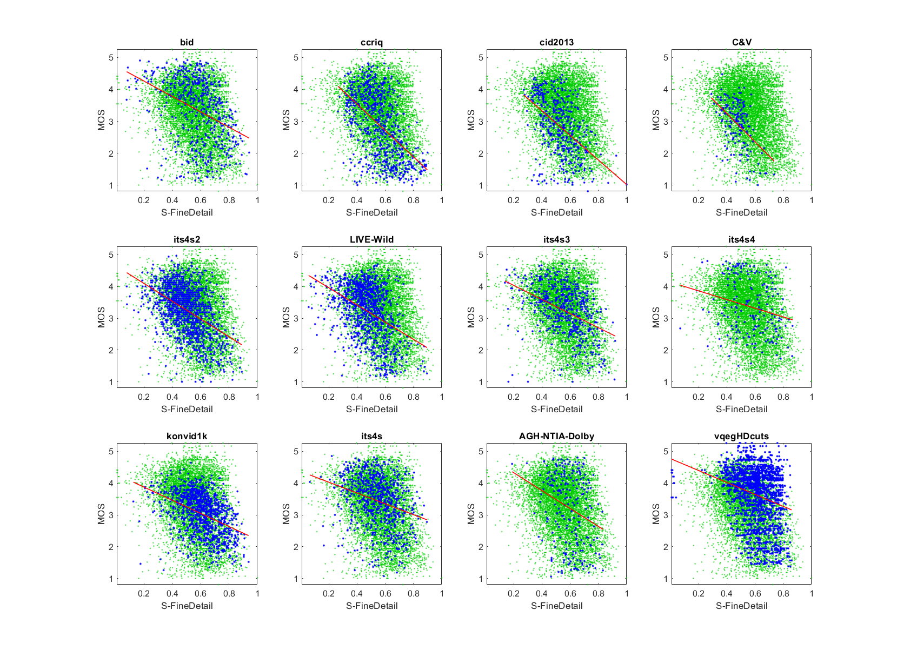

# Report on Fine Detail

_This is a self-assessment._

_Go to [Report.md](Report.md) for an introduction to this series of NR metric reports, including their purpose, important warnings, the rating scale, and details of the statistical analysis._ 

Function `nrff_fine_detail.m` assesses impairments related to the lack of fine detail. The Fine Detail metric is accurate enough to be included in NR Metric [Sawatch](ReportSawatch.md). 

Goal|Metric Name|Rating
----|-----------|------
RCA|Fine Detail|:star: :star: :star:

## Algorithm Summary

Function `nrff_fine_detail.m` compares small edges in the luma plane with large edges in the luma plane. These edge filters are (5×5) and (15×15) respectively. The comparison is made using Pearson correlation. High values for this parameter (near one) indicate that all small edges are pieces of larger edges. This could indicate up-sampling, too aggressive noise filtering, or low bit-rate compression that erased fine details.
The edge filter is a variant of the Sobel filter that was developed by  NTIA to detect larger edges than the popular (3×3) edge filters (e.g., Sobel, Laplacian). See function `filter_si_hv_adapt.m`.

## Speed and Conformity
Function `nrff_fine_detail.m` was initially provided by this repository, so conformity is ensured. Fine Detail runs as fast as [nrff_blur.m](ReportBlur.md), which is approximately O(n).

Speed is constrained by the edge filter, which contains symmetries that enable faster calculation. Thus, Fine Detail is O(nm), where n is the number of pixels and m is the size of the larger edge filter (15). Investigations around 2005 concluded that this filter could be implemented in real time.  

## Analysis

The NR Parameter Fine Detail is evaluated using three types of datasets:
* Image quality datasets with camera impairments (BID, CCRIQ, CID2013, C&V, ITS4S2, and LIVE-Wild)
* Video quality datasets with camera impairments (ITS4S3, ITS4S4, and KonViD-1K)
* Simulated adaptive streaming, at broadcast bit-rates (ITS4S) 

The Fine Detail scatter plots show a loose distribution of points around a fit line that is fairly consistent across the diverse datasets. Compare the scatter of blue dots (for the current dataset) with the green dots (that show the overall response of all datasets). We expect this shape when an impairment is a major factor for all datasets.

```text

1) FineDetail 
bid              corr =  0.38  rmse =  0.94  percentiles [ 0.08, 0.48, 0.58, 0.68, 0.94]
ccriq            corr =  0.53  rmse =  0.86  percentiles [ 0.27, 0.47, 0.55, 0.65, 0.90]
cid2013          corr =  0.49  rmse =  0.79  percentiles [ 0.27, 0.43, 0.52, 0.59, 1.00]
C&V              corr =  0.47  rmse =  0.63  percentiles [ 0.29, 0.42, 0.48, 0.52, 0.73]
its4s2           corr =  0.47  rmse =  0.66  percentiles [ 0.08, 0.42, 0.49, 0.58, 0.89]
LIVE-Wild        corr =  0.42  rmse =  0.74  percentiles [ 0.06, 0.40, 0.48, 0.55, 0.90]
its4s3           corr =  0.43  rmse =  0.68  percentiles [ 0.14, 0.46, 0.58, 0.67, 0.92]
its4s4           corr =  0.23  rmse =  0.86  percentiles [ 0.07, 0.47, 0.57, 0.69, 0.87]
konvid1k         corr =  0.42  rmse =  0.58  percentiles [ 0.13, 0.53, 0.61, 0.70, 0.94]
its4s            corr =  0.30  rmse =  0.74  percentiles [ 0.07, 0.46, 0.56, 0.64, 0.90]

average          corr =  0.41  rmse =  0.75
pooled           corr =  0.40  rmse =  0.76  percentiles [ 0.06, 0.44, 0.54, 0.63, 1.00]
```


