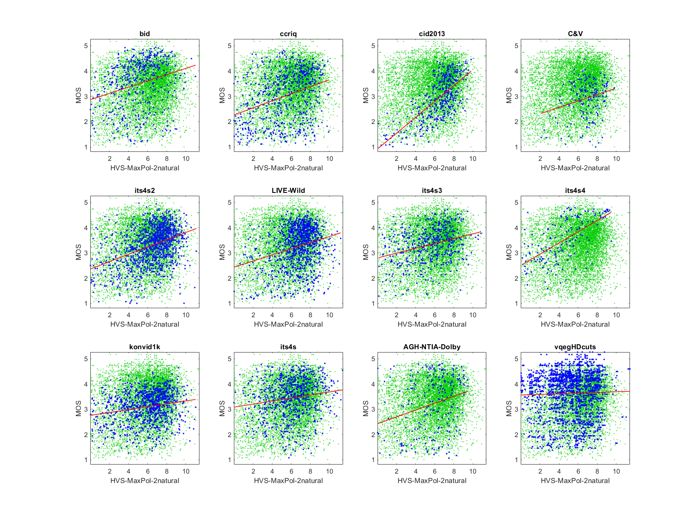
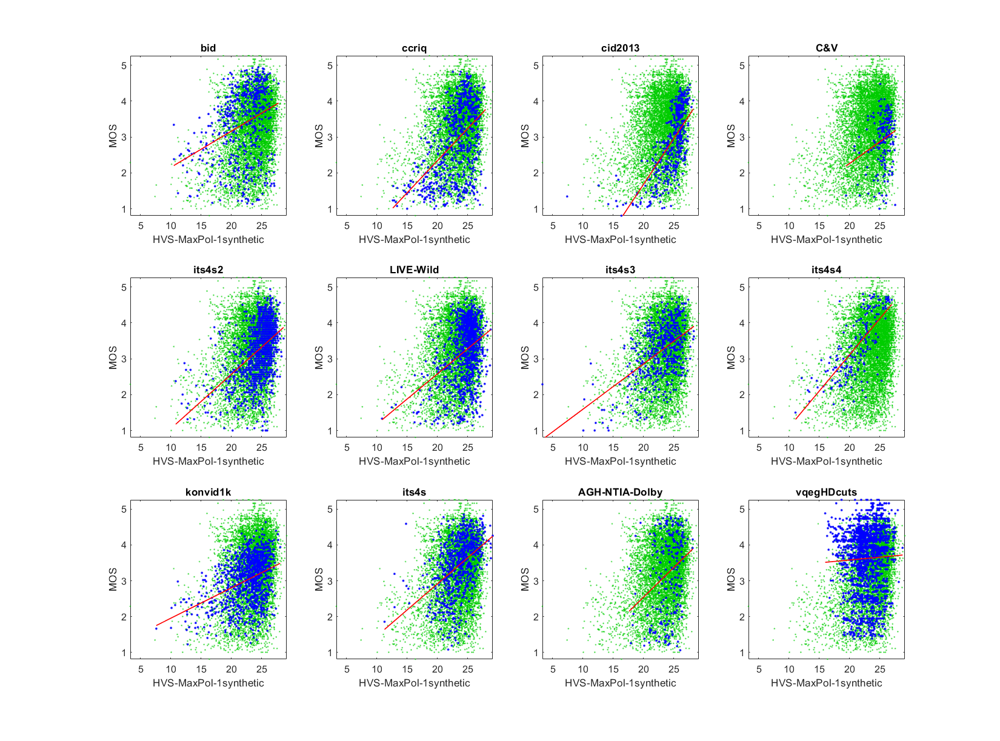

# Report on HVS-MaxPol

_Go to [Report.md](Report.md) for an introduction to this series of NR metric reports, including their purpose, important warnings, the rating scale, and details of the statistical analysis._ 

Function `nrff_HVSMaxPol.m` implements the Human Visual System MaxPol (HVS-MaxPol) metrics, as presented in [[21]](Publications.md). This NR metric assesses image sharpness. While one of the four variants did not work reliably across a broad range of modern camera systems and video content, the other three show promise. 

Goal | Metric Name|Rating
-----|------------|------
RCA  | HVS-MaxPol-1natural | :star: :star: 
RCA  | HVS-MaxPol-2natural | :star:   
RCA  | HVS-MaxPol-1synthetic | :star: :star: 
RCA  | HVS-MaxPol-2synthetic | :star: :star:  

__R&D Potential__: 

- Our assessment of HVS-MaxPol-1natural, HVS-MaxPol-1synthetic, and HVS-MaxPol-2synthethic would be updated to :star: :star: :star: if the cause of code failures and extreme outlier values were identified and eliminated. See the Speed and Conformity section for details.

- The authors of HVS-MaxPol [[21]](Publications.md) use seven datasets to analyze NR metrics. Their analysis technique has value for future NR metric research. 

## Algorithm Summary
The algorithm starts by setting parameters and weight values based on the type value used. Per the author's demonstration program, we implemented both the _natural_ and _synthetic_ blur types, to get a broader look at the how the algorithm performs in its different types. The algorithm then checks the background of the image by filtering the darker values out of the image and labelling each value as 1 or 0 corresponding to true or false. The image is then filtered twice using the _symmetric_ and _conv_ parameters in MATLAB® `imfilter.m` function. These images are then filtered using the binary true-false _background_ values that were calculated previously. 

After this, the two filtered forms of the image are combined into a probability density function (PDF), and a cumulative distribution function (CDF) is calculated from that PDF. Various minor calculations involving a basic sigma approximation and the hyperbolic tangent function are made to generate a feature map of the image. The central moment statistic is then taken from that feature map and the negative base ten logarithm of that moment value is taken to generate an unweighted statistic and is then multiplied by weight values that depend on the form (_synthetic_ or _natural_).

Function `nrff_HVSMaxPol.m` produces four variants of the HVSMaxPol NR metric. HVS-MaxPol-1natural and HVS-MaxPol-2natural are _natural_, while HVS-MaxPol-1synthetic and HVS-MaxPol-2synthethic are _synthetic_. HVS-MaxPol-1natural and HVS-MaxPol-1synthetic use one kernel, while HVS-MaxPol-2natural and HVS-MaxPol-2synthetic use two kernels. The authors describe the kernel parameter as "the number of kernels used for focus quality measure." See [[21]](Publications.md) or the author supplied code for details.

## Speed and Conformity
HVS-MaxPol took __3×__ times as long to run as the benchmark metric, [nrff_blur.m](ReportBlur.md).

In terms of Big-O notation, HVS-MaxPol runs in O(n) time since each image is filtered about 12 times and various other O(n) calculations are also used in this algorithm. 

The algorithm was conformed with in nearly every aspect (i.e., the author supplied MATLAB code that ran without modification). Occasionally, the algorithm returns an extreme outlier (e.g., -100). We replaced these values with NaN, so that these outliers would not overwhelm the other analyses.

The HVS-MaxPol code occasionally produces an error. The values for these media are also replaced with NaN.

## Analysis

In [[21]](Publications.md), the authors provide an overall assessment of these four NR metrics. Seven datasets are used for this analysis: 2006 LIVE Image Quality Assessment Database [[31]](Publications.md), CSIQ [[33]](Publications.md), TID2008 Dataset [[32]](Publications.md), TID2013 [[34]](Publications.md), BID [[37]](Publications.md), CID2013 [[38]](Publications.md), and FocusPath [[36]](Publications.md). 

Metric | Pearson Correlation
-------|--------------------
HVS-MaxPol-1natural | 0.6663
HVS-MaxPol-2natural | 0.9266
HVS-MaxPol-1synthetic | 0.7059
HVS-MaxPol-2synthetic | 0.9253

Our analysis of the BID and CID2013 datasets differs slightly from [[21]](Publications.md), because our analyses only use 90% of the media in each dataset. The remaining 10% of media are set aside to verify metrics developed using the NRMetricFramework. See [Training vs Verification](DatasetStructure.md) for details.  

This report evaluates HVS-MaxPol using six image quality datasets that contain camera impairments. 
HVS-MaxPol-1natural, HVS-MaxPol-1synthetic, and HVS-MaxPol-2synthetic are nearly identical, yielding cross correlations (to each other) between 0.98 and 0.99. Their scatter plots have a lower triangle shape (i.e., narrow range of values for high quality, wide range of values for low quality). We expect this shape when an impairment occurs sporadically. This meets our expectations for a sharpness metric. 

HVS-MAxPol-2natural is very inaccurate for camera capture.  
```
NRFF Group HVS-MaxPol

--------------------------------------------------------------
1) HVS-MaxPol-1natural 
bid              corr =  0.36  rmse =  0.95  percentiles [ 5.17,10.80,12.22,13.46,15.86]
ccriq            corr =  0.53  rmse =  0.87  percentiles [ 5.82,11.49,12.97,13.98,15.76]
cid2013          corr =  0.73  rmse =  0.61  percentiles [ 3.45,12.90,14.09,14.61,  NaN]
C&V              corr =  0.30  rmse =  0.69  percentiles [10.43,13.79,14.29,14.79,15.61]
its4s2           corr =  0.51  rmse =  0.64  percentiles [ 5.33,13.02,13.98,14.62,16.29]
LIVE-Wild        corr =  0.38  rmse =  0.76  percentiles [ 5.57,13.34,14.08,14.55,16.48]
its4s3           corr =  0.51  rmse =  0.65  percentiles [ 0.69,11.56,12.97,13.92,16.21]
its4s4           corr =  0.73  rmse =  0.60  percentiles [ 5.35,10.02,11.87,12.75,15.11]
konvid1k         corr =  0.39  rmse =  0.59  percentiles [ 3.29,11.62,12.98,13.75,16.07]
its4s            corr =  0.43  rmse =  0.69  percentiles [ 5.27,11.97,13.08,14.01,  NaN]
AGH-NTIA-Dolby   corr =  0.28  rmse =  1.08  percentiles [ 8.96,12.46,13.43,14.31,  NaN]
vqegHDcuts       corr =  0.03  rmse =  0.89  percentiles [ 8.25,11.52,12.50,13.49,  NaN]

average          corr =  0.43  rmse =  0.75
pooled           corr =  0.30  rmse =  0.84  percentiles [ 0.69,11.90,13.23,14.17,  NaN]


--------------------------------------------------------------
2) HVS-MaxPol-2natural 
bid              corr =  0.27  rmse =  0.94  percentiles [ 0.01, 3.87, 5.53, 7.52,  NaN]
ccriq            corr =  0.34  rmse =  0.92  percentiles [ 0.01, 4.09, 6.21, 7.88,  NaN]
cid2013          corr =  0.69  rmse =  0.61  percentiles [ 0.08, 5.79, 7.01, 7.76,  NaN]
C&V              corr =  0.25  rmse =  0.69  percentiles [ 2.14, 6.17, 6.93, 7.84, 9.80]
its4s2           corr =  0.40  rmse =  0.66  percentiles [ 0.02, 5.53, 6.95, 7.99,  NaN]
LIVE-Wild        corr =  0.27  rmse =  0.77  percentiles [ 0.02, 5.89, 6.98, 7.86,  NaN]
its4s3           corr =  0.32  rmse =  0.65  percentiles [ 0.14, 4.22, 6.01, 7.55,  NaN]
its4s4           corr =  0.64  rmse =  0.66  percentiles [ 0.16, 2.85, 4.99, 7.53,  NaN]
konvid1k         corr =  0.20  rmse =  0.60  percentiles [ 0.03, 4.78, 6.52, 7.83,  NaN]
its4s            corr =  0.16  rmse =  0.76  percentiles [ 0.00, 4.92, 6.25, 7.47,  NaN]
AGH-NTIA-Dolby   corr =  0.26  rmse =  1.09  percentiles [ 0.01, 4.43, 6.35, 7.53,  NaN]
vqegHDcuts       corr =  0.03  rmse =  0.88  percentiles [ 0.02, 3.84, 5.68, 7.14,  NaN]

average          corr =  0.32  rmse =  0.77
pooled           corr =  0.19  rmse =  0.83  percentiles [ 0.00, 4.62, 6.37, 7.68,  NaN]


--------------------------------------------------------------
3) HVS-MaxPol-1synthetic 
bid              corr =  0.33  rmse =  0.96  percentiles [10.51,20.07,22.55,24.36,27.79]
ccriq            corr =  0.51  rmse =  0.88  percentiles [12.64,21.49,23.68,25.21,27.97]
cid2013          corr =  0.69  rmse =  0.65  percentiles [ 7.41,23.89,25.48,26.17,  NaN]
C&V              corr =  0.24  rmse =  0.70  percentiles [19.43,24.97,25.78,26.42,27.61]
its4s2           corr =  0.48  rmse =  0.65  percentiles [10.82,23.84,25.21,26.12,28.63]
LIVE-Wild        corr =  0.36  rmse =  0.76  percentiles [10.87,23.93,25.13,25.91,28.79]
its4s3           corr =  0.51  rmse =  0.65  percentiles [ 3.33,21.46,23.60,25.08,28.32]
its4s4           corr =  0.74  rmse =  0.59  percentiles [11.08,19.05,21.90,23.40,26.97]
konvid1k         corr =  0.39  rmse =  0.59  percentiles [ 7.62,21.30,23.41,24.63,28.08]
its4s            corr =  0.45  rmse =  0.69  percentiles [11.28,22.08,23.79,25.34,  NaN]
AGH-NTIA-Dolby   corr =  0.29  rmse =  1.08  percentiles [17.63,22.91,24.37,25.60,  NaN]
vqegHDcuts       corr =  0.04  rmse =  0.89  percentiles [15.99,21.54,22.83,24.41,  NaN]

average          corr =  0.42  rmse =  0.76
pooled           corr =  0.29  rmse =  0.84  percentiles [ 3.33,21.96,23.98,25.45,  NaN]


--------------------------------------------------------------
4) HVS-MaxPol-2synthetic 
bid              corr =  0.31  rmse =  0.96  percentiles [ 3.78, 6.50, 7.23, 7.75, 8.69]
ccriq            corr =  0.51  rmse =  0.87  percentiles [ 4.47, 6.95, 7.56, 8.03, 8.74]
cid2013          corr =  0.70  rmse =  0.64  percentiles [ 3.27, 7.58, 8.07, 8.29,  NaN]
C&V              corr =  0.27  rmse =  0.69  percentiles [ 6.35, 7.95, 8.17, 8.38, 8.73]
its4s2           corr =  0.50  rmse =  0.64  percentiles [ 3.93, 7.63, 8.02, 8.28, 8.99]
LIVE-Wild        corr =  0.38  rmse =  0.76  percentiles [ 4.05, 7.63, 8.00, 8.22, 9.20]
its4s3           corr =  0.51  rmse =  0.65  percentiles [ 2.21, 6.95, 7.53, 7.95, 8.87]
its4s4           corr =  0.73  rmse =  0.60  percentiles [ 4.07, 6.21, 7.00, 7.48, 8.52]
konvid1k         corr =  0.39  rmse =  0.59  percentiles [ 3.35, 6.87, 7.44, 7.80, 8.81]
its4s            corr =  0.50  rmse =  0.67  percentiles [ 4.08, 7.05, 7.58, 7.99,  NaN]
AGH-NTIA-Dolby   corr =  0.08  rmse =  1.12  percentiles [ 1.31, 7.34, 7.72, 8.10,  NaN]
vqegHDcuts       corr =  0.03  rmse =  0.89  percentiles [ 5.26, 6.92, 7.28, 7.73,  NaN]

average          corr =  0.41  rmse =  0.76
pooled           corr =  0.28  rmse =  0.84  percentiles [ 1.31, 7.05, 7.63, 8.07,  NaN]
```





