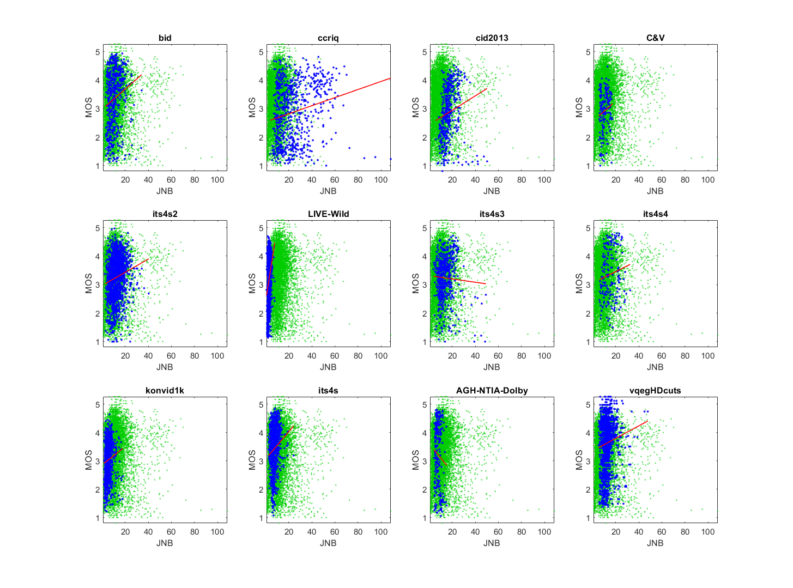

# Report on Just Noticeable Blur (JNB)

_Go to [Report.md](Report.md) for an introduction to this series of NR metric reports, including their purpose, important warnings, the rating scale, and details of the statistical analysis._ 

Function `nrff_jnbm.m` implements the Just Noticeable Blur (JNB) metric, as presented in [[22]](Publications.md). This NR metric assesses image sharpness / blurriness. 

Goal | Metric Name|Rating
-----|------------|------
RCA  | JNB | :star: :star:

__R&D Potential__: JNB yields promising results but contains different dataset responses that must be eliminated.

## Algorithm Summary
The algorithm begins by establishing constants, finding the pixel size of the image, and establishing block size for just-noticeable blur (JNB). The algorithm then loops 1 to the row size divided by 64 rounded down and 1 to the column divided by 64 rounded down nested within the row loop. The algorithm then makes a decision based on the edge sizes and performs calculations based on the MATLAB® `blkproc.m` library function. This fills one index of a temporary array. The inverse of the sum of the temporary array to the power of a constant beta to the power 1/beta times the size of the block analyzed yields the final metric.

## Speed and Conformity
JNB took __4×__ times as long to run as the benchmark metric, [nrff_blur.m](ReportBlur.md).

In Big-O notation, JNB is O(n), where n is the number of pixels.  

Our calculations rely on code provided by the authors. 
This algorithm was not able to yield viable data for every image in the datasets. We added a try-catch block around the function call to `JNBM_compute.m`. The catch just replaces the output data with NaN to ensure that there is no falsified data. There was also an issue where the code was attempting to index a non-integer in `JNBM_compute.m` so this value was placed in a floor function to guarantee an integer for indexing.  

## Analysis
The authors report 0.932 Pearson correlation between JNB and MOS for Gaussian blur and 0.881 Pearson correlation between JNB and MOS for JPEG2000 blur. These analyses use private datasets.

The expected performance of JNB in [[22]](Publications.md) is as follows. "As the blurriness increases, the sharpness metric should decrease monotonically." We observe this behavior (i.e., JNB decreases for lower quality images). The correlation values are internally consistent (i.e., similar magnitude) but lower than observed in the alternate sharpness / blurriness metric, [blur](ReportBlur.md).

The data are broadly scattered around a line. We expect this shape when RCA parameter detects a dominant factor (i.e., always relevant). Compare the scatter of blue dots (for the current dataset) with the green dots (that show the overall response of all datasets). 

The scatter plots for different datasets have strongly different slopes when JNB is fitted to MOS. Compare the red lines that fit the current data (in blue). For example, the CCRIQ dataset contains 4K and HD images, and JNB yields very different values for these image resolutions. The bottom of this page splits the CCRIQ dataset into HD and 4K subsets, to visually demonstrate this issue.
```
--------------------------------------------------------------
1) JNB 
bid              corr =  0.18  rmse =  1.00  percentiles [ 2.78, 6.82,10.02,13.45,34.21]
ccriq            corr =  0.21  rmse =  1.00  percentiles [ 3.88,13.01,21.14,32.46,108.51]
cid2013          corr =  0.17  rmse =  0.88  percentiles [ 5.68,13.61,16.11,19.23,  NaN]
C&V              corr =  0.15  rmse =  0.71  percentiles [ 5.38, 7.70, 9.84,12.93,17.45]
its4s2           corr =  0.16  rmse =  0.73  percentiles [ 2.27, 9.09,12.20,15.81,40.31]
LIVE-Wild        corr =  0.32  rmse =  0.78  percentiles [ 0.68, 2.29, 2.98, 3.69, 7.85]

average          corr =  0.20  rmse =  0.85
pooled           corr =  0.01  rmse =  0.88  percentiles [ 0.68, 4.57,10.85,16.15,  NaN]
```


