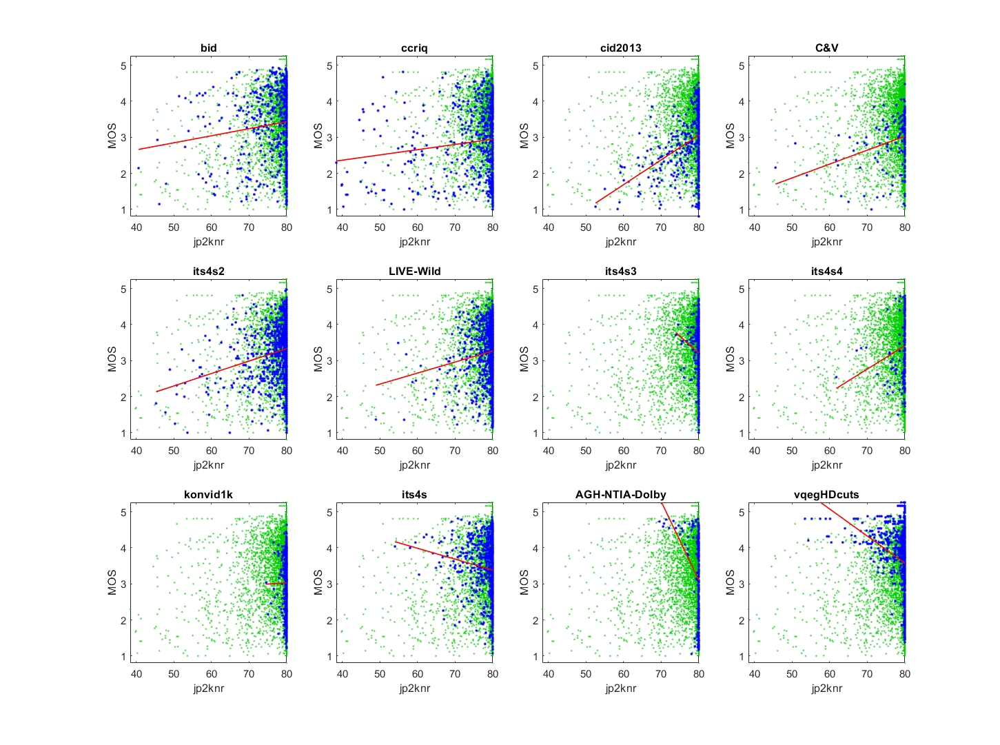

# Report on JPEG2000 NR (JP2KNR)

_Go to [Report.md](Report.md) for an introduction to this series of NR metric reports, including their purpose, important warnings, the rating scale, and details of the statistical analysis._ 

Function `nrff_JP2KNR.m` implements the JPEG2000 no-reference metric (JP2KNR), as presented in [[23]](Publications.md), using code from [https://github.com/utlive/jp2knr](https://github.com/utlive/jp2knr). The metric name is taken from that code repository; the publication does not provide a metric name. JP2KNR code produces occasional errors that need to be located and addressed before it could be used.

Goal | Metric Name|Rating
-----|------------|------
MOS  | JP2KNR | :star: 
RCA  | JP2KNR | :star: :star: 

__R&D Potential__: Although the authors indicate that JP2KNR is intended to assess MOS, JP2KNR may have potential use as a root cause analysis metric, because the training was limited to a single impairment: JPEG2000 compression.  

## Algorithm Summary
The algorithm starts by loading the prerequisite constants and values that are needed in the primary helper functions, including the type of wavelet transform (bior4.4), the number of wavelet levels (4), and histogram thresholds. The algorithm performs the wavelet transform and then calculates histograms. The algorithm then calculates coefficients based on certain indices within the blocks. The algorithm then takes the base 2 logarithms of the coefficients and constructs a 2-dimensional histogram. 
Afterwards, it builds a few parameters based on the base 2 logarithms of the wave tree values and uses these parameters to develop threshold values. The values are then fitted into an exponential function. The values are extracted from the fit line and generate a weighted average based on the training data (provided by the authors). These weights were learned using non-negatively constrained least-squares fit over private training data with the MATLAB® command `lsqnonneg`. 

## Speed and Conformance
JP2KNR took __3×__ as long to run as the benchmark metric, [nrff_blur.m](ReportBlur.md). 

In terms of Big-O notation, all of the helper functions used by JP2KNRcan be categorized as O(n) where 'n' is the number of pixels in the image. Since all of the other operations performed in the primary section of the NRFF operate in constant time, `nrff_jp2knr_quality.m` can also be categorized as O(n). 

In terms of conformity, code provided by the authors was used for the helper functions and their demo was formatted into an NRFF to follow our framework. The only notable change to their code was changing the use of the MATLAB library function `hist2d.m` to `histogram2.m` in `jointhist.m`. This was done because `hist2d.m` is a dated function that no longer exists in the current MATLAB version and `histogram2.m` performs the same operation. 

JP2KNR produced numerous "rank deficiency" warnings when run on video dataset ITS4S3. Due to this problem, JP2KNR is only evaluated on image datasets. 

## Analysis
The authors report 0.92 Pearson correlation between JP2KNR and MOS for LIVE Image Quality Assessment Database [[31]](Publications.md). 

Our analysis of JP2KNR shows a significant drop in accuracy, with an average Pearson correlation of 0.20. 
The JP2KNR scatter plots have a lower triangle shape (i.e., narrow range of values for high quality, wide range of values for low quality). We expect this shape when an impairment occurs sporadically. This meets our expectations for a metric that focuses on artifacts from JPEG2000 compression. 

JP2KNR has trouble with the BID and CCRIQ datasets. These scatter plots lose the lower triangle shape displayed in the CID2013, CCRIQ2 & VIME1, ITS4S2, and LIVE-Wild datasets. When we split the CCRIQ dataset by subject matter type (see the bottom plots), JP2KNR performs very differently for dusk and night scenes (large range of values) versus full sun and indoor scenes (narrow range of values).
```
--------------------------------------------------------------
1) weighted_average
bid              corr =  0.12  rmse =  1.01  percentiles [40.57,74.24,78.61,79.99,80.02]
ccriq            corr =  0.12  rmse =  1.01  percentiles [38.36,75.68,79.47,80.01,80.02]
cid2013          corr =  0.37  rmse =  0.84  percentiles [52.52,76.34,79.73,80.02,80.02]
C&V              corr =  0.30  rmse =  0.69  percentiles [45.57,76.83,79.90,80.02,80.02]
its4s2           corr =  0.20  rmse =  0.73  percentiles [45.24,78.19,79.88,80.02,80.02]
LIVE-Wild        corr =  0.11  rmse =  0.81  percentiles [48.90,78.64,79.88,80.02,80.02]

average          corr =  0.20  rmse =  0.85
pooled           corr =  0.18  rmse =  0.87  percentiles [38.36,77.38,79.75,80.02,80.02]
```



