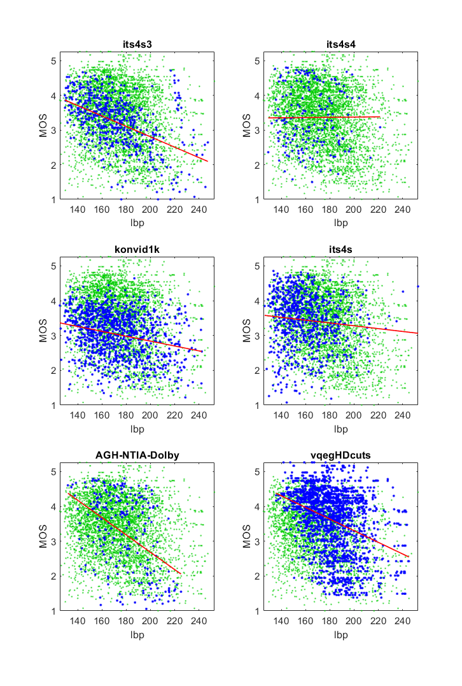

# Report on Local Binary Pattern (LBP)

_Go to [Report.md](Report.md) for an introduction to this series of NR metric reports, including their purpose, important warnings, the rating scale, and details of the statistical analysis._ 

Function `nrff_LBP.m` implements the Local Binary Pattern (LBP), which is presented in [[24]](Publications.md) and [[25]](Publications.md). LBP is intended for texture classification. This report instead evaluates whether LBP could be used to assess image quality. 

Goal | Metric Name|Rating
-----|------------|------
MOS  | LBP | :star: 

## Algorithm Summary
This algorithm divides the image into 3x3 blocks, examines the local binary patterns for each block, and produces one value for each 3x3 block. When examining each block, the algorithm compares edge pixels to the center pixel and calculates an overall value based on the differences observed. The output of the LBP algorithm is a matrix of per-block values. We chose to take the average LBP, to allow per-media analyses. 

## Speed and Conformity
LBP took __2.5×__ as long to run as the benchmark metric, [nrff_blur.md](ReportBlur.md), but our implementation may be inefficient. 

Assuming that the division into blocks is itself not truly a part of the central algorithm, LBP runs in O(n) time where n is the number of blocks generated by the block division algorithm. 

In terms of the summations and piecewise functions, our implementation closely follows the published algorithm. The only true issue was how to summarize the matrix of LBP values as one value; the natural choice was to take the mean value. 

## Analysis
The LBP algorithm was not intended for MOS assessment.

For image quality datasets, the LBP scatter plots have a wider range of values and a lower triangle shape (i.e., narrow range of values for high quality, wide range of values for low quality). We expect this shape when an impairment occurs sporadically. 

For video quality datasets, LBP produces an extremely narrow range of values and data scattered very loosely around the fit line.  
```
1) lbp 
bid              corr =  0.17  rmse =  1.00  false decisions =  40%  percentiles [14883.96,16207.17,16496.43,16975.83,26569.30]
ccriq            corr =  0.20  rmse =  1.00  false decisions =  38%  percentiles [15021.65,16628.54,17058.33,17681.91,32287.59]
cid2013          corr =  0.11  rmse =  0.89  false decisions =  34%  percentiles [15715.72,16528.16,16871.07,17606.91,32629.01]
C&V              corr =  0.14  rmse =  0.71  false decisions =  29%  percentiles [15466.58,16587.82,17134.97,17966.60,26315.56]
its4s2           corr =  0.01  rmse =  0.74  false decisions =  30%  percentiles [12260.71,16408.45,16898.74,17801.49,28778.62]
LIVE-Wild        corr =  0.14  rmse =  0.81  false decisions =  34%  percentiles [13603.98,16177.82,16803.55,17976.41,30956.98]
its4s3           corr =  0.50  rmse =  0.66  false decisions =  47%  percentiles [129.37,152.70,168.41,184.97,247.29]
its4s4           corr =  0.01  rmse =  0.88  false decisions =  34%  percentiles [129.21,148.20,160.94,175.82,221.45]
konvid1k         corr =  0.27  rmse =  0.62  false decisions =  36%  percentiles [125.25,153.36,169.34,188.27,242.32]
its4s            corr =  0.10  rmse =  0.77  false decisions =  36%  percentiles [126.23,145.74,156.18,170.80,252.72]
AGH-NTIA-Dolby   corr =  0.46  rmse =  1.00  false decisions =  50%  percentiles [131.90,161.57,176.62,194.56,225.18]
vqegHDcuts       corr =  0.37  rmse =  0.83  false decisions =  44%  percentiles [135.63,165.97,179.35,191.92,245.13]

average          corr =  0.21  rmse =  0.83
pooled           corr =  0.15  rmse =  0.87  percentiles [125.25,169.74,208.89,16771.40,32629.01]
```



