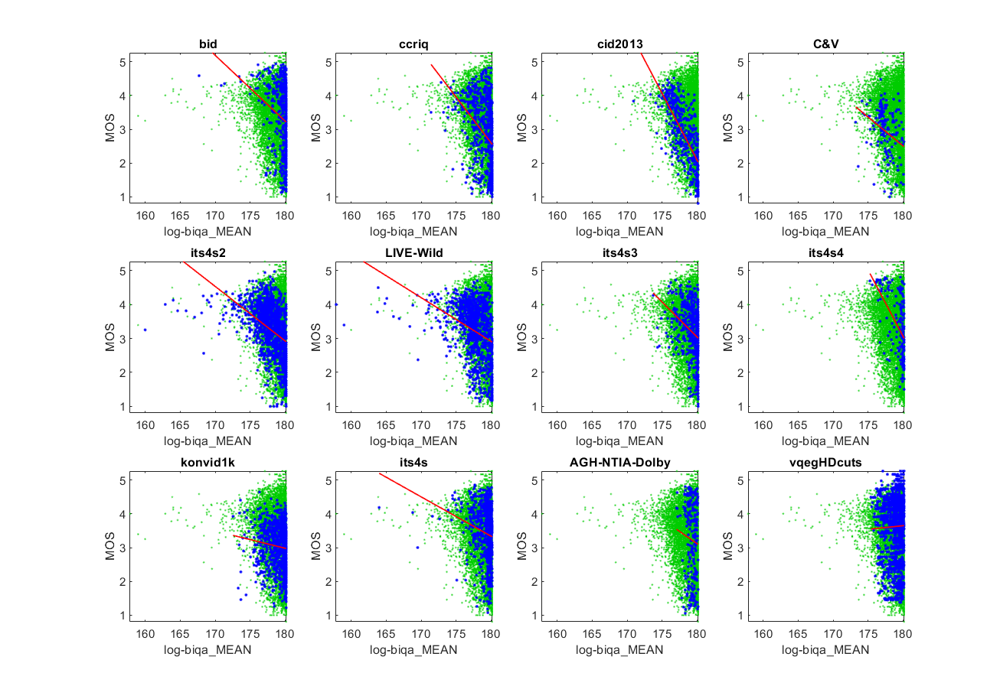

# Report on Laplacian of Gaussian Blind Image Quality Assessment (LOG-BIQA)

_Go to [Report.md](Report.md) for an introduction to this series of NR metric reports, including their purpose, important warnings, the rating scale, and details of the statistical analysis._ 

Function `nrff_log_biqa.m` implements the Laplacian of Gaussian Blind Image Quality Assessment (LOG-BIQA), as presented in [[9]](Publications.md) and [[10]](Publications.md). LOG-BIQA does not work reliably across a broad range of modern camera systems and video content. 

Goal|Metric Name|Rating
----|-----------|------
MOS|Log-BIQA|:star:

## Algorithm Summary
Function `nrff_log_biqa.m` is based on [[10]](Publications.md). This Blind Image Quality Assessment takes its name from the feature Gradient Magnitude (GM) and the Laplacian of Gaussian (LOG) operator. LOG is a tool used to identify image intensity contrast in small neighborhoods of space, while the GM feature focuses more on the extent of luminance variance. The overall objective of the NR metric based on [[10]](Publications.md) is to detect luminance discontinuities such that the structure of natural images can be properly evaluated. Computation of a joint probability matrix analyzes the results of the GM/LOG analyses such that any fluctuations caused by illumination changes or other structural irregularities are normalized. Through this process, the analysis of the image as a whole is not thrown off by local image distortion. 

## Speed and Conformity
Log-BIQA took __1.5×__ as long to run as the benchmark metric, [nrff_blur.md](ReportBlur.md).
 
Reference [[9]](Publications.md) states that the overall complexity of the metric is O(N(h+k)), where N is the total number of image pixels, h is the size of the filters (Gaussian partial derivative filter, horizontal filter, and vertical filter) and k is the size of the joint probability matrix. 

Code was provided by the authors.

## Analysis

In [[9]](Publications.md), Table I ("Overall Performance of the Competing BIQA Models on the Three Databases") reports Pearson correlations in the range of 0.92 to 0.95. LOG-BIQA performed well on the CID2013 dataset (0.70 correlation) but otherwise our correlation results were significantly lower (0.24 to 0.44).

In addition, the shape of the scatter plots is troubling. Most media have LOG-BIQA values between 178 and 180.14, which is associated with the full range of MOSs (note the vertical distribution of data). This is a severe problem for metrics that assess overall quality (MOS). LOG-BIQA shows an upper triangle shape (i.e., narrow range of values for low quality, wide range of values for high quality). We expect this shape when the metric detects characteristics of some (but not all) high quality images. 
```
1) log-biqa_MEAN 
bid              corr =  0.24  rmse =  0.98  percentiles [167.68,179.30,179.88,180.13,180.14]
ccriq            corr =  0.37  rmse =  0.94  percentiles [171.40,178.09,179.56,180.03,180.17]
cid2013          corr =  0.70  rmse =  0.65  percentiles [170.90,176.81,178.01,179.55,180.14]
C&V              corr =  0.31  rmse =  0.68  percentiles [173.21,176.86,177.40,178.40,180.11]
its4s2           corr =  0.44  rmse =  0.67  percentiles [159.98,176.98,178.11,179.38,180.14]
LIVE-Wild        corr =  0.36  rmse =  0.77  percentiles [157.83,176.76,177.81,179.10,180.14]
its4s3           corr =  0.31  rmse =  0.72  percentiles [173.71,178.50,179.39,180.00,180.16]
its4s4           corr =  0.52  rmse =  0.75  percentiles [175.26,178.92,179.75,180.01,180.14]
konvid1k         corr =  0.10  rmse =  0.64  percentiles [172.54,178.45,179.58,180.01,180.15]
its4s            corr =  0.20  rmse =  0.75  percentiles [163.99,178.73,179.54,179.87,180.14]
AGH-NTIA-Dolby   corr =  0.08  rmse =  1.12  percentiles [177.06,178.79,179.31,179.72,180.14]
vqegHDcuts       corr =  0.02  rmse =  0.89  percentiles [175.40,178.66,179.42,179.83,180.14]

average          corr =  0.31  rmse =  0.80
pooled           corr =  0.20  rmse =  0.86  percentiles [157.83,177.81,179.21,179.86,180.17]
```

