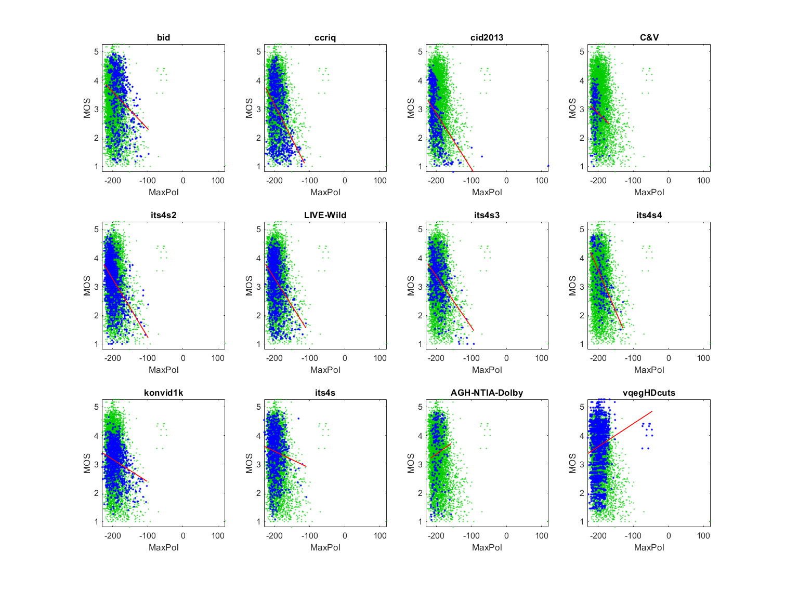

# Report on Synthetic MaxPol

_Go to [Report.md](Report.md) for an introduction to this series of NR metric reports, including their purpose, important warnings, the rating scale, and details of the statistical analysis._ 

Function `nrff_MaxPol.m` implements the MaxPol as presented in [[43]](Publications.md). This algorithm is distributed on [GitHub](https://github.com/mahdihosseini/Synthetic-MaxPol) under the alternate name SyntheticMaxPol. MaxPol is an image sharpness metric based on a visual sensitivity model. 

Goal | Metric Name|Rating
-----|------------|------
RCA  | MaxPol | :star: :star: 

__R&D Potential__: If the invalid results and outliers produced by MaxPol for certain images could be resolved, this metric could have a :star: :star: :star: rating for the User Generated Content (UGC) use case.
  

## Algorithm Summary

The algorithm starts by loading predetermined data as variables. It then loops through the loaded parameters and filters the image twice using the `'symmetric'` and `'conv'` parameters for the filter. It then analyzes the number of bins in the theoretical histogram that is associated with the image. The data is then normalized to form a probability density function (PDF), and that PDF is used to generate a cumulative distribution function (CDF). The algorithm uses a simple threshold comparison relative to the CDF to determine index values. Using those index values, the algorithm generates a sigma approximation. The algorithm then forms a feature map with the filtered image and a predetermined constant. The map is then sorted and sliced into a smaller matrix. The algorithm then calculates the central moment statistic of the matrix and takes the negative base 10 logarithm of the calculated moment which results in a score value.

## Speed and Conformity
MaxPol took __1.3×__ as long to run as the benchmark metric, [nrff_blur.m](ReportBlur.md).

In terms of Big-O, this algorithm is O(n) since it filters the images multiple times and performs calculations that assess every pixel. 

In terms of conformity, a try-catch block had to be added for an area of `Synthetic_MaxPol.m`. A vector of values that were to be used as indices sometimes contained invalid offsets (zeros).  

## Analysis

In [[43]](Publications.md), the authors provide an overall assessment of 0.9735 Pearson correlation between MaxPol and MOS for the 2006 LIVE Image Quality Assessment Database [[31]](Publications.md), 
0.9657 Pearson correlation between MaxPol and MOS for CSIQ [[33]](Publications.md), 
0.9359 Pearson correlation between MaxPol and MOS for the TID2008 Dataset [[32]](Publications.md), 
and 0.9412 Pearson Correlation between MaxPol and MOS for the TID2013 [[34]](Publications.md).
The authors also perform a noise sensitivity analysis. 

For the UGC use case, the scatter plots have a lower triangle shape (i.e., narrow range of values for high quality, wide range of values for low quality). We expect this shape when an impairment occurs sporadically. This meets our expectations for a sharpness metric.
The CID2013 and C&V scatter plots lack this lower triangle shape but fall within the area of the other datasets. 
MaxPol is very inaccurate for the broadcaster use case (datasets ITS4S, AGH/NTIA/Dolby, and vqegHDcuts).

MaxPol has two problems. First, some media failed to produce valid estimates. We assigned not-a-number (NaN) to these media. Second, CID2013 has an outlier at MaxPol = 100. These issues prevent a :star: :star: :star: rating.
```
1) MaxPol 
bid              corr =  0.26  rmse =  0.98  percentiles [-219.19,-195.23,-184.37,-169.82,  NaN]
ccriq            corr =  0.42  rmse =  0.92  percentiles [-225.72,-203.93,-194.32,-179.69,  NaN]
cid2013          corr =  0.49  rmse =  0.79  percentiles [-224.26,-212.43,-207.38,-197.21,120.00]
C&V              corr =  0.15  rmse =  0.70  percentiles [-221.66,-212.17,-208.35,-202.94,  NaN]
its4s2           corr =  0.43  rmse =  0.67  percentiles [-224.48,-209.66,-202.87,-194.47,  NaN]
LIVE-Wild        corr =  0.35  rmse =  0.76  percentiles [-226.35,-207.03,-200.58,-192.18,  NaN]
its4s3           corr =  0.46  rmse =  0.65  percentiles [-224.82,-208.06,-198.12,-182.25,  NaN]
its4s4           corr =  0.57  rmse =  0.72  percentiles [-221.35,-204.76,-193.58,-183.17,  NaN]
konvid1k         corr =  0.25  rmse =  0.58  percentiles [-229.33,-202.89,-191.54,-170.99,  NaN]
its4s            corr =  0.11  rmse =  0.77  percentiles [-230.36,-208.07,-199.85,-190.49,  NaN]
AGH-NTIA-Dolby   corr =  0.09  rmse =  1.08  percentiles [-215.94,-203.91,-196.26,-179.50,  NaN]
vqegHDcuts       corr =  0.16  rmse =  0.87  percentiles [-229.32,-204.99,-195.92,-183.64,  NaN]

average          corr =  0.31  rmse =  0.79
pooled           corr =  0.20  rmse =  0.85  percentiles [-230.36,-206.90,-198.06,-184.84,  NaN]
```

