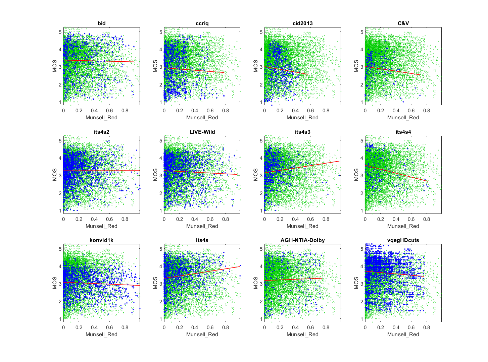

# Report on Munsell Red

_Go to [Report.md](Report.md) for an introduction to this series of NR metric reports, including their purpose, important warnings, the rating scale, and details of the statistical analysis._ 

Function `nrff_munsell_red.m` implements Munsell Red algorithm presented in [[46]](Publications.md). The goal was to demonstrate that a theoretically plausible NR metric may respond differently to the datasets that were designed for NR metric research. 


Goal|Metric Name|Rating
----|-----------|------
MOS|Munsell_Red|:star: 

__R&D Potential__: See [[46]](Publications.md) for ideas on how to prove that an NR metric is not influenced by coding impairments and insights into the potentially complex relationship between coding bitrate, MOS, and an NR metric.

## Algorithm Summary
Munsell Red is the square root of the fraction of red pixels in the media. "Red" is defined using the Munsell color space, where chroma > 2 and hue is between 2.5YR and 2.5P, inclusive.  Note that the Munsell color space prioritizes human perception of color over mathematical convenience. It was designed by an art instructor, Albert H. Munsell. 

The Munsell Red metric was motivated by an attempt to measure aesthetic appeal. The goal was to understand the impact of aesthetics on MOS and to understand whether NR metrics must assess aesthetics to accurately estimate MOS. 

The importance of the color red can be understood by reading the work of linguists, visual psychologists, and anthropologists to understand human perception of color. More colloquially, there is a long-time belief that red has a huge impact in still photography. Put briefly, the color red is aesthetically appealing. 

## Speed and Conformity

Munsell_Red took __3×__ as long to run as the benchmark metric, [nrff_blur.md](ReportBlur.md).

In terms of Big-O notation, the algorithm runs in O(n) where 'n' is the number of pixels in the image.

Function `nrff_munsell_red.m` uses the software produced by the authors. 

## Analysis

Munsell Red was developed as a prototype to the NRMetricFramework repository. The original publication, [[46]](Publications.md), provides additional analyses. Our statistics differ slightly because we reserves 10% of videos for verifying the performance of high performing NR metrics developed with this repository. The original statistics use all videos. 

Munsell Red shows strongly different responses to different datasets. For ITS4S (on which it was trained), Munsell Red detects a characteristic of high quality media. Pearson correlation is higher for when analyzing the videos associated with a single coding bitrate (0.15 to 0.39) than for the ITS4S dataset as a whole (0.17). The scatter plots show a clearly defined __upper triangle__ for each bitrate, with a different MOS offset. The influence of bitrate and other impairments obscures this upper triangle shape when we plot the entire ITS4S dataset. For the CID2013 dataset, Munsell Red depicts a __lower triangle__. One problem is that camera capture impairments sometimes occur as a red tint over the entire image. Munsell Red is too simplistic to differentiate between such an overall color error and an aesthetic design choice.  

Munsell Red is presented to encourage discussion. How can we design NR metrics that respond appropriately if an image trait is positive for some applications and negative for others? In this case, we must conclude that Munsell Red is too simplistic. A better heuristic could offer improved performance. 
```
NRFF Group Munsell

--------------------------------------------------------------
1) Munsell_Red 
bid              corr =  0.02  rmse =  1.01  percentiles [ 0.00, 0.05, 0.17, 0.40, 0.92]
ccriq            corr =  0.05  rmse =  1.02  percentiles [ 0.00, 0.05, 0.12, 0.24, 0.78]
cid2013          corr =  0.09  rmse =  0.90  percentiles [ 0.00, 0.11, 0.18, 0.26, 0.57]
C&V              corr =  0.13  rmse =  0.71  percentiles [ 0.00, 0.04, 0.08, 0.24, 0.71]
its4s2           corr =  0.00  rmse =  0.74  percentiles [ 0.00, 0.04, 0.12, 0.26, 0.99]
LIVE-Wild        corr =  0.05  rmse =  0.82  percentiles [ 0.00, 0.05, 0.15, 0.31, 0.96]
its4s3           corr =  0.12  rmse =  0.75  percentiles [ 0.00, 0.04, 0.09, 0.18, 0.97]
its4s4           corr =  0.23  rmse =  0.86  percentiles [ 0.00, 0.06, 0.14, 0.25, 0.81]
konvid1k         corr =  0.07  rmse =  0.64  percentiles [ 0.00, 0.06, 0.21, 0.44, 0.99]
its4s            corr =  0.17  rmse =  0.76  percentiles [ 0.00, 0.04, 0.15, 0.30, 1.00]
AGH-NTIA-Dolby   corr =  0.03  rmse =  1.13  percentiles [ 0.00, 0.06, 0.22, 0.46, 0.75]
vqegHDcuts       corr =  0.08  rmse =  0.89  percentiles [ 0.00, 0.06, 0.18, 0.32, 0.77]

average          corr =  0.09  rmse =  0.85
pooled           corr =  0.02  rmse =  0.88  percentiles [ 0.00, 0.05, 0.15, 0.31, 1.00]
```



```
1) Munsell_Red 
its4s            corr =  0.17  rmse =  0.76  percentiles [ 0.00, 0.04, 0.15, 0.30, 1.00]

average          corr =  0.17  rmse =  0.76


Analyze by System

original         corr =  0.18  rmse =  0.44  percentiles [ 0.00, 0.04, 0.14, 0.30, 1.00]
2340K            corr =  0.15  rmse =  0.49  percentiles [ 0.00, 0.04, 0.17, 0.29, 0.85]
1732K            corr =  0.27  rmse =  0.34  percentiles [ 0.00, 0.05, 0.16, 0.28, 0.76]
1256K            corr =  0.20  rmse =  0.47  percentiles [ 0.00, 0.07, 0.15, 0.26, 0.99]
0951K            corr =  0.32  rmse =  0.47  percentiles [ 0.00, 0.03, 0.13, 0.30, 0.83]
0512K            corr =  0.39  rmse =  0.49  percentiles [ 0.00, 0.02, 0.14, 0.30, 0.79]
```

