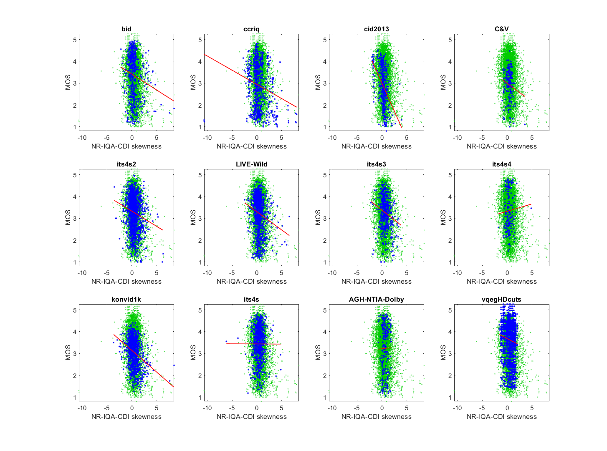

# Report on No-Reference Image Quality Assessment for Contrast-Distorted Images (NR-IQA-CDI) 

_Go to [Report.md](Report.md) for an introduction to this series of NR metric reports, including their purpose, important warnings, the rating scale, and details of the statistical analysis._ 

Function `nrff_nr_iqa_cdi.m` implements the algorithms implements the five parameters that form the No-Reference Image Quality Assessment for Contrast-Distorted Images (NR-IQA-CDI) metric, as presented in Section II of [[3]](Publications.md). With further research and development, Kurtosis and Entropy may have value for root cause analysis. The other three NR metrics do not work reliably across a broad range of modern camera systems and video content. 

Goal|Metric Name|Rating
----|-----------|------
MOS|Mean|:star:
MOS|Standard Deviation|:star:
MOS|Skewness|:star:
MOS|Kurtosis|:star: :star:
MOS|Entropy|:star: :star:

## Algorithm Summary
The authors of [[3]](Publications.md) recommend the following one- and two-dimensional statistics, calculated from the luma plane:
* Mean - the average value 
* Standard Deviation - the spread of values about the mean
* Skewness - the symmetry or lack thereof 
* Kurtosis - the size of the 'tails' of the data, outliers
* Entropy - randomness, whether the data is predictable or unpredictable 

Ahmed [[3]](Publications.md) reports that these five statistics are used for Natural Scene Statistics (NSS) and can be used well even without Natural Scenes being involved.

## Speed and Conformity

NR-IQA-CDI took __2×__ as long to run as the benchmark metric, [nrff_blur.m](ReportBlur.md). 

Function `nrff_nr_iqa_cdi.m` primarily uses MATLAB® library functions that have a linear runtime, which gives this algorithm a Big-O complexity of O(n) where 'n' is the number of pixels in the image. 

The conformity is excellent when analyzing images. These algorithms are relatively straightforward, and the code needed was already provided by MATLAB. The algorithms are extended to video quality by taking the average over time. 

## Analysis
The Basic Statistics algorithms are evaluated using six image quality datasets that contain camera impairments. The authors do not provide statistics that can be directly compared to our results.

### Mean ###
The correlation coefficients are mediocre, and the distribution is fairly random with a mild positive trend. Compare the scatter of blue dots (for the current dataset) with the green dots (that show the overall response of all datasets). The exception is the CID2013 dataset, which has a relatively high correlation.  

```
1) NR-IQA-CDI mean 
bid              corr =  0.20  rmse =  0.99  percentiles [19.48,87.98,112.26,127.32,195.81]
ccriq            corr =  0.11  rmse =  1.01  percentiles [16.09,72.80,107.33,134.61,233.89]
cid2013          corr =  0.53  rmse =  0.76  percentiles [16.00,77.98,108.87,119.41,183.27]
C&V              corr =  0.14  rmse =  0.71  percentiles [17.15,87.70,113.97,128.30,190.71]
its4s2           corr =  0.20  rmse =  0.73  percentiles [18.20,83.25,106.76,125.90,213.89]
LIVE-Wild        corr =  0.20  rmse =  0.80  percentiles [19.61,89.99,108.52,123.26,214.60]

average          corr =  0.23  rmse =  0.83
pooled           corr =  0.21  rmse =  0.86  percentiles [16.00,83.04,108.79,125.56,233.89]
```


### Standard Deviation ###
The correlation coefficients are mediocre, and the distribution is fairly random with a mild positive trend.
```
2) NR-IQA-CDI std 
bid              corr =  0.20  rmse =  0.99  percentiles [ 2.43,28.51,37.58,46.13,74.29]
ccriq            corr =  0.22  rmse =  0.99  percentiles [ 0.74,23.61,29.97,44.27,70.55]
cid2013          corr =  0.24  rmse =  0.87  percentiles [ 0.00,35.10,44.08,55.37,76.22]
C&V              corr =  0.21  rmse =  0.70  percentiles [ 2.16,37.54,51.43,59.70,81.15]
its4s2           corr =  0.24  rmse =  0.72  percentiles [ 2.24,33.52,42.61,51.03,78.49]
LIVE-Wild        corr =  0.16  rmse =  0.81  percentiles [ 4.20,33.23,42.15,50.63,90.43]

average          corr =  0.21  rmse =  0.85
pooled           corr =  0.21  rmse =  0.86  percentiles [ 0.00,30.39,40.71,50.36,90.43]
```


### Entropy ###
The scatter plots have a lower triangle shape (i.e., narrow range of values for high quality, wide range of values for low quality). We expect this shape when the metric detects an impairment that occurs sporadically. Further research would be needed to identify how this information could be used for root cause analysis, as it is not clear what impairment Entropy detects. 
```
3) NR-IQA-CDI entropy 
bid              corr =  0.24  rmse =  0.98  percentiles [ 1.92, 6.53, 7.02, 7.33, 7.66]
ccriq            corr =  0.32  rmse =  0.97  percentiles [ 0.27, 6.37, 6.93, 7.20, 7.70]
cid2013          corr =  0.35  rmse =  0.84  percentiles [-0.00, 6.52, 7.14, 7.44, 7.68]
C&V              corr =  0.31  rmse =  0.68  percentiles [ 2.10, 6.67, 6.96, 7.17, 7.56]
its4s2           corr =  0.24  rmse =  0.72  percentiles [ 2.13, 6.68, 7.11, 7.38, 7.70]
LIVE-Wild        corr =  0.27  rmse =  0.79  percentiles [ 0.94, 6.73, 7.10, 7.35, 7.70]

average          corr =  0.29  rmse =  0.83
pooled           corr =  0.29  rmse =  0.84  percentiles [-0.00, 6.64, 7.06, 7.35, 7.70]
```


### Skewness
Most media have similar Skewness values, but MOSs that span the full range of MOSs. Note the vertical distribution of data from -0.5 to 0.75. This is a severe problem for metrics that assess overall quality. The remaining data (scattered both above and below the vertical cluster of data) and a small number of outliers strongly influence the correlation and fit. 

Skewness would probably benefit from being clipped. For example, positive Skewness values may indicate a specific impairment.
```
5) NR-IQA-CDI skewness 
bid              corr =  0.16  rmse =  1.00  percentiles [-2.20,-0.19, 0.21, 0.67, 8.51]
ccriq            corr =  0.20  rmse =  1.00  percentiles [-10.66,-0.28, 0.11, 0.90,  NaN]
cid2013          corr =  0.42  rmse =  0.81  percentiles [-1.99,-0.01, 0.29, 0.61,  NaN]
C&V              corr =  0.14  rmse =  0.71  percentiles [-0.98, 0.02, 0.42, 0.74,  NaN]
its4s2           corr =  0.17  rmse =  0.73  percentiles [-3.52,-0.04, 0.36, 0.86,  NaN]
LIVE-Wild        corr =  0.18  rmse =  0.81  percentiles [-2.46,-0.03, 0.37, 0.76,  NaN]

average          corr =  0.21  rmse =  0.84
pooled           corr =  0.18  rmse =  0.87  percentiles [-10.66,-0.10, 0.31, 0.78,  NaN]
```



### Kurtosis
Most media have Kurtosis values below 5, which is associated with the full range of MOSs (note the vertical distribution of data near zero). This is a severe problem for metrics that assess overall quality (MOS). 

However, Kurtosis shows a lower triangle shape (i.e., narrow range of values for high quality, wide range of values for low quality). We expect this shape when the metric detects an impairment that occurs sporadically and infrequently. Further research would be needed to identify how this information could be used for root cause analysis, as it is not clear what impairment Kurtosis detects. 
```
4) NR-IQA-CDI kurtosis 
bid              corr =  0.15  rmse =  1.00  percentiles [ 1.23, 2.27, 2.81, 3.96,139.39]
ccriq            corr =  0.24  rmse =  0.99  percentiles [ 1.55, 2.57, 3.25, 5.25,  NaN]
cid2013          corr =  0.03  rmse =  0.90  percentiles [ 1.62, 2.05, 2.60, 3.37,  NaN]
C&V              corr =  0.27  rmse =  0.69  percentiles [ 1.23, 1.96, 2.55, 3.10,  NaN]
its4s2           corr =  0.14  rmse =  0.74  percentiles [ 1.21, 2.20, 2.82, 4.11,  NaN]
LIVE-Wild        corr =  0.14  rmse =  0.81  percentiles [ 1.14, 2.20, 2.75, 3.74,  NaN]

average          corr =  0.16  rmse =  0.85
pooled           corr =  0.17  rmse =  0.87  percentiles [ 1.14, 2.26, 2.84, 3.99,  NaN]
```


