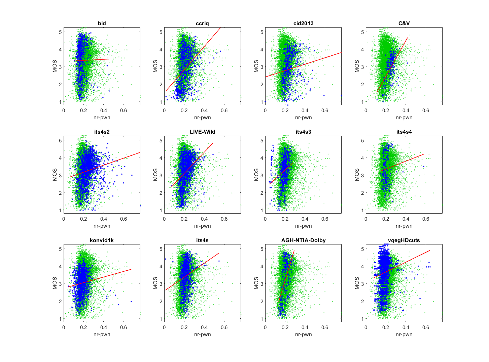

# Report on No Reference Perceptually Weighted Noise (NR-PWN)

_Go to [Report.md](Report.md) for an introduction to this series of NR metric reports, including their purpose, important warnings, the rating scale, and details of the statistical analysis._ 

Function `nrff_NR_PWN.m` implements the NR Perceptually Weighted Noise (NR-PWN) metric, as presented in [[26]](Publications.md). This NR metric detects noisiness, based on local noise standard deviation.
Despite overall poor performance, NR-PWN has promising results for some datasets, which is worth further investigation. 

Goal | Metric Name|Rating
-----|------------|------
RCA  | NR-PWN | :star: :star:


## Algorithm Summary 
The algorithm divides each image into MxM blocks. M is 32 pixels in the code released by the ASU). Multiple calculations occur within each sub-block, typically simple calculations like multiplication, division, exponents, thresholds, and normalization. The code relies upon 11 constants. 

## Speed and Conformity
NR-PWN took __8×__ as long to run as the benchmark metric, [nrff_blur.md](ReportBlur.md).

In terms of Big-O notation, this algorithm runs in O(n). This is simply because every block in the image gets evaluated a finite number of times and assuming that each block is not evaluated a number of times close to the number of pixels in the block then it would fair to say that each block is evaluated in O(n) time thus making the image evaluated in O(n) time.

In terms of conformity, code was supplied by the authors. 

## Analysis
The authors analyze NR-PWN on two datasets: 0.9770 Pearson correlation for the 2006 LIVE Image Quality Assessment Database [[31]](Publications.md) and 0.8020 Pearson correlation for the TID2008 Dataset [[32]](Publications.md). 

Despite the mention of "noise" in the metric's name, the goal of NR-PWN appears to be to assess MOS, not just noise. 
Only the scatter plots for the C&V and AGH-NTIA-Dolby datasets depict a scatter of points around a line, as we expect for an NR metric that predicts MOS. 
The other datasets' scatter plots depict an upper triangle (i.e., narrow range of values for low quality, wide range of values for high quality). We expect this shape when an RCA metric detects an infrequent characteristic of high quality media. 
The correlations are erratic: sometimes high (e.g., 0.55, 0.56) and sometimes very low (e.g., 0.01, 0.11, 0.14). 
The high correlation indicates that NR-PWN could be impactful, if these issues are investigated and eliminated.
```
1) nr-pwn 
bid              corr =  0.01  rmse =  1.01  false decisions =  33%  percentiles [ 0.11, 0.16, 0.17, 0.19, 0.46]
ccriq            corr =  0.38  rmse =  0.94  false decisions =  22%  percentiles [ 0.02, 0.17, 0.20, 0.24, 0.56]
cid2013          corr =  0.14  rmse =  0.89  false decisions =  26%  percentiles [ 0.00, 0.21, 0.23, 0.28, 0.77]
C&V              corr =  0.55  rmse =  0.60  false decisions =  15%  percentiles [ 0.11, 0.22, 0.25, 0.27, 0.42]
its4s2           corr =  0.19  rmse =  0.73  false decisions =  21%  percentiles [ 0.07, 0.20, 0.24, 0.28, 0.77]
LIVE-Wild        corr =  0.36  rmse =  0.76  false decisions =  21%  percentiles [ 0.07, 0.19, 0.22, 0.25, 0.49]
its4s3           corr =  0.27  rmse =  0.73  false decisions =  21%  percentiles [ 0.04, 0.17, 0.19, 0.21, 0.28]
its4s4           corr =  0.11  rmse =  0.88  false decisions =  30%  percentiles [ 0.15, 0.18, 0.20, 0.22, 0.58]
konvid1k         corr =  0.11  rmse =  0.64  false decisions =  23%  percentiles [ 0.05, 0.16, 0.18, 0.20, 0.68]
its4s            corr =  0.19  rmse =  0.76  false decisions =  25%  percentiles [ 0.01, 0.19, 0.21, 0.23, 0.55]
AGH-NTIA-Dolby   corr =  0.56  rmse =  0.93  false decisions =  19%  percentiles [ 0.14, 0.18, 0.20, 0.22, 0.29]
vqegHDcuts       corr =  0.14  rmse =  0.88  false decisions =  27%  percentiles [ 0.08, 0.16, 0.18, 0.20, 0.64]

average          corr =  0.25  rmse =  0.81
pooled           corr =  0.13  rmse =  0.87  percentiles [ 0.00, 0.17, 0.20, 0.23, 0.77]
```
