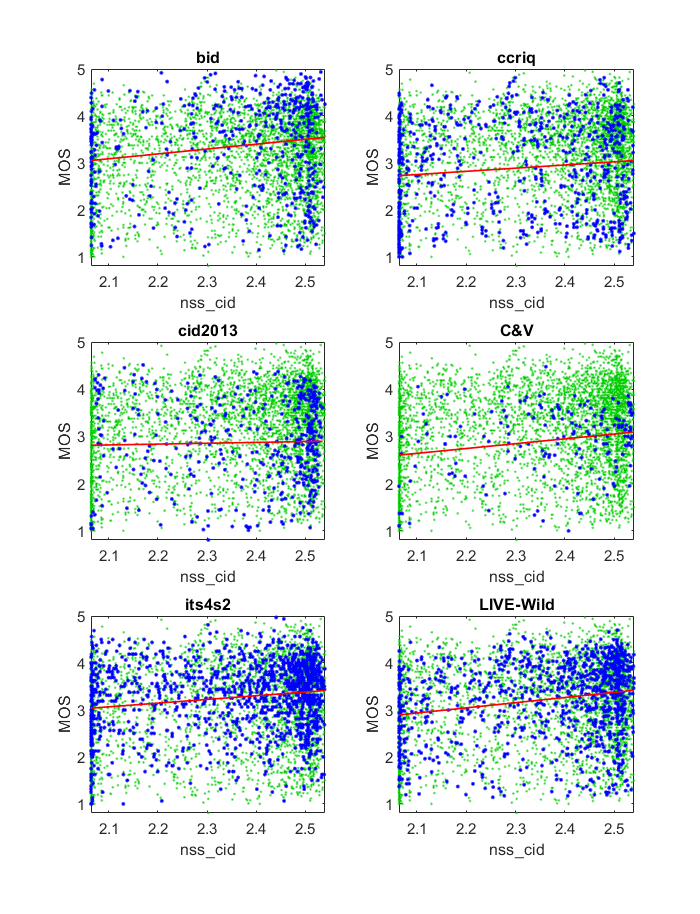
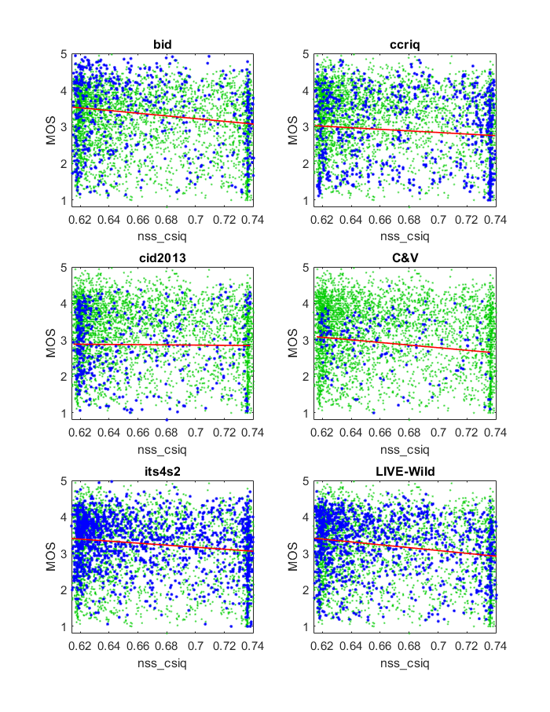
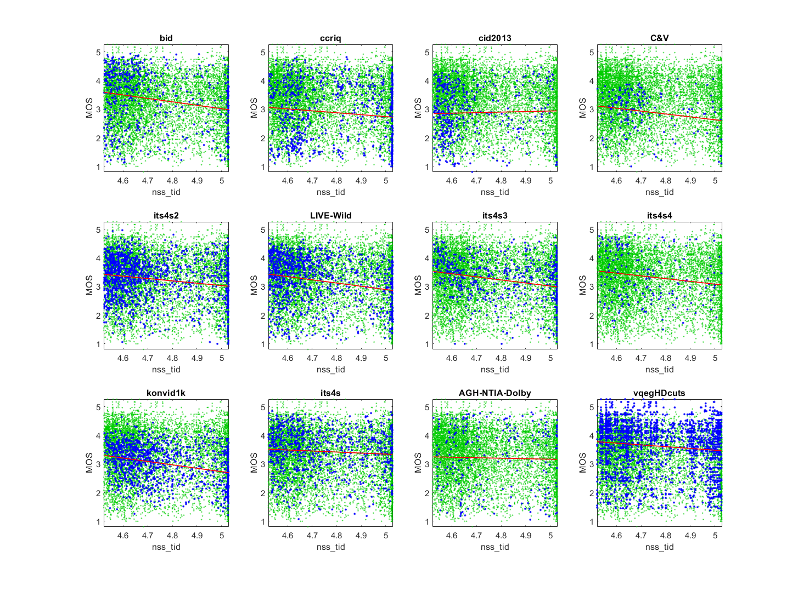

# Report on Natural Scene Statistics (NSS)

_Go to [Report.md](Report.md) for an introduction to this series of NR metric reports, including their purpose, important warnings, the rating scale, and details of the statistical analysis._ 

Function `nrff_nss.m` implements no-reference quality assessment of contrast distorted images based on the principle of natural scene statistics (NSS), as presented in [[17]](Publications.md). NSS does not work reliably across a broad range of modern camera systems and video content.  

Goal | Metric Name|Rating
-----|------------|------
MOS  | NSS_CID | :star: 
MOS  | NSS_CSIQ | :star: 
MOS  | NSS_TID | :star: 

__Warning__: Function `nrff_nss.m` requires a different version of svmpredict.mex than is distributed with NRMetricFramework repository. Download the appropriate version from the author's website, https://github.com/steffensbola/blind_iqa_contrast, subdirectory NSS.

## Algorithm Summary
This algorithm loads training data from either the CID2013, CSIQ, or TID13 image datasets. The data matrix for the chosen training dataset is sliced to isolate specific values to be used in conjunction with certain statistics. 

The data is then trained using the `svmtrain.mex64` file for each set of training data. The training is done using the `'-s 3'` model. Then statistics based around the mean, the standard deviation, the entropy, the kurtosis, and the skewness of the image are calculated. The code then predicts a score via the `svmpredict.mex64` file with those statistics to predict a score.

## Speed and Conformity
NSS took __1.3×__ as long to run as the benchmark metric, [nrff_blur.m](ReportBlur.md).

There is no documentation left in the MATLAB® documentation database on how the `svmpredict.mex64` and `svmtrain.mex64` work and therefore a true Big-O notation complexity can't be determined. However, ignoring those files this algorithm runs in O(n) since those basic statistics need to view each pixel value once to calculate the resulting statistic. 

In terms of conformity, the authors demo file was completely followed except for the fact that we used all three training sets instead of just one at a time. If used for future research, `function_nss.m` should be updated with the new functions that replace `svmpredict.mex64` and `svmtrain.mex64`. 

## Analysis

The authors report 0.9096 Pearson correlation between NSS_CID and MOS for the CID2013 dataset [[38]](Publications.md), 0.6588 Pearson correlation between NSS_TID and the TID2013 dataset [[34]](Publications.md), and 0.8508 Pearson correlation between NSS_CSIQ and the CSIQ dataset [[33]](Publications.md). 


NSS CID2013, NSS_CSIQ, and NSS_TID do not respond well to diverse content and camera impairments. The correlations are low and metric values are associated with the full range of MOSs.
```
--------------------------------------------------------------
1) nss_cid
bid              corr =  0.17  rmse =  1.00  percentiles [ 2.06, 2.24, 2.42, 2.49, 2.54]
ccriq            corr =  0.12  rmse =  1.01  percentiles [ 2.06, 2.11, 2.32, 2.47, 2.54]
cid2013          corr =  0.03  rmse =  0.90  percentiles [ 2.06, 2.29, 2.45, 2.51,  NaN]
C&V              corr =  0.20  rmse =  0.70  percentiles [ 2.06, 2.28, 2.41, 2.49, 2.54]
its4s2           corr =  0.17  rmse =  0.73  percentiles [ 2.06, 2.22, 2.41, 2.49, 2.54]
LIVE-Wild        corr =  0.21  rmse =  0.80  percentiles [ 2.06, 2.26, 2.42, 2.49, 2.54]

average          corr =  0.15  rmse =  0.86
pooled           corr =  0.16  rmse =  0.87  percentiles [ 2.06, 2.22, 2.41, 2.49,  NaN]
```


```
--------------------------------------------------------------
2) nss_csiq
bid              corr =  0.16  rmse =  1.00  percentiles [ 0.61, 0.63, 0.65, 0.70, 0.74]
ccriq            corr =  0.10  rmse =  1.01  percentiles [ 0.62, 0.63, 0.68, 0.73, 0.74]
cid2013          corr =  0.01  rmse =  0.90  percentiles [ 0.62, 0.62, 0.64, 0.69,  NaN]
C&V              corr =  0.18  rmse =  0.71  percentiles [ 0.62, 0.63, 0.65, 0.69, 0.74]
its4s2           corr =  0.16  rmse =  0.73  percentiles [ 0.61, 0.63, 0.65, 0.71, 0.74]
LIVE-Wild        corr =  0.20  rmse =  0.80  percentiles [ 0.61, 0.63, 0.65, 0.70, 0.74]

average          corr =  0.13  rmse =  0.86
pooled           corr =  0.15  rmse =  0.87  percentiles [ 0.61, 0.63, 0.65, 0.71,  NaN]
```


```
--------------------------------------------------------------
3) nss_tid
bid              corr =  0.21  rmse =  0.99  percentiles [ 4.52, 4.57, 4.65, 4.85, 5.03]
ccriq            corr =  0.12  rmse =  1.01  percentiles [ 4.52, 4.62, 4.74, 4.98, 5.03]
cid2013          corr =  0.03  rmse =  0.90  percentiles [ 4.53, 4.57, 4.61, 4.72,  NaN]
C&V              corr =  0.19  rmse =  0.71  percentiles [ 4.52, 4.61, 4.66, 4.75, 5.03]
its4s2           corr =  0.19  rmse =  0.73  percentiles [ 4.52, 4.58, 4.65, 4.85, 5.03]
LIVE-Wild        corr =  0.22  rmse =  0.80  percentiles [ 4.52, 4.58, 4.65, 4.81, 5.03]

average          corr =  0.16  rmse =  0.86
pooled           corr =  0.17  rmse =  0.87  percentiles [ 4.52, 4.58, 4.66, 4.86,  NaN]
```


