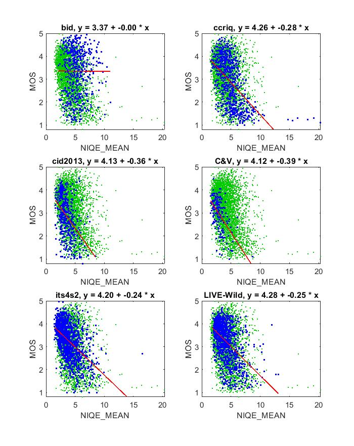

# Report on NIQE

_Go to [Report.md](Report.md) for an introduction to this series of NR metric reports, including their purpose, important warnings, the rating scale, and details of the statistical analysis._ 

Function `nrff_niqe.m` implements the Natural Image Quality Evaluator (NIQE) algorithm presented in [[4] and [5]](Publications.md). Natural Scene Statistics are combined with a Multivariate Gaussian Model to create the NIQE index for Image Quality Analysis. NIQE yields promising results but should be re-trained for the target application, to improve accuracy. MATLAB offers the necessary tools, but users must provide their own data (images with MOSs). 

Goal|Metric Name|Rating
----|-----------|------
MOS|NIQE|:star: :star:

## Algorithm Summary
NIQE is based on the work in [[4]](Publications.md). The natural image quality evaluator (NIQE) provided in [[5]](Publications.md) uses natural scene statistics (NSS) to predict overall image quality. The software in [[5]](Publications.md) breaks the image into a number of blocks that are analyzed individually, with size and overlap of those blocks being set by their NSS values (the numbers in our code match those in [[5]](Publications.md)). The blocks are compared locally to quantify sharpness relative to the area surrounding them. From there, a subset of blocks/patches considered to contain the best image information is used to compile the statistical model that will determine the quality of the rest of the patches. After fitting the entire image with a multivariate Gaussian model and the statistics gathered in the original analysis, NIQE provides an estimate for the overall quality of the image as a whole. 

## Speed and Conformity
Function `nrff_niqe.m` uses the software produced by the authors [[5]](Publications.md). A newer version, released in 2015 uses parallel pools in MATLAB for some of its calculations. That would conflict with the functionality of the rest of the NRMetricFramework, so it was decided to sacrifice some speed for more complete integration. 

In [[4]](Publications.md), the authors claim that NIQE is of a similar complexity to [BRISQUE](ReportBrisque.md) and our trials agree. Like BRISQUE, NIQE took 1.5 times as long to run as [nrff_blur.md](ReportBlur.md). 

## Analysis
Reference [[4]](Publications.md) reports 0.9135 Pearson correlation between NIQE and the [LIVE IQA database](https://live.ece.utexas.edu/research/Quality/subjective.htm). This database contains JPEG and JPEG2000 compression, Gaussian blur, white noise, and bit-errors in JPEG2000 bit-streams. 

Our analysis shows much lower correlation for modern camera impairments, with an average Pearson correlation of 0.43. Five of 6 datasets have similar fit lines and Pearson correlation values. All datasets have a scattering of outliers, with high NIQE values. Overall, NIQE is too inaccurate for immediate use but may serve as the starting point for future research. Retraining with a larger dataset might make NIQE more resilient.

```
1) NIQE_MEAN 
bid              corr =  0.00  rmse =  1.01  percentiles [ 2.12, 4.29, 5.12, 6.11,11.03]
ccriq            corr =  0.55  rmse =  0.85  percentiles [ 1.53, 3.54, 4.71, 5.70,20.33]
cid2013          corr =  0.45  rmse =  0.80  percentiles [ 1.61, 2.68, 3.28, 4.18, 8.51]
C&V              corr =  0.57  rmse =  0.59  percentiles [ 1.52, 2.29, 2.86, 3.45, 8.68]
its4s2           corr =  0.52  rmse =  0.63  percentiles [ 1.42, 2.65, 3.50, 4.69,16.51]
LIVE-Wild        corr =  0.49  rmse =  0.71  percentiles [ 1.72, 2.99, 3.83, 4.90,13.07]

average          corr =  0.43  rmse =  0.77
pooled           corr =  0.39  rmse =  0.81  percentiles [ 1.42, 2.96, 3.88, 5.14,20.33]
```

