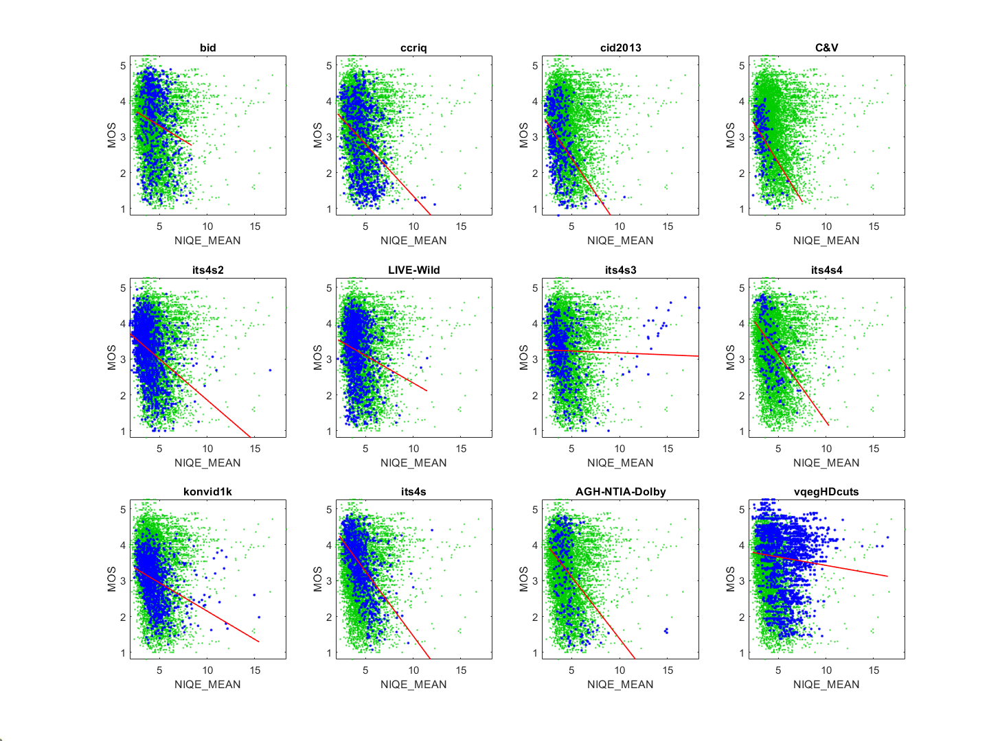

# Report on Natural Image Quality Evaluator (NIQE)

_Go to [Report.md](Report.md) for an introduction to this series of NR metric reports, including their purpose, important warnings, the rating scale, and details of the statistical analysis._ 

Function `nrff_niqe.m` implements the Natural Image Quality Evaluator (NIQE) algorithm presented in [[4] and [5]](Publications.md). Natural Scene Statistics are combined with a Multivariate Gaussian Model to create the NIQE index for Image Quality Analysis. 

Goal|Metric Name|Rating
----|-----------|------
MOS|NIQE|:star: :star:

__R&D Potential__: NIQE yields promising results but should be re-trained for the target application, to improve accuracy. MATLAB® offers the necessary tools, but users must provide their own data. 

## Algorithm Summary
Function `nrff_niqe.m` calls the MATLAB implementation of NIQE.

NIQE is based on the work in [[4]](Publications.md). The natural image quality evaluator (NIQE) provided in [[5]](Publications.md) uses natural scene statistics (NSS) to predict overall image quality. The software in [[5]](Publications.md) breaks the image into a number of blocks that are analyzed individually, with size and overlap of those blocks being set by their NSS values (the numbers in our code match those in [[5]](Publications.md)). The blocks are compared locally to quantify sharpness relative to the area surrounding them. From there, a subset of blocks/patches considered to contain the best image information is used to compile the statistical model that will determine the quality of the rest of the patches. After fitting the entire image with a multivariate Gaussian model and the statistics gathered in the original analysis, NIQE provides an estimate for the overall quality of the image as a whole. 

## Speed and Conformity

NIQE took __1.5×__ as long to run as the benchmark metric, [nrff_blur.md](ReportBlur.md).

In [[4]](Publications.md), the authors claim that NIQE is of a similar complexity to [BRISQUE](ReportBrisque.md) and our trials agree.  

Function `nrff_niqe.m` uses the software provided by MATLAB, which seems to produce slightly different values than the code provided by the authors [[5]](Publications.md).  

## Analysis
Reference [[4]](Publications.md) reports 0.9135 Pearson correlation between NIQE and the [LIVE IQA database](https://live.ece.utexas.edu/research/Quality/subjective.htm). This database contains JPEG and JPEG2000 compression, Gaussian blur, white noise, and bit-errors in JPEG2000 bit-streams. 

Our analysis shows much lower correlation for modern camera impairments, with an average Pearson correlation of 0.33. Five of six IQA datasets have similar fit lines and Pearson correlation values. All datasets have a scattering of outliers, with high NIQE values. The scatter plots for video datasets ITS4S3 and vqegHDcuts show a secondary pattern that appears to have the inverse correlation to MOS from the primary relationship depicted in the other datasets. Overall, NIQE is too inaccurate for immediate use but may serve as the starting point for future research. Retraining with a larger dataset might make NIQE more resilient.

NIQE is not equivalent to a one person ad-hoc test, for any of these datasets. 

The authors of [ADMD](ReportADMD.md) conclude that NIQE is ineffective on images that contain uneven illumination.  
```
1) NIQE_MEAN 
bid              corr =  0.18  rmse =  1.00  percentiles [ 2.58, 3.90, 4.46, 5.35, 8.37]
ccriq            corr =  0.35  rmse =  0.95  percentiles [ 2.08, 3.86, 4.54, 5.41,12.26]
cid2013          corr =  0.42  rmse =  0.81  percentiles [ 2.20, 3.08, 3.63, 4.25,  NaN]
C&V              corr =  0.48  rmse =  0.63  percentiles [ 2.36, 3.01, 3.35, 3.71, 7.55]
its4s2           corr =  0.35  rmse =  0.70  percentiles [ 1.89, 3.10, 3.63, 4.33,16.62]
LIVE-Wild        corr =  0.19  rmse =  0.80  percentiles [ 2.11, 3.51, 3.95, 4.54,11.46]
its4s3           corr =  0.03  rmse =  0.76  percentiles [ 2.06, 3.31, 3.79, 4.52,18.32]
its4s4           corr =  0.47  rmse =  0.78  percentiles [ 2.51, 3.56, 4.11, 4.88,10.31]
konvid1k         corr =  0.35  rmse =  0.60  percentiles [ 2.35, 3.56, 4.13, 4.87,15.45]
its4s            corr =  0.55  rmse =  0.64  percentiles [ 2.27, 3.68, 4.31, 5.10,11.98]
AGH-NTIA-Dolby   corr =  0.48  rmse =  0.99  percentiles [ 2.67, 3.77, 4.34, 4.96,14.95]
vqegHDcuts       corr =  0.09  rmse =  0.89  percentiles [ 2.31, 4.32, 5.48, 6.82,16.49]

average          corr =  0.33  rmse =  0.80
pooled           corr =  0.12  rmse =  0.87  percentiles [ 1.89, 3.54, 4.23, 5.24,  NaN]
```

