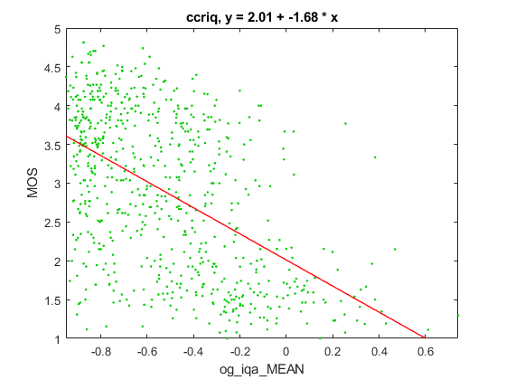

# Partial Report on Oriented Gradients Image Quality Assessment (OG-IQA) Metric

_Go to [Report.md](Report.md) for an introduction to this series of NR metric reports, including their purpose, important warnings, the rating scale, and details of the statistical analysis._ 

Function `nrff_og_iqa.m` implements the Oriented Gradients Image Quality Assessment (OG-IQA) metric, as presented in [[27]](Publications.md). This function requires the Fuzzy Logic toolbox and code from [[28]](Publication.md). OG-IQA is only analyzed on one dataset, because we do not have the Fuzzy Logic toolbox. This issue severely limits the accuracy of our assessment.

Goal | Metric Name|Rating
-----|------------|------
MOS  | OG-IQA | :star: :star:

__R&D Potential__: OG-IQA might be useful for RCA, if a pattern can be found among images that produce high values.

## Algorithm Summary 
The algorithm first gathers approximate values for the directional derivatives in the horizontal and vertical directions. From there, it generates three types of gradient maps to characterize quality dependent behavior over individual patches of the image. Publication [[27]](Publications.md) names the types as gradient magnitude (GM), relative gradient orientation (RO), and relative gradient magnitude (RM) and states that each of these maps is distinctly affected by the five types of distortions found in the LIVE-Wild dataset. In addition to these gradient maps, the algorithm implements a weak learning algorithm, AdaBoosting BP neural network, to analyze the distribution of the training data. Using this information, OG-IQA can adapt to errors in hypotheses and build a more reliable regression model. 

## Speed and Conformity
OG-IQA took __2×__ as long to run as the benchmark metric, [nrff_blur.m](ReportBlur.md). 

In terms of Big-O, this algorithm runs at O(n), since it filters the image a finite number of times whilst the remainder of the helper functions run in some sort of constant time. 
 
In terms of conformity, the authors' example code is followed exactly except for converting the image from RGB to grayscale, since our framework automatically supplies grayscale.

## Analysis
The authors report 0.9524 Pearson correlation between OG-IQA and MOS for the LIVE Image Quality Assessment Database Release 2 [[30]](Publications.md).

This report evaluates AGWN using the CCCRIQ dataset, which contains camera impairments. 
We only briefly had access to the MATLAB® Fuzzy Logic Toolbox and, due to that limitation, were only able to calculate OG-IQA values for the CCRIQ dataset. The CCRIQ scatter plot has a lower triangle shape (i.e., narrow range of values for high quality, wide range of values for low quality). OG-IQA estimates MOS, where we expect the data to scatter around a fit line. This problem is the basis for our conclusion that OG-IQA is very inaccurate. 

We expect the lower triangle shape when an impairment occurs sporadically. 
Thus, OG-IQA might be useful for RCA, if a pattern can be found among images that produce high values. 
```
--------------------------------------------------------------
1) og_iqa_MEAN
ccriq            corr =  0.53  rmse =  0.87  percentiles [-0.95,-0.80,-0.57,-0.32, 0.74]

average          corr =  0.53  rmse =  0.87
```


