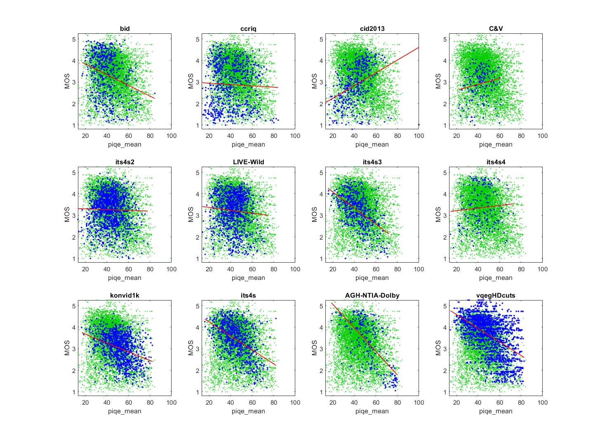

# Report on Perception Based Image Quality Evaluator (PIQE) Metric

_Go to [Report.md](Report.md) for an introduction to this series of NR metric reports, including their purpose, important warnings, the rating scale, and details of the statistical analysis._ 

Function `nrff_piqe.m` implements the Perception based Image Quality Evaluator (PIQE) metric, as presented in [[29]](Publications.md) and [[30]](Publications.md), using code made available from MATLAB®. PIQE does not work reliably across a broad range of modern camera systems and video content. 

Goal | Metric Name|Rating
-----|------------|------
MOS  | PIQE | :star:

__R&D Potential__: PIQE shows promising results for some datasets that contain broadcast quality videos, compression artifacts, and no camera impairments. 

## Algorithm Summary 
See MATLAB® help for an algorithm summary.

## Speed and Conformity
NR-PWN took __1.5×__ as long to run as the benchmark metric, [nrff_blur.md](ReportBlur.md).

Conformity is ensured by using MATLAB's implementation of PIQE. When applied to videos, `nrff_piqe.m` takes the average over all frames.

## Analysis

The authors report 0.90 Pearson correlation between PIQE and MOS for the LIVE Image Quality Assessment Database Release 2 [[30]](Publications.md), 0.87 Pearson correlation between PIQE and MOS for the CSIQ dataset [[33]](Publications.md), and 0.86 Pearson correlation between PIQE and MOS for the TID2008 dataset [[32]](Publications.md). 

PIQE does not respond well to diverse content and camera impairments. Note that the red fit line has a negative slope for the ITS4S dataset but a positive slope for the CID2013 dataset. 

The correlations are erratic: sometimes high (e.g., 0.67, 0.52, 0.51) and sometimes very low (e.g., 0.02, 0.04, 0.08). 
The high correlation indicates that PIQE could be impactful, if these issues are investigated and eliminated.
PIQE may have RCA potential, since its performance seems to be related to the presence or absence of certain types of impairments. 
```
1) piqe_mean 
bid              corr =  0.26  rmse =  0.98  false decisions =  43%  percentiles [16.91,31.94,38.00,45.03,84.43]
ccriq            corr =  0.04  rmse =  1.02  false decisions =  37%  percentiles [13.81,28.62,38.09,50.05,84.13]
cid2013          corr =  0.37  rmse =  0.84  false decisions =  21%  percentiles [13.40,33.32,41.77,48.36,100.00]
C&V              corr =  0.17  rmse =  0.71  false decisions =  25%  percentiles [22.02,35.69,42.43,47.65,61.04]
its4s2           corr =  0.02  rmse =  0.74  false decisions =  31%  percentiles [12.99,35.58,42.15,49.01,77.75]
LIVE-Wild        corr =  0.08  rmse =  0.82  false decisions =  34%  percentiles [13.74,35.85,42.37,48.91,74.36]
its4s3           corr =  0.52  rmse =  0.64  false decisions =  47%  percentiles [15.66,35.11,42.32,49.58,72.11]
its4s4           corr =  0.08  rmse =  0.88  false decisions =  32%  percentiles [14.31,35.43,42.46,50.43,72.81]
konvid1k         corr =  0.37  rmse =  0.60  false decisions =  39%  percentiles [16.59,44.26,51.93,59.10,82.20]
its4s            corr =  0.49  rmse =  0.67  false decisions =  46%  percentiles [15.90,36.61,44.08,53.24,82.01]
AGH-NTIA-Dolby   corr =  0.67  rmse =  0.83  false decisions =  58%  percentiles [18.57,44.71,52.34,62.17,79.71]
vqegHDcuts       corr =  0.51  rmse =  0.77  false decisions =  48%  percentiles [14.29,40.11,49.59,60.70,82.85]

average          corr =  0.30  rmse =  0.79
pooled           corr =  0.21  rmse =  0.86  percentiles [12.99,36.38,44.75,53.69,100.00]
```

