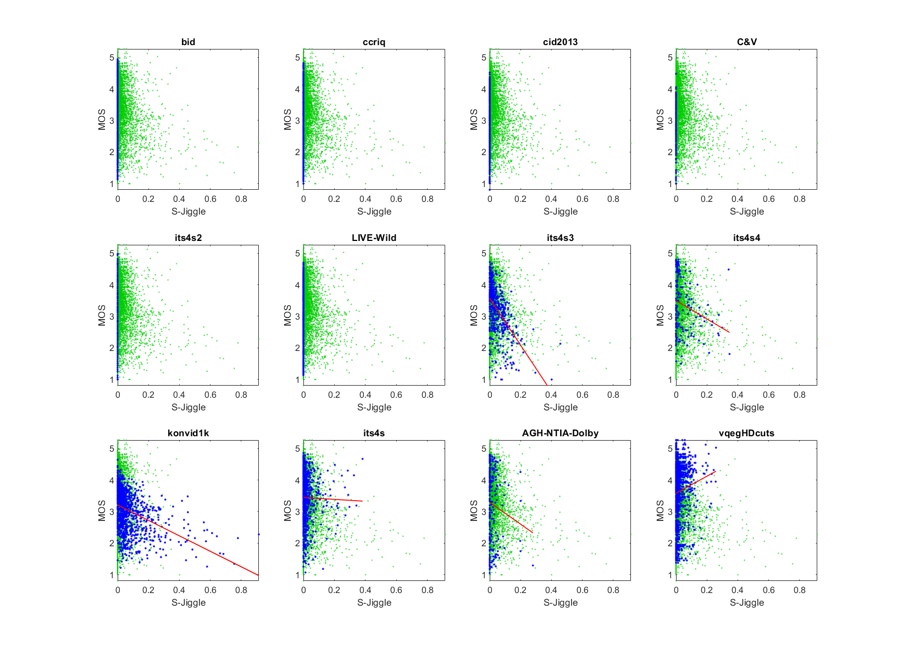

# Report on S-PanSpeed and S-Jiggle from group PanIPS

_This is a self-assessment._

_Go to [Report.md](Report.md) for an introduction to this series of NR metric reports, including their purpose, important warnings, the rating scale, and details of the statistical analysis._ 

Function `nrff_panIPS.m` assesses quality impairments associated with too fast camera pans. This algorithm performs well for camera pans, but more investigation is needed on the impact of within-camera movement.

Goal|Metric Name|Rating
----|-----------|------
RCA|S-PanSpeed|:star: :star:
RCA|S-Jiggle|:star: :star:

## Algorithm Summary

These algorithms are referenced to images per second (IPS), as described in [[47]](Publications.md).

Each pair of frames is divided into approximately 100 blocks. The horizontal and vertical motion is estimated for each block, based on a random subsampling of 0.2% of pixels in that block. To ensure robust calculations, at least 20 pixels are chosen. A heuristic search begins with a flat distribution of random shifts, then considers randomly selected shifts near the best previously found. A block's shift will be marked as invalid (NaN) if the region has too little texture or the frames are identical. The random selection and heuristic search mean that the metric's value could vary if run multiple times.

This shift search heuristic is based on shift registration algorithm used by the NTIA Video Quality Metric (VQM) [[48]](Publications.md) from ITU-T Rec. J.244 (2004) and ITU-R Rec. BT.1683 (2004). 
The search window is based an object or the background moving across the screen each 0.33 seconds. This fast camera pan speed is estimated from bodycam movements. 

S-PanSpeed computes the current frame's shift using the median horizontal and median vertical shift estimate over all 100 blocks. The average vertical and average horizontal shifts are calculated for each 0.2 seconds of video. The overall horizontal and vertical shifts for the entire video are calculated as the average of the slowest 50% of these 0.2 second estimates. That is, the algorithm ignores the 50% of estimates with fastest pan speeds (horizontal or vertical).

The separate horizontal and vertical estimates are combined into overall pan speed using Euclidean distance, weighing horizontal speed twice as much as vertical speed. 

S-Jiggle takes the same 100 block estimates and estimates camera jiggle for each 0.2 seconds of video. 
Jiggle is estimated based on the standard deviation of the horizontal and vertical motion. 
However, frames are occasionally repeated due to frame rate conversions (3/2 pull-down is the most common) and compression adds noise to the repeated frames. Thus, this standard deviation is computed three ways and the lowest estimate retained. The goal is to avoid erroneously high estimates. 

The overall jiggle for the entire video are calculated as the average of the lowest 50% of these 0.2 second estimates. That is, the algorithm ignores the 50% of estimates with highest jiggle estimates.

The previous version of PanIPS, as described in [[47]](Publications.md), can be found in the Release [NR Metric Framework Version 2](https://github.com/NTIA/NRMetricFramework/releases).
The major improvement here is to separate the NR metric into separate estimates for pan speed and jiggle.

## Speed and Conformity

PanIPS runs roughly __1.6×__ slower than the benchmark metric, [nrff_blur.m](ReportBlur.md).

Function `nrff_panIPS.m` was initially provided by this repository, so conformity is ensured. 

## Analysis

The NR Parameter PanIPS is evaluated using three types of datasets:
* Image quality datasets with camera impairments (BID, CCRIQ, CID2013, C&V, ITS4S2, and LIVE-Wild)
* Video quality datasets with camera impairments (ITS4S3, ITS4S4, and KonViD-1K)
* Video quality datasets with broadcast content and compression (ITS4S, AGH-NTIA-Dolby, and vqegHDcuts) 

S-PanSpeed for ITS4S4 depicts a narrow scatter of data around the fit line. We expect this shape for RCA parameters when the impairment is a dominant factor, as is the case here. ITS4S4 explores the relationship between video quality and camera pan speed. 

The scatter plots of the other video datasets have a lower triangle shape. We expect this shape when an impairment occurs sporadically, as is the case for these datasets. The drop in accuracy reflects both the change from training data to testing data, and the change from a dominant impairment to a sporadic impairment. 

The ITS4S and AGH/NTIA/Dolby datasets have low correlation and narrow range of values near zero (ignoring outliers). This indicate that these datasets only have slow camara pans. This is consistent with the dataset designs, which use footage from professional videographers. 

The undefined correlation and constant value are expected for image datasets which do not contain motion (e.g., BID, CCRIQ, CID2013, C&V, ITS4S2, LIVE-Wild). 

```text
1) S-PanSpeed 
bid              corr =   NaN  rmse =   Inf  percentiles [ 0.00, 0.00, 0.00, 0.00, 0.00]
ccriq            corr =   NaN  rmse =   Inf  percentiles [ 0.00, 0.00, 0.00, 0.00, 0.00]
cid2013          corr =   NaN  rmse =   Inf  percentiles [ 0.00, 0.00, 0.00, 0.00, 0.00]
C&V              corr =   NaN  rmse =   Inf  percentiles [ 0.00, 0.00, 0.00, 0.00, 0.00]
its4s2           corr =   NaN  rmse =   Inf  percentiles [ 0.00, 0.00, 0.00, 0.00, 0.00]
LIVE-Wild        corr =   NaN  rmse =   Inf  percentiles [ 0.00, 0.00, 0.00, 0.00, 0.00]
its4s3           corr =  0.38  rmse =  0.70  percentiles [ 0.00, 0.05, 0.10, 0.14, 0.47]
its4s4           corr =  0.81  rmse =  0.52  percentiles [ 0.00, 0.14, 0.23, 0.35, 0.62]
konvid1k         corr =  0.34  rmse =  0.60  percentiles [ 0.00, 0.05, 0.09, 0.14, 0.49]
its4s            corr =  0.08  rmse =  0.77  percentiles [ 0.00, 0.00, 0.06, 0.11, 0.49]
AGH-NTIA-Dolby   corr =  0.04  rmse =  1.13  percentiles [ 0.00, 0.00, 0.03, 0.07, 0.39]
vqegHDcuts       corr =  0.09  rmse =  0.89  percentiles [ 0.00, 0.00, 0.06, 0.10, 0.43]

average          corr =  0.29  rmse =   Inf
pooled           corr =  0.02  rmse =  0.88  percentiles [ 0.00, 0.00, 0.00, 0.08, 0.62]
```


S-Jiggle shows a lower triangle shape for the datasets that have significant presence of camera jiggle: KoNViD-1K, ITS4S3, and to a lesser extent ITS4S4. For all other datasets, S-Jiggle produces a narrow range of values near zero (minimal camera jiggle) that causes very low correlation values. As with S-PanSpeed, these statistics are not meaningful. Thus, S-Jiggle detects camera jiggle (which is the design intent) and does not seem to falsely trigger on other impairments. 

```
2) S-Jiggle 
bid              corr =   NaN  rmse =   Inf  percentiles [ 0.00, 0.00, 0.00, 0.00, 0.00]
ccriq            corr =   NaN  rmse =   Inf  percentiles [ 0.00, 0.00, 0.00, 0.00, 0.00]
cid2013          corr =   NaN  rmse =   Inf  percentiles [ 0.00, 0.00, 0.00, 0.00, 0.00]
C&V              corr =   NaN  rmse =   Inf  percentiles [ 0.00, 0.00, 0.00, 0.00, 0.00]
its4s2           corr =   NaN  rmse =   Inf  percentiles [ 0.00, 0.00, 0.00, 0.00, 0.00]
LIVE-Wild        corr =   NaN  rmse =   Inf  percentiles [ 0.00, 0.00, 0.00, 0.00, 0.00]
its4s3           corr =  0.52  rmse =  0.65  percentiles [ 0.00, 0.01, 0.03, 0.07, 0.46]
its4s4           corr =  0.24  rmse =  0.86  percentiles [ 0.00, 0.00, 0.01, 0.06, 0.35]
konvid1k         corr =  0.39  rmse =  0.59  percentiles [ 0.00, 0.02, 0.04, 0.09, 0.91]
its4s            corr =  0.02  rmse =  0.77  percentiles [ 0.00, 0.00, 0.01, 0.03, 0.38]
AGH-NTIA-Dolby   corr =  0.11  rmse =  1.12  percentiles [ 0.00, 0.00, 0.00, 0.03, 0.28]
vqegHDcuts       corr =  0.09  rmse =  0.89  percentiles [ 0.00, 0.00, 0.01, 0.02, 0.26]

average          corr =  0.23  rmse =   Inf
pooled           corr =  0.11  rmse =  0.87  percentiles [ 0.00, 0.00, 0.00, 0.01, 0.91]
```


