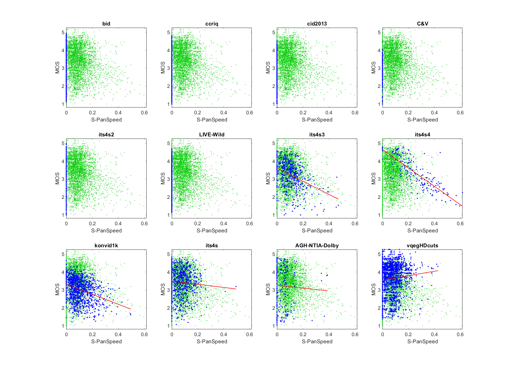

# Report on Pan Speed

_This is a self-assessment._

_Go to [Report.md](Report.md) for an introduction to this series of NR metric reports, including their purpose, important warnings, the rating scale, and details of the statistical analysis._ 

Function `nrff_panIPS.m` assesses quality impairments associated with too fast camera pans. This algorithm performs well for camera pans, but more investigation is needed on the impact of within-camera movement.

Goal|Metric Name|Rating
----|-----------|------
RCA|PanIPS|:star: :star:

## Algorithm Summary

Pan Speed is NR parameter #7 in function `nrff_panIPS.m`. Parameter #8 (an alternative to Pan Speed that was trained using a neural network) has superior performance on the training dataset (ITS4S4) but worse performance on testing datasets. Parameters #1 through #6 provide intermediate results. Only parameter #7 is intended for immediate use. The other parameters are provided to encourage future development and are not intended for immediate use.

Pan Speed estimates the overall camera pan using several estimates, each based on crossing line of pixels through the image (vertically and horizontally). This algorithm is a compromise between accuracy and run speed, with run speed being the constraining factor. See `nrff_panIPS.m` for details. 

## Speed and Conformity
Function `nrff_panIPS.` was initially provided by this repository, so conformity is ensured. PanIPS has the same run speed [nrff_blur.m](ReportBlur.md). 

## Analysis

The NR Parameter PanIPS is evaluated using three types of datasets:
* Image quality datasets with camera impairments (BID, CCRIQ, CID2013, C&V, ITS4S2, and LIVE-Wild)
* Video quality datasets with camera impairments (ITS4S3, ITS4S4, and KonViD-1K)
* Simulated adaptive streaming, at broadcast bit-rates (ITS4S) 

Pan Speed was trained on the ITS4S4 dataset. ITS4S4's data is narrowly scattered around the fit line. We expect this shape for RCA parameters when the impairment is a dominant factor, as is the case here. ITS4S4 explores the relationship between video quality and camera pan speed. 

The scatter plots of the other video datasets (i.e., ITS4S, ITS4S3, KoNViD-1k) have a lower triangle shape. We expect this shape when an impairment occurs sporadically, as is the case for these datasets. The drop in accuracy reflects both the change from training data to testing data, and the change from a dominant impairment to a sporadic impairment. It is not clear whether the reduced performance for the ITS4S dataset indicates a flaw in the metric or a characteristic of the videos in this dataset. 

The undefined correlation and constant value are expected for image datasets which do not contain motion (e.g., BID, CCRIQ, CID2013, C&V, ITS4S2, LIVE-Wild). We did not investigate LIVE-Wild images that yield other values for Pan Speed. 

The overall performance is promising. More detailed investigation is needed to determine what happens when Pan Speed is given a video with complex motion (e.g., a large object moving across a still background). 


```text
7) PanSpeed 
bid              corr =   NaN  rmse =   Inf  percentiles [ 4.67, 4.67, 4.67, 4.67, 4.67]
ccriq            corr =   NaN  rmse =   Inf  percentiles [ 4.67, 4.67, 4.67, 4.67, 4.67]
cid2013          corr =   NaN  rmse =   Inf  percentiles [ 4.67, 4.67, 4.67, 4.67, 4.67]
C&V              corr =   NaN  rmse =   Inf  percentiles [ 4.67, 4.67, 4.67, 4.67, 4.67]
its4s2           corr =   NaN  rmse =   Inf  percentiles [ 4.67, 4.67, 4.67, 4.67, 4.67]
LIVE-Wild        corr =  0.06  rmse =  0.82  percentiles [ 4.48, 4.67, 4.67, 4.67, 4.67]
its4s3           corr =  0.35  rmse =  0.71  percentiles [ 1.26, 3.79, 4.14, 4.67, 4.67]
its4s4           corr =  0.79  rmse =  0.54  percentiles [ 1.43, 2.73, 3.32, 3.99, 4.67]
konvid1k         corr =  0.34  rmse =  0.60  percentiles [ 1.20, 3.89, 4.67, 4.67, 4.67]
its4s            corr =  0.10  rmse =  0.77  percentiles [ 2.16, 4.11, 4.42, 4.67, 4.67]

average          corr =   NaN  rmse =   Inf
pooled           corr =  0.11  rmse =  0.83  percentiles [ 1.20, 4.67, 4.67, 4.67, 4.67]
```


