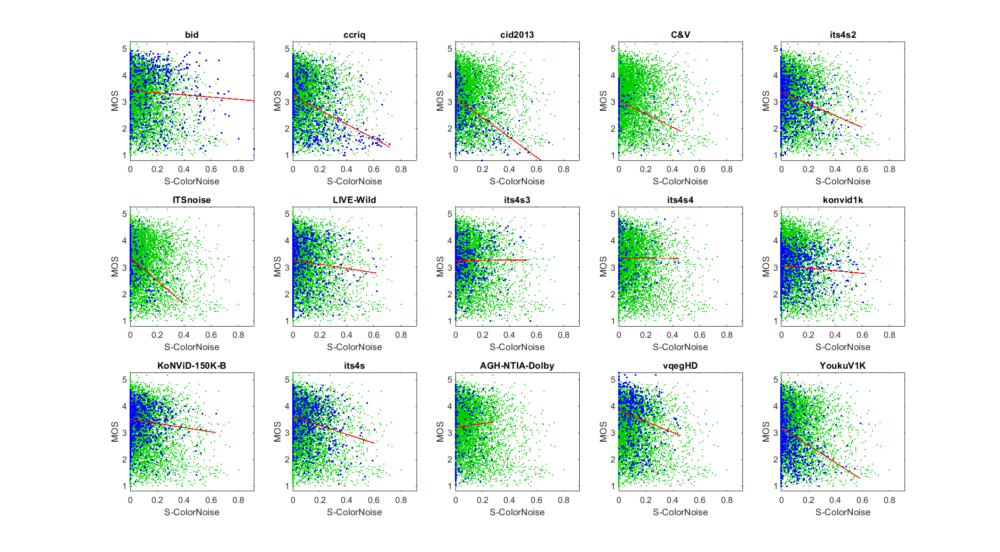
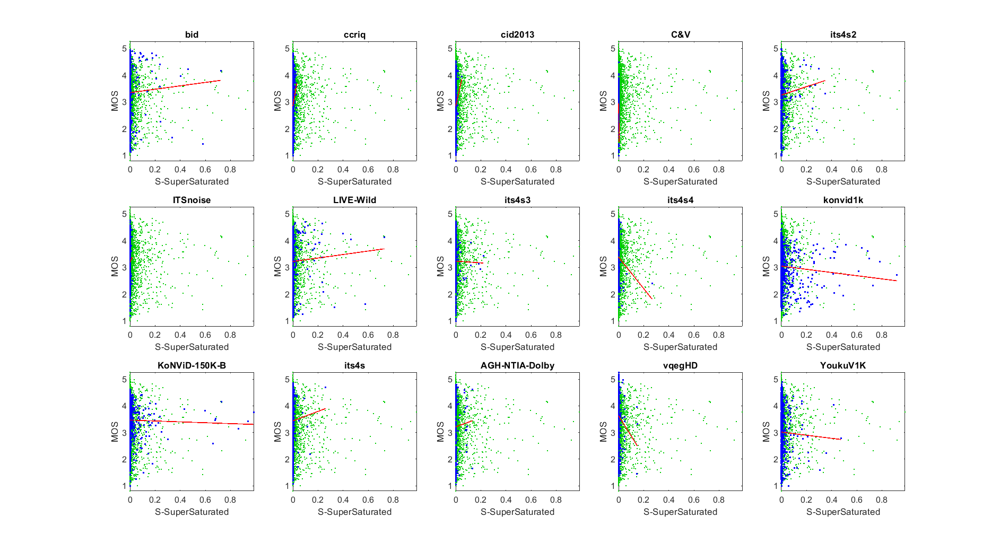
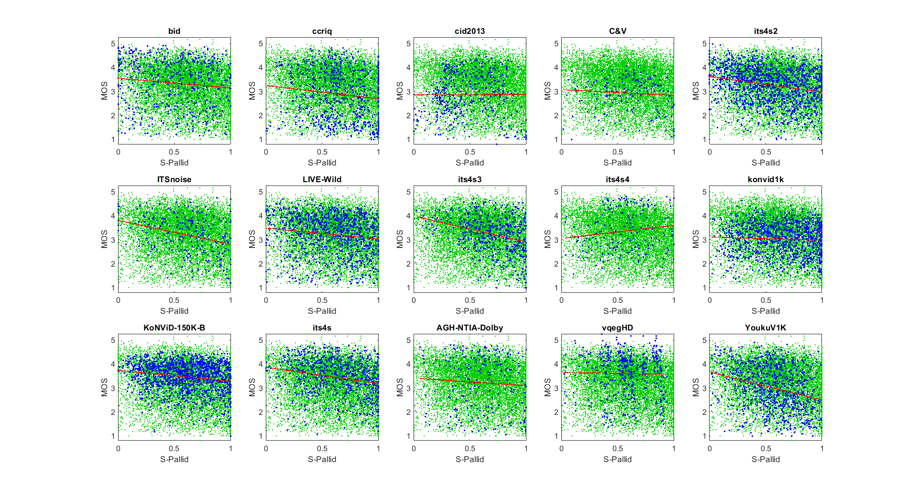

# Report on S-ColorNoise, S-SuperSaturated, and S-Pallid, from the Peculiar Color Group

_This is a self-assessment._

_Go to [Report.md](Report.md) for an introduction to this series of NR metric reports, including their purpose, important warnings, the rating scale, and details of the statistical analysis._ 

Function `nrff_peculiar_color.m` assesses impairments related to discrepancies in the color planes (Cb and Cr). These algorithms provide RCA with enough accuracy to be included in NR Metric [Sawatch](ReportSawatch.md).

Goal|Metric Name|Rating
----|-----------|------
RCA|S-ColorNoise|:star: :star:
RCA|S-SuperSaturated|:star: :star:
RCA|S-Pallid|:star: :star:

## Algorithm Summary

Function `nrff_peculiar_color.m` provides three NR parameters: Color Noise, Super Saturated, and Pallid. 

**S-ColorNoise** uses quirks of the YCbCr color space to detect quality problems. The Cb and Cr color planes do not really align to how people perceive, think, and talk about colors [[49](Publications.md)]. Thus, we expect edges in the Cb plane to also appear in the Cr plane. The Color Noise parameter uses an (11×11) edge filter, and makes judgements based on the blocks with the most similar edges. Dropping similarity indicates quality problems like camera noise, color limit overflow, and post-processing that unnaturally changes the relationship between Cb and Cr.  

**S-ColorNoise** produces Not a Number (NaN) there is so little color, that the Pearson correlation is overly impacted by sampling errors (i.e., the standar deviation of Cb or Cr is less than 3). 

**S-SuperSaturated** calculates the fraction of Cb/Cr pixels with magnitudes < -64 or > 64. These magnitudes are more extreme than is typically observed in cameras. The value "64" was selected experimentally, by based on the training datasets.

**S-Pallid** estimates the fraction of the image (or video) that contains an extremely low spread of Cb or Cr values. This detects pallid images (i.e., deficient in color). Luma is ignored to avoid bias with regard to white balance or the image's overall hue. For example, a camera photograph of a black-and-white receipt may not have any pixels where Cb = 0 or Cr = 0. 

## Speed and Conformity
Peculiar Color takes __1×__ as long to run as the benchmark metric, [nrff_blur.md](ReportBlur.md).  

In Big-O notation, Pecular Color is O(n). 

Function `nrff_peculiar_color.m` was initially provided by this repository, so conformity is ensured. 

## Analysis

This analysis uses three types of datasets:
* Image quality datasets with camera impairments (BID, CCRIQ, CID2013, C&V, ITS4S2, ITSnoise, and LIVE-Wild)
* Video quality datasets with camera impairments (ITS4S3, ITS4S4, KonViD-1K, and KoNViD-150K-B)
* Video quality datasets with broadcast content and compression (ITS4S, AGH-NTIA-Dolby, vqegHD, and YoukuV1K) 

### S-ColorNoise

The S-ColorNoise scatter plots show some variation in fit line among datasets. Compare the scatter of blue dots (for the current dataset) with the green dots (that show the overall response of all datasets). The red lines plot fits for the blue dots.  

S-ColorNoise has the highest accuracy and consistency for datasets that contain only camera impairments. See CCRIQ, CID2013, C&V, ITS4S2, and ITS4S3. S-ColorNoise flags camera photographs in CCRIQ where low light conditions cause random noise in Cb and Cr planes. Color Noise also flags camera photographs in CCRIQ where bright light caused problems in the Cb and Cr planes (e.g., a magenta haze around clouds in the Winter Peaks scene). 

These scatter plots have a well defined lower triangle shape (i.e., narrow range of values for high quality, wide range of values for low quality). We expect this shape when an impairment occurs sporadically. 

Lower metric performance stems from two causes. First, some datasets, most notably ITS4S, do not contain this impairment. Color Noise is > 0.4 for most media in these datasets. 

Second, dataset LIVE-Wild and BID contain images that seem to have been color enhanced after camera capture. S-ColorNoise yields low values (S-ColorNoise < 0.4) for some images in the BID dataset which subjects liked (MOS > 3). It would be nice if Color Noise could detect and ignore color modifications that improve or do not reduce quality.


```text
1) S-ColorNoise 
bid              corr =  0.069  rmse =  1.01  false decisions =  36%  percentiles [ 0.00, 0.04, 0.14, 0.27,  NaN]
ccriq            corr =  0.410  rmse =  0.94  false decisions =  49%  percentiles [ 0.00, 0.00, 0.10, 0.30,  NaN]
cid2013          corr =  0.492  rmse =  0.76  false decisions =  55%  percentiles [ 0.00, 0.00, 0.00, 0.09,  NaN]
C&V              corr =  0.335  rmse =  0.66  false decisions =  42%  percentiles [ 0.00, 0.00, 0.00, 0.03,  NaN]
its4s2           corr =  0.265  rmse =  0.72  false decisions =  42%  percentiles [ 0.00, 0.00, 0.00, 0.07,  NaN]
ITSnoise         corr =  0.388  rmse =  0.72  false decisions =  50%  percentiles [ 0.00, 0.00, 0.00, 0.06,  NaN]
LIVE-Wild        corr =  0.090  rmse =  0.82  false decisions =  35%  percentiles [ 0.00, 0.00, 0.00, 0.07,  NaN]
its4s3           corr =  0.007  rmse =  0.74  false decisions =  32%  percentiles [ 0.00, 0.00, 0.03, 0.10,  NaN]
its4s4           corr =  0.005  rmse =  0.88  false decisions =  36%  percentiles [ 0.00, 0.00, 0.03, 0.10,  NaN]
konvid1k         corr =  0.087  rmse =  0.64  false decisions =  32%  percentiles [ 0.00, 0.00, 0.01, 0.13,  NaN]
KoNViD-150K-B    corr =  0.108  rmse =  0.59  false decisions =  30%  percentiles [ 0.00, 0.00, 0.00, 0.06,  NaN]
its4s            corr =  0.251  rmse =  0.74  false decisions =  40%  percentiles [ 0.00, 0.00, 0.06, 0.16,  NaN]
AGH-NTIA-Dolby   corr =  0.048  rmse =  1.13  false decisions =  35%  percentiles [ 0.00, 0.00, 0.00, 0.08,  NaN]
vqegHD           corr =  0.203  rmse =  0.87  false decisions =  40%  percentiles [ 0.00, 0.05, 0.10, 0.16, 0.46]
YoukuV1K         corr =  0.298  rmse =  0.87  false decisions =  49%  percentiles [ 0.00, 0.00, 0.01, 0.08,  NaN]

average          corr =  0.204  rmse =  0.81
pooled           corr =  0.182  rmse =  0.82  percentiles [ 0.00, 0.00, 0.02, 0.12,  NaN]
```



### S-SuperSaturated
S-SuperSaturated detects extreme values of Cb and Cr that may be associated with a drop in quality, as demonstrated by dataset KonVid-1K. However, the other datasets neither support nor convincingly reject this conclusion. BID and Live-Wild indicate that higher values of Super Saturation may be associated with a slight quality increase, but there are too few media with values above 0.1 and too many outliers to reach a definitive conclusion. More training data is needed to develop this idea into a more robust NR metric for RCA.
```
2) S-SuperSaturated 
bid              corr =  0.037  rmse =  1.01  false decisions =  37%  percentiles [ 0.00, 0.00, 0.00, 0.00, 0.72]
ccriq            corr =  0.119  rmse =  1.01  false decisions =  33%  percentiles [ 0.00, 0.00, 0.00, 0.00, 0.03]
cid2013          corr =  0.095  rmse =  0.90  false decisions =  27%  percentiles [ 0.00, 0.00, 0.00, 0.00, 0.05]
C&V              corr =  0.166  rmse =  0.71  false decisions =  28%  percentiles [ 0.00, 0.00, 0.00, 0.00, 0.01]
its4s2           corr =  0.051  rmse =  0.74  false decisions =  23%  percentiles [ 0.00, 0.00, 0.00, 0.00, 0.35]
ITSnoise         corr =  0.029  rmse =  0.80  false decisions =  24%  percentiles [ 0.00, 0.00, 0.00, 0.00, 0.02]
LIVE-Wild        corr =  0.035  rmse =  0.82  false decisions =  32%  percentiles [ 0.00, 0.00, 0.00, 0.00, 0.73]
its4s3           corr =  0.007  rmse =  0.76  false decisions =  25%  percentiles [ 0.00, 0.00, 0.00, 0.00, 0.22]
its4s4           corr =  0.143  rmse =  0.87  false decisions =  41%  percentiles [ 0.00, 0.00, 0.00, 0.00, 0.27]
konvid1k         corr =  0.080  rmse =  0.64  false decisions =  34%  percentiles [ 0.00, 0.00, 0.00, 0.01, 0.92]
KoNViD-150K-B    corr =  0.018  rmse =  0.60  false decisions =  27%  percentiles [ 0.00, 0.00, 0.00, 0.00, 0.98]
its4s            corr =  0.030  rmse =  0.77  false decisions =  30%  percentiles [ 0.00, 0.00, 0.00, 0.00, 0.26]
AGH-NTIA-Dolby   corr =  0.033  rmse =  1.13  false decisions =  37%  percentiles [ 0.00, 0.00, 0.00, 0.00, 0.13]
vqegHD           corr =  0.118  rmse =  0.89  false decisions =  39%  percentiles [ 0.00, 0.00, 0.00, 0.00, 0.15]
YoukuV1K         corr =  0.023  rmse =  0.91  false decisions =  32%  percentiles [ 0.00, 0.00, 0.00, 0.00, 0.47]

average          corr =  0.065  rmse =  0.84
pooled           corr =  0.013  rmse =  0.83  percentiles [ 0.00, 0.00, 0.00, 0.00, 0.98]
```



### S-Pallid
Overall, the S-Pallid scatter plots form a gentle downward slope across most datasets. Low values (colorful media) are associated with higher MOSs, while high values (pallid media) are associated with lower MOSs.  Dataset ITS4S4 avoids all impairments other than camera pans, so its negative correlation is expected. The overall shape of these scatter plots is an upper triangle. This is consistent with an impairment that has only a small impact on the overall MOS. 

Of interest is the strong response of dataset its4s3 (0.30 correlation). Dataset ITS4S3 contains simulated public safety content that was rated within the context of public safety applications. Dataset ITS4S2 contains 40% public safety content and has the second strongest response (0.24 correlation); while dataset ITS4S contains 17% public safety content and has the third strongest response (0.22 correlation). This may indicate that colorful media are helpful when first responders use videos and images during their jobs. 

While the intent of S-Pallid is to detect camera impairments, it could be triggered by content that is inherently lacking colors, such tire tracks in ash or snow.

```
3) S-Pallid 
bid              corr =  0.112  rmse =  1.01  false decisions =  40%  percentiles [ 0.00, 0.24, 0.51, 0.72, 1.00]
ccriq            corr =  0.129  rmse =  1.01  false decisions =  40%  percentiles [ 0.01, 0.49, 0.65, 0.86, 1.00]
cid2013          corr =  0.003  rmse =  0.90  false decisions =  33%  percentiles [ 0.00, 0.29, 0.43, 0.68, 1.00]
C&V              corr =  0.083  rmse =  0.72  false decisions =  33%  percentiles [ 0.02, 0.43, 0.63, 0.81, 1.00]
its4s2           corr =  0.243  rmse =  0.72  false decisions =  37%  percentiles [ 0.00, 0.32, 0.55, 0.78, 1.00]
ITSnoise         corr =  0.318  rmse =  0.76  false decisions =  43%  percentiles [ 0.00, 0.43, 0.65, 0.80, 1.00]
LIVE-Wild        corr =  0.146  rmse =  0.81  false decisions =  37%  percentiles [ 0.00, 0.37, 0.61, 0.80, 1.00]
its4s3           corr =  0.313  rmse =  0.72  false decisions =  40%  percentiles [ 0.03, 0.56, 0.72, 0.88, 1.00]
its4s4           corr =  0.147  rmse =  0.87  false decisions =  30%  percentiles [ 0.04, 0.41, 0.58, 0.74, 1.00]
konvid1k         corr =  0.053  rmse =  0.64  false decisions =  31%  percentiles [ 0.02, 0.44, 0.67, 0.87, 1.00]
KoNViD-150K-B    corr =  0.183  rmse =  0.59  false decisions =  31%  percentiles [ 0.00, 0.42, 0.62, 0.81, 1.00]
its4s            corr =  0.220  rmse =  0.75  false decisions =  39%  percentiles [ 0.00, 0.44, 0.64, 0.85, 1.00]
AGH-NTIA-Dolby   corr =  0.067  rmse =  1.12  false decisions =  39%  percentiles [ 0.06, 0.42, 0.61, 0.77, 1.00]
vqegHD           corr =  0.016  rmse =  0.89  false decisions =  34%  percentiles [ 0.03, 0.44, 0.59, 0.74, 0.94]
YoukuV1K         corr =  0.289  rmse =  0.87  false decisions =  44%  percentiles [ 0.01, 0.40, 0.58, 0.74, 1.00]

average          corr =  0.155  rmse =  0.83
pooled           corr =  0.150  rmse =  0.82  percentiles [ 0.00, 0.40, 0.61, 0.80, 1.00]
```


