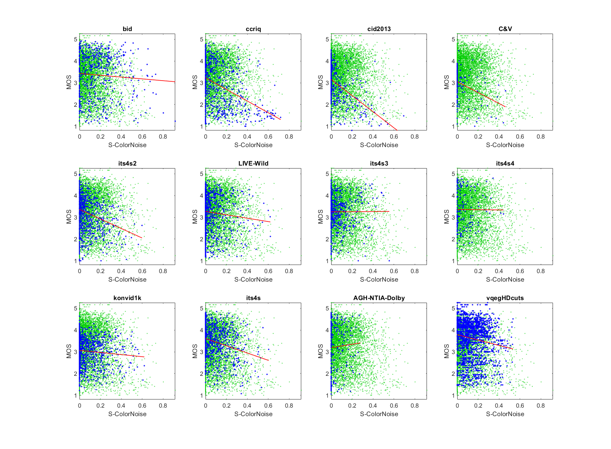
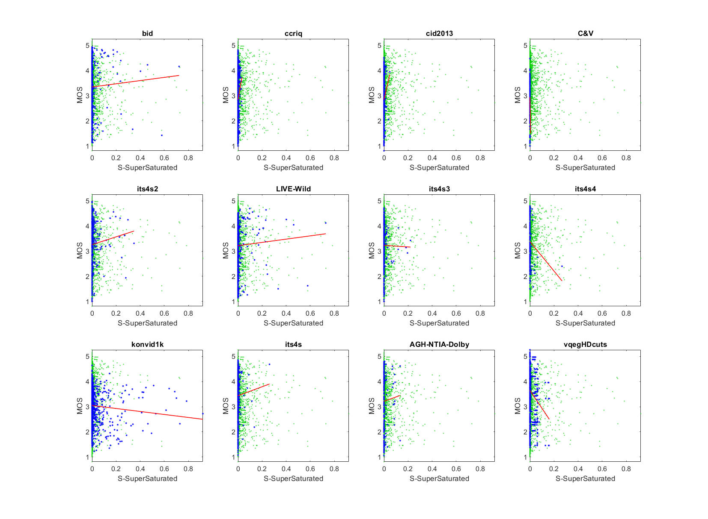
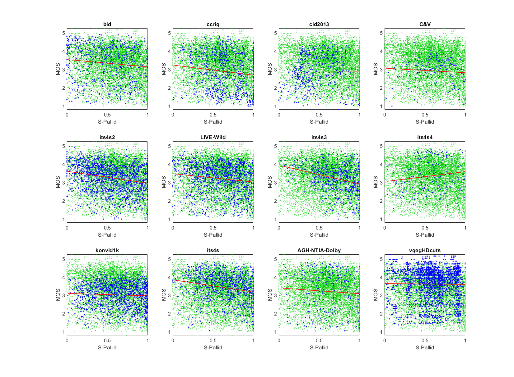

# Report on Peculiar Color

_This is a self-assessment._

_Go to [Report.md](Report.md) for an introduction to this series of NR metric reports, including their purpose, important warnings, the rating scale, and details of the statistical analysis._ 

Function `nrff_peculiar_color.m` assesses impairments related to discrepancies in the color planes (Cb and Cr). These algorithms provide RCA with enough accuracy to be included in NR Metric [Sawatch](ReportSawatch.md).

Goal|Metric Name|Rating
----|-----------|------
RCA|Color Noise|:star: :star:
RCA|Super Saturation|:star: :star:
RCA|Pallid|:star: :star:

## Algorithm Summary

Function `nrff_peculiar_color.m` provides three NR parameters: Color Noise, Super Saturated, and Pallid. 

**Color Noise** uses quirks of the YCbCr color space to detect quality problems. The Cb and Cr color planes do not really align to how people think and talk about colors. Thus, we expect edges in the Cb plane to also appear in the Cr plane. The Color Noise parameter uses an (11×11) edge filter, and makes judgements based on the blocks with the most similar edges. Dropping similarity indicates quality problems like camera noise, color limit overflow, and post-processing that unnaturally changes the relationship between Cb and Cr.

**Super Saturated** calculates the fraction of Cb/Cr pixels with magnitudes < -64 or > 64. These magnitudes are more extreme than is typically observed in cameras.

**Pallid** estimates the fraction of the image (or video) that contains an extremely low spread of Cb or Cr values. This detects pallid images (i.e., deficient in color). Luma is ignored to avoid bias with regard to white balance or the image's overall hue. For example, a camera photograph of a black-and-white receipt may not have any pixels where Cb = 0 or Cr = 0. 

## Speed and Conformity
Function `nrff_peculiar_color.m` was initially provided by this repository, so conformity is ensured. 

The speed of Super Saturated and Pallid is O(n), which is as fast as can be expected of any NR metric. 

The speed of Color Noise is constrained by the edge filter, which contains symmetries that enable faster calculation. Investigations around 2005 concluded that this filter could be implemented in real time on a typical desktop computer, using chip specific function calls. The MATLAB implementation in this repository is much slower. 


## Analysis

The NR metric Sawatch is evaluated using three types of datasets:
* Image quality datasets with camera impairments (BID, CCRIQ, CID2013, C&V, ITS4S2, and LIVE-Wild)
* Video quality datasets with camera impairments (ITS4S3, ITS4S4, and KonViD-1K)
* Simulated adaptive streaming, at broadcast bit-rates (ITS4S) 

### Color Noise

The Color Noise scatter plots show some variation in fit line among datasets. Compare the scatter of blue dots (for the current dataset) with the green dots (that show the overall response of all datasets). The red lines plot fits for the blue dots.  

Color Noise has the highest accuracy and consistency for datasets that contain only camera impairments. See CCRIQ, CID2013, C&V, ITS4S2, and ITS4S3. Color Noise flags camera photographs in CCRIQ where low light conditions cause random noise in Cb and Cr planes. Color Noise also flags camera photographs in CCRIQ where bright light caused problems in the Cb and Cr planes (e.g., a magenta haze around clouds in the Winter Peaks scene). 

These scatter plots have a well defined lower triangle shape (i.e., narrow range of values for high quality, wide range of values for low quality). We expect this shape when an impairment occurs sporadically. 

Lower metric performance stems from two causes. First, some datasets, most notably ITS4S, do not contain this impairment. Color Noise is > 0.4 for most media in these datasets. 

Second, dataset LIVE-Wild and BID contain images that seem to have been color enhanced after camera capture. Color Noise yields low values (Color Noise < 0.4) for some images in the BID dataset which subjects liked (MOS > 3). It would be nice if Color Noise could detect and ignore color modifications that improve or do not reduce quality.


```text
1) ColorNoise 
bid              corr =  0.07  rmse =  1.01  percentiles [ 0.08, 0.66, 0.78, 0.87,  NaN]
ccriq            corr =  0.41  rmse =  0.94  percentiles [ 0.25, 0.74, 0.86, 0.90,  NaN]
cid2013          corr =  0.49  rmse =  0.76  percentiles [ 0.28, 0.82, 0.90, 0.90,  NaN]
C&V              corr =  0.34  rmse =  0.66  percentiles [ 0.48, 0.87, 0.90, 0.90,  NaN]
its4s2           corr =  0.26  rmse =  0.72  percentiles [ 0.36, 0.86, 0.90, 0.90,  NaN]
LIVE-Wild        corr =  0.09  rmse =  0.82  percentiles [ 0.34, 0.85, 0.90, 0.90,  NaN]
its4s3           corr =  0.00  rmse =  0.74  percentiles [ 0.40, 0.82, 0.88, 0.90,  NaN]
its4s4           corr =  0.01  rmse =  0.88  percentiles [ 0.50, 0.81, 0.87, 0.90,  NaN]
konvid1k         corr =  0.09  rmse =  0.64  percentiles [ 0.34, 0.79, 0.89, 0.90,  NaN]
its4s            corr =  0.25  rmse =  0.74  percentiles [ 0.36, 0.77, 0.85, 0.90,  NaN]

average          corr =  0.20  rmse =  0.79
pooled           corr =  0.19  rmse =  0.81  percentiles [ 0.08, 0.80, 0.89, 0.90,  NaN]
```



### Super Saturation
Super Saturation detects extreme values of Cb and Cr that may be associated with a drop in quality, as demonstrated by dataset KonVid-1K. However, the other datasets neither support nor convincingly reject this conclusion. BID and Live-Wild indicate that higher values of Super Saturation may be associated with a slight quality increase, but there are too few media with values above 0.1 and too many outliers to reach a definitive conclusion. More training data is needed to develop this idea into a more robust NR metric for RCA.
```
2) SuperSaturated 
bid              corr =  0.04  rmse =  1.01  percentiles [ 0.00, 0.00, 0.00, 0.00, 0.72]
ccriq            corr =  0.12  rmse =  1.01  percentiles [ 0.00, 0.00, 0.00, 0.00, 0.03]
cid2013          corr =  0.09  rmse =  0.90  percentiles [ 0.00, 0.00, 0.00, 0.00, 0.05]
C&V              corr =  0.17  rmse =  0.71  percentiles [ 0.00, 0.00, 0.00, 0.00, 0.01]
its4s2           corr =  0.05  rmse =  0.74  percentiles [ 0.00, 0.00, 0.00, 0.00, 0.35]
LIVE-Wild        corr =  0.03  rmse =  0.82  percentiles [ 0.00, 0.00, 0.00, 0.00, 0.73]
its4s3           corr =  0.01  rmse =  0.76  percentiles [ 0.00, 0.00, 0.00, 0.00, 0.22]
its4s4           corr =  0.14  rmse =  0.87  percentiles [ 0.00, 0.00, 0.00, 0.00, 0.27]
konvid1k         corr =  0.08  rmse =  0.64  percentiles [ 0.00, 0.00, 0.00, 0.01, 0.92]
its4s            corr =  0.03  rmse =  0.77  percentiles [ 0.00, 0.00, 0.00, 0.00, 0.26]

average          corr =  0.08  rmse =  0.82
pooled           corr =  0.01  rmse =  0.83  percentiles [ 0.00, 0.00, 0.00, 0.00, 0.92]
```



### Pallid
Overall, the Pallid scatter plots form a gentle downward slope across most datasets. Low values (colorful media) are associated with higher MOSs, while high values (pallid media) are associated with lower MOSs.  Dataset ITS4S4 avoids all impairments other than camera pans, so its negative correlation is expected. The overall shape of these scatter plots is an upper triangle. This is consistent with an impairment that has only a small impact on the overall MOS. 

Of interest is the strong response of dataset its4s3 (0.30 correlation). Dataset ITS4S3 contains simulated public safety content that was rated within the context of public safety applications. Dataset ITS4S2 contains 40% public safety content and has the second strongest response (0.24 correlation); while dataset ITS4S contains 17% public safety content and has the third strongest response (0.22 correlation). This may indicate that colorful media are helpful when first responders use videos and images during their jobs. 

```
3) Pallid 
bid              corr =  0.11  rmse =  1.01  percentiles [ 0.00, 0.24, 0.51, 0.72, 1.00]
ccriq            corr =  0.13  rmse =  1.01  percentiles [ 0.01, 0.49, 0.65, 0.86, 1.00]
cid2013          corr =  0.00  rmse =  0.90  percentiles [ 0.00, 0.29, 0.43, 0.68, 1.00]
C&V              corr =  0.08  rmse =  0.72  percentiles [ 0.02, 0.43, 0.63, 0.81, 1.00]
its4s2           corr =  0.24  rmse =  0.72  percentiles [ 0.00, 0.32, 0.55, 0.78, 1.00]
LIVE-Wild        corr =  0.15  rmse =  0.81  percentiles [ 0.00, 0.37, 0.61, 0.80, 1.00]
its4s3           corr =  0.30  rmse =  0.72  percentiles [ 0.03, 0.56, 0.73, 0.89, 1.00]
its4s4           corr =  0.15  rmse =  0.87  percentiles [ 0.04, 0.41, 0.58, 0.74, 1.00]
konvid1k         corr =  0.05  rmse =  0.64  percentiles [ 0.02, 0.44, 0.67, 0.87, 1.00]
its4s            corr =  0.22  rmse =  0.75  percentiles [ 0.00, 0.44, 0.64, 0.85, 1.00]

average          corr =  0.14  rmse =  0.81
pooled           corr =  0.15  rmse =  0.82  percentiles [ 0.00, 0.39, 0.61, 0.82, 1.00]
```


