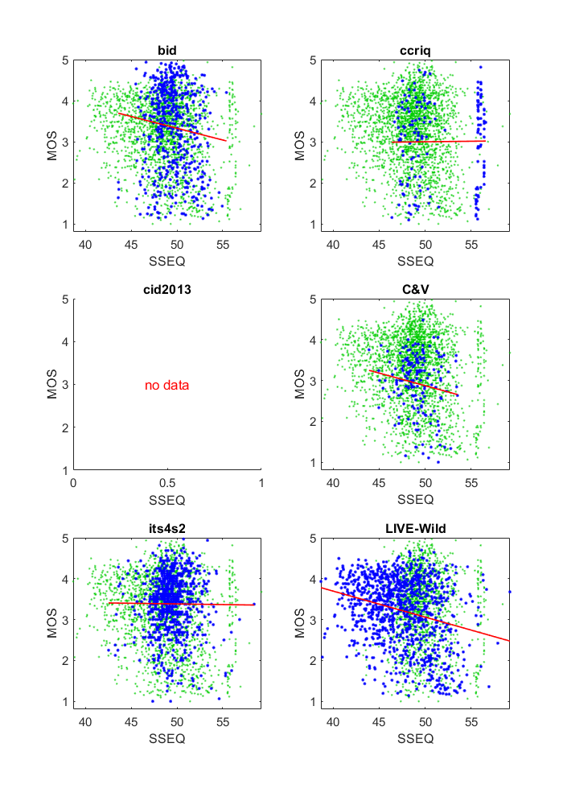

# Report on Spatial-Spectral Entropy-based Quality (SSEQ)

_Go to [Report.md](Report.md) for an introduction to this series of NR metric reports, including their purpose, important warnings, the rating scale, and details of the statistical analysis._ 

Function `nrff_sseq.m` implements the Spatial-Spectral Entropy-based Quality (SSEQ) metric as presented in [[41]](Publications.md) and [[42]](Publications.md). SSEQ does not work reliably across a broad range of modern camera systems and video content.

Goal | Metric Name|Rating
-----|------------|------
MOS  | SSEQ | :star: 

## Installation 

Function `nnrf_sseq.m` requires the SSEQ code from [[42]](Publications.md) or [GitHub](https://github.com/utlive/SSEQ).
Use MATLAB® function `addpath` to add the path to the SSEQ code to the MATLAB path. Then, make the changes noted in the "Conformance and Speed" section below (i.e., in this document). 

Additionally, the tool LIBSVM "A Library for Support Vector Machines"
must be downloaded and added to the MATLAB path. Download the package at 
URL: [https://www.csie.ntu.edu.tw/~cjlin/libsvm/#download](https://www.csie.ntu.edu.tw/~cjlin/libsvm/#download)

## Algorith Summary
The primary function calls the two helper functions `feature_extract.m` and `SSQA_by_f.m`. Function `feature_extract.m` essentially traverses the image in blocks and focuses on the mean and skew of each block. The function then resizes the image and repeats the process. The image is resized a finite number of times, by default three times. Fucntion `SSQA_by_f.m` contains trivial calculations through the use of `setscales.m`, which performs vector math on the feature vector, and `svmpredict`, which makes predictions about image quality. The overall assessment is a multiplication and sum of those prior values. 

## Conformance and Speed

In terms of Big-O notation, this algorithm as a whole runs in O(n) where 'n' is the number of pixels in the image. This is mainly because of `feature_extract.m`. `feature_extract.m` utilizes the MATLAB library function `blkproc.m`, which processes an image by blocks; this means at some point the algorithm has to traverse every single pixel. This is done a finite number of times within the algorithm. 

__The following changes must be made to the SSEQ code__ for it to run in the NRMetricFramework. (1) The statement in `feature_extract.m` line 3 has to be commented out or removed since the images are already in gray scale and that sometimes will yield errors. (2) Two try-catch blocks must be added to `SSEQ_by_f.m`. One is enclosed in the loop where it attempts to assign values to `q(:,j)`,`reg_acc`, and `dec`. The other is the attempted summation of the product of `p` and `q` with the number 2. Variables `p` and `q` do not always have dimensions that agree therefore the try-catch is needed. (3) Use `nansum.m` instead of `sum.m` when summing those values as a precaution.

## Analysis

The authors report 0.9383 Pearson correlation between SSEQ and MOS for the 2006 LIVE Image Quality Assessment Database [[31]](Publications.md) and 0.8501 Pearson correlation between SSEQ and MOS for the TID2008 Dataset [[32]](Publications.md).
  
SSEQ does not respond well to diverse content and camera impairments. The correlations are low. SSEQ fails for all images in dataset CID2013 and portions of the C&V and ITS4S2 datasets. SSEQ values near 50 are associated with the full range of MOSs. The vertical line in the CCRIQ scatter plot near 55 is probably associated with images displayed on a 4K monitor. 
```
1) SSEQ 
bid              corr =  0.11  rmse =  1.01  percentiles [43.58,48.24,49.40,50.75,55.42]
ccriq            corr =  0.01  rmse =  1.02  percentiles [46.39,  NaN,  NaN,  NaN,  NaN]
C&V              corr =  0.15  rmse =  0.71  percentiles [43.89,48.08,49.10,50.10,  NaN]
its4s2           corr =  0.01  rmse =  0.72  percentiles [42.52,49.03,51.19,  NaN,  NaN]
LIVE-Wild        corr =  0.26  rmse =  0.79  percentiles [38.65,44.97,47.43,49.88,59.24]

average          corr =  0.11  rmse =  0.85
pooled           corr =  0.13  rmse =  0.85  percentiles [38.65,48.35,50.73,  NaN,  NaN]
```

