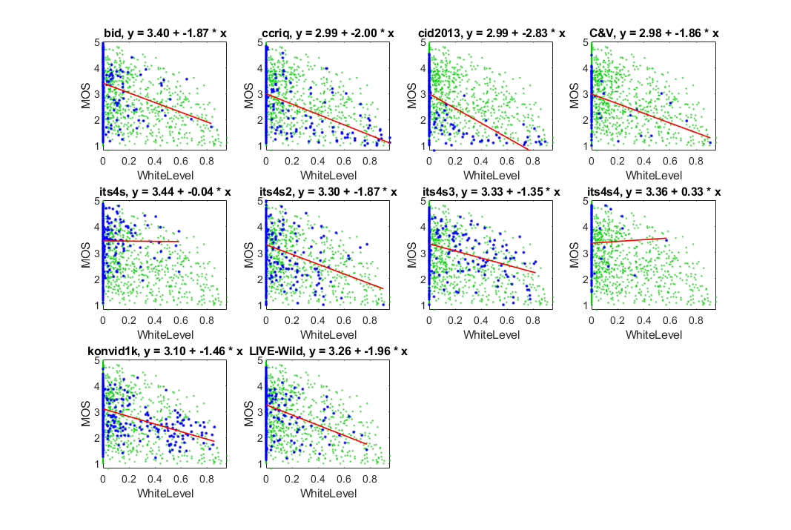
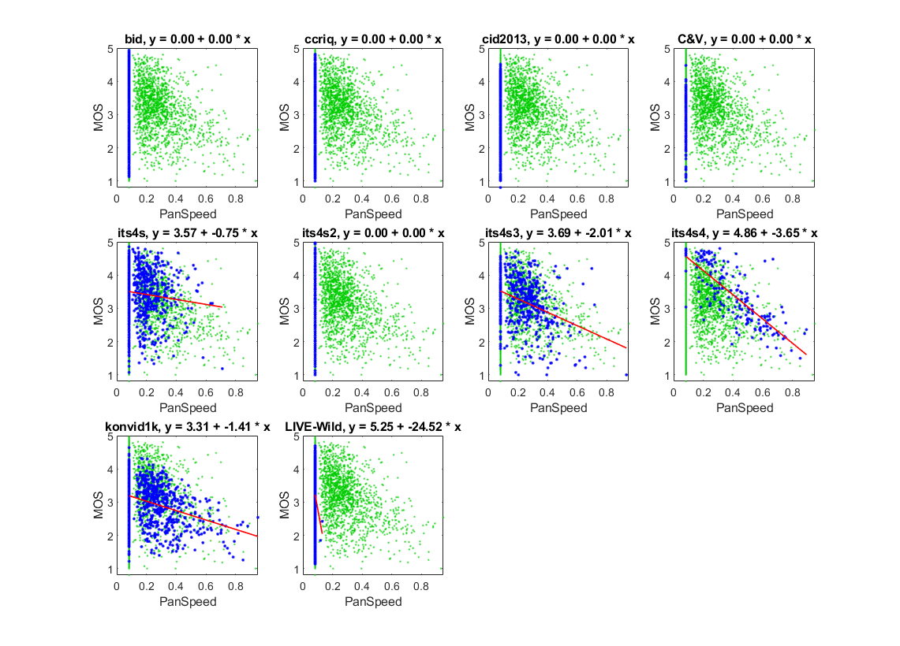
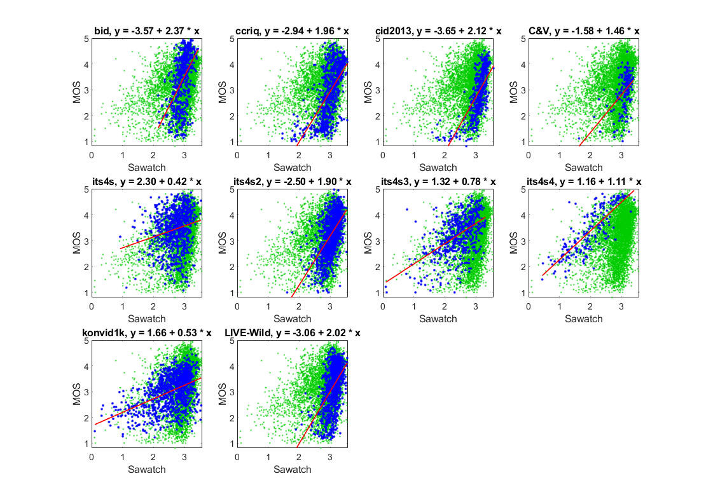

# Report on nrff_sawatch.m
**Goal:** To predict MOS and provide root cause analysis (RCA).  

## Reference
This report analyzes version 1.0 of [NR metric Sawatch](MetricSawatch.md), as distributed with the [initial release](https://github.com/NTIA/NRMetricFramework/releases) of the NRMetricFramework repository. Sawatch version 1.0 was developed by the [Institute for Telecommunication Sciences (ITS)](https://www.its.bldrdoc.gov).

Code is provided in `metric_sawatch.m`

## Algorithm Summary

Sawatch version 1.0 is the starting point for a series of NR metrics that provide RCA. The intention is that Sawatch will be updated regularly instead of remaining a fixed, static algorithm. NR metric Sawatch is intended for consumer camera applications. In addition to predicting the overall quality (MOS) on a [5..1] scale, Sawatch provides RCA through three NR parameters:

* White Level — is the media too dark?
* Sharpness — is the most in-focus region of the media too blurry?
* Pan Speed — does the camera move too quickly?

Sawatch does not contain machine learning. 

## Speed and Conformity
The underlying algorithms were selected for fast run-speed. Conformity is ensured by running the code provided by this repository. 

## Performance
The authors report the following known faults:

* Low accuracy
* Fails to account for the difference between MOSs from consumer camera images and videos
* RCA unavailable for many impairments (e.g., noise, compression, ringing, interlace)

## Statistics of Each Dataset

The NR Metrtic Sawatch is evaluated using both image quality datasets and video quality datasets. 

### NR Parameter White Level

The __White Level__ scatter plots show a fairly consistent response for these diverse datasets. Compare the scatter of blue dots (for the current dataset) with the green dots (that show the overall response of all datasets). 

The __White Level__ scatter plots have a lower triangle shape (i.e., narrow range of values for high quality, wide range of values for low quality). We expect this shape when an impairment occurs sporadically. This meets our expectations for white level imbalances. 

The low correlation values are likewise appropriate for a sporadic impairment. The zero correlation for **its4s** is appropriate, because the dataset does not contain white level problems. The 0.02 correlation for **its4s4** is appropriate, because this dataset avoids all impairments other than pans. __White Level__ has best performance for datasets that include consumer cameras operating in low light environments (i.e., **CCRIQ**, **CID2013**, **KoNViD-1k**).

```text
1) WhiteLevel 
bid              corr =  0.16  rmse =  1.00  percentiles [ 0.00, 0.00, 0.00, 0.00, 0.83]
ccriq            corr =  0.33  rmse =  0.96  percentiles [ 0.00, 0.00, 0.00, 0.00, 0.95]
cid2013          corr =  0.48  rmse =  0.79  percentiles [ 0.00, 0.00, 0.00, 0.00, 0.89]
C&V              corr =  0.32  rmse =  0.68  percentiles [ 0.00, 0.00, 0.00, 0.00, 0.91]
its4s            corr =  0.00  rmse =  0.77  percentiles [ 0.00, 0.00, 0.00, 0.00, 0.58]
its4s2           corr =  0.20  rmse =  0.73  percentiles [ 0.00, 0.00, 0.00, 0.00, 0.90]
its4s3           corr =  0.31  rmse =  0.72  percentiles [ 0.00, 0.00, 0.00, 0.00, 0.82]
its4s4           corr =  0.02  rmse =  0.88  percentiles [ 0.00, 0.00, 0.00, 0.00, 0.57]
konvid1k         corr =  0.34  rmse =  0.60  percentiles [ 0.00, 0.00, 0.00, 0.00, 0.86]
LIVE-Wild        corr =  0.18  rmse =  0.80  percentiles [ 0.00, 0.00, 0.00, 0.00, 0.77]

average          corr =  0.23  rmse =  0.79
pooled           corr =  0.26  rmse =  0.80  percentiles [ 0.00, 0.00, 0.00, 0.00, 0.95]
```


### NR Parameter Blur

The __Blur__ scatter plots show a fairly consistent response among datasets. Compare the scatter of blue dots (for the current dataset) with the green dots (that show the overall response of all datasets). 

The data are broadly scattered around a line. We expect this shape when RCA parameter detects a dominant factor (i.e., always relevant). The modest correlation values are encouraging. The reduced correlation for **its4s** is worth further investigation, because this dataset includes resolution sub-sampling. 

The overall performance is promising. 
```text
2) Blur 
bid              corr =  0.49  rmse =  0.88  percentiles [ 0.30, 0.49, 0.55, 0.63, 0.83]
ccriq            corr =  0.66  rmse =  0.76  percentiles [ 0.23, 0.41, 0.52, 0.61, 0.85]
cid2013          corr =  0.75  rmse =  0.60  percentiles [ 0.22, 0.39, 0.46, 0.53, 1.00]
C&V              corr =  0.49  rmse =  0.63  percentiles [ 0.32, 0.42, 0.46, 0.52, 0.78]
its4s            corr =  0.31  rmse =  0.73  percentiles [ 0.22, 0.49, 0.55, 0.62, 0.86]
its4s2           corr =  0.60  rmse =  0.60  percentiles [ 0.25, 0.42, 0.48, 0.57, 0.85]
its4s3           corr =  0.50  rmse =  0.66  percentiles [ 0.33, 0.49, 0.57, 0.65, 0.83]
its4s4           corr =  0.51  rmse =  0.76  percentiles [ 0.31, 0.49, 0.59, 0.65, 0.77]
konvid1k         corr =  0.28  rmse =  0.62  percentiles [ 0.11, 0.47, 0.55, 0.63, 0.87]
LIVE-Wild        corr =  0.50  rmse =  0.71  percentiles [ 0.23, 0.40, 0.45, 0.52, 0.83]

average          corr =  0.51  rmse =  0.69
pooled           corr =  0.44  rmse =  0.75  percentiles [ 0.11, 0.44, 0.51, 0.60, 1.00]
```


### NR Parameter Pan Speed

__Pan Speed__ was trained on the **its4s4** dataset. The **its4s4** data are narrowly scattered around a line. We expect this shape for RCA parameters when the impairment is a dominant factor, as is the case here. **its4s4** explores the relationship between video quality and camera pan speed. 

The other video datasets (i.e., **its4s**, **its4s3**, **KoNViD-1k**) have a lower triangle shape. We expect this shape when an impairment occurs sporadically, as is the case for these datasets. The drop in accuracy reflects both the change from training data to testing data, and the change from a dominant impairment to a sporadic impairment. It is not clear whether the reduced performance for the **its4s** dataset indicates a flaw in the metric or a characteristic of the videos in this dataset. 

The undefined correlation and constant value are expected for image datasets, which do not contain motion (e.g., **BID**, **CCRIQ**, **CID2013**, **C&V**, **ITS4S2**, **LIVE-Wild**). We did not investigate **LIVE-Wild** images that yield other values for __Pan Speed__. 

The overall performance is promising. More detailed investigation is needed to determine what happens when __Pan Speed__ is given a video with complex motion (e.g., a large object moving across a still background). 

```text
3) PanSpeed 
bid              corr =   NaN  rmse =   Inf  percentiles [ 0.08, 0.08, 0.08, 0.08, 0.08]
ccriq            corr =   NaN  rmse =   Inf  percentiles [ 0.08, 0.08, 0.08, 0.08, 0.08]
cid2013          corr =   NaN  rmse =   Inf  percentiles [ 0.08, 0.08, 0.08, 0.08, 0.08]
C&V              corr =   NaN  rmse =   Inf  percentiles [ 0.08, 0.08, 0.08, 0.08, 0.08]
its4s            corr =  0.10  rmse =  0.77  percentiles [ 0.08, 0.08, 0.14, 0.22, 0.71]
its4s2           corr =   NaN  rmse =   Inf  percentiles [ 0.08, 0.08, 0.08, 0.08, 0.08]
its4s3           corr =  0.35  rmse =  0.71  percentiles [ 0.08, 0.08, 0.22, 0.30, 0.93]
its4s4           corr =  0.79  rmse =  0.54  percentiles [ 0.08, 0.25, 0.42, 0.55, 0.89]
konvid1k         corr =  0.34  rmse =  0.60  percentiles [ 0.08, 0.08, 0.08, 0.28, 0.95]
LIVE-Wild        corr =  0.06  rmse =  0.82  percentiles [ 0.08, 0.08, 0.08, 0.08, 0.13]

average          corr =   NaN  rmse =   Inf
pooled           corr =  0.11  rmse =  0.83  percentiles [ 0.08, 0.08, 0.08, 0.08, 0.95]
```



### NR Metric Sawatch

The accuracy of __Sawatch__ is barely higher than its primary parameter, __Blur__, on a per-dataset basis. __Sawatch__ looks worse than __Blur__: note the different patterns of blue dots for each dataset. The contributions of __White Level__ and __Pan Speed__ ought to improve accuracy over __Blur__ alone, but this is difficult to see in our scatter plots. 

Probably, the problem is an insufficient set of RCA parameters. __Sawatch__ version 1.0 can only detect three of many impairments present in these diverse datasets. The Video Quality Experts Group (VQEG) identified more than 30 impairments that impact consumer cameras. An improved method for combining RCA parameters into a cohesive prediction of MOS may also be helpful. __Sawatch__ uses a linear equation to map three NR parameters onto MOS. This approach may not account for the differences between how the image quality datasets and the video quality datasets use the ACR scale. 

```text
4) Sawatch 
bid              corr =  0.50  rmse =  0.88  percentiles [ 2.15, 2.79, 2.96, 3.07, 3.43]
ccriq            corr =  0.64  rmse =  0.79  percentiles [ 1.45, 2.81, 3.02, 3.22, 3.55]
cid2013          corr =  0.71  rmse =  0.63  percentiles [ 1.59, 2.99, 3.13, 3.26, 3.57]
C&V              corr =  0.48  rmse =  0.63  percentiles [ 1.63, 3.02, 3.14, 3.20, 3.38]
its4s            corr =  0.22  rmse =  0.75  percentiles [ 0.92, 2.49, 2.77, 2.98, 3.53]
its4s2           corr =  0.58  rmse =  0.61  percentiles [ 1.61, 2.92, 3.08, 3.20, 3.53]
its4s3           corr =  0.54  rmse =  0.64  percentiles [ 0.09, 2.17, 2.50, 2.83, 3.31]
its4s4           corr =  0.80  rmse =  0.52  percentiles [ 0.44, 1.49, 1.99, 2.44, 3.41]
konvid1k         corr =  0.46  rmse =  0.57  percentiles [ 0.10, 2.29, 2.73, 2.99, 3.54]
LIVE-Wild        corr =  0.50  rmse =  0.71  percentiles [ 1.89, 3.01, 3.14, 3.24, 3.55]

average          corr =  0.54  rmse =  0.67
pooled           corr =  0.35  rmse =  0.78  percentiles [ 0.09, 2.70, 2.98, 3.15, 3.57]
```



