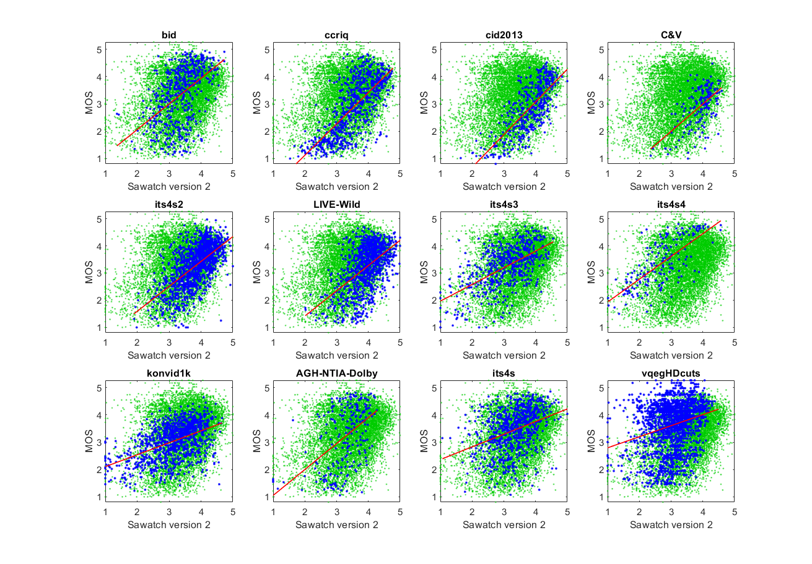
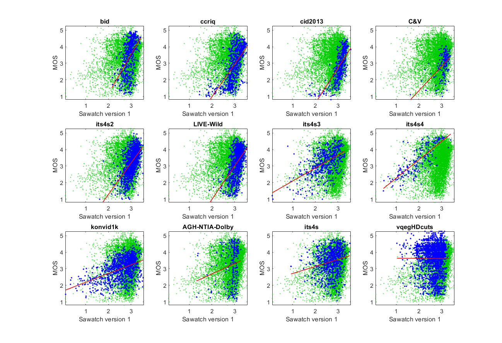

# Report on NR metric Sawatch

_This is a self-assessment._

_Go to [Report.md](Report.md) for an introduction to this series of NR metric reports, including their purpose, important warnings, the rating scale, and details of the statistical analysis._ 

Function `nrff_sawatch.m` calculates NR Metric Sawatch, which was developed by [Institute for Telecommunication Sciences (ITS)](https://www.its.bldrdoc.gov). Sawatch is a series of NR metrics that provide RCA, open source, and fast run speed. The intention is that Sawatch will be updated regularly instead of remaining a fixed, static algorithm. Sawatch is intended for a broad range of modern camera systems and video content. Sawatch assesses image quality and video quality but not transmission errors. 

The Sawatch mountain range in central Colorado contains eight of the 20 highest peaks in the Rocky Mountains. Similarly, the Sawatch metric is a collection of NR metrics and RCA algorithms. Mountain climbers tackle increasingly difficult mountains. Similarly, NR metric development is a difficult challenge, and our goal is steady improvement until we achieve the highest levels of performance. ITS welcomes collaboration on improving Sawatch. 

Goal|Metric Name|Rating
----|-----------|------
MOS|Sawatch version 2|:star: :star: :star:
MOS|Sawatch version 1|:star: :star:
RCA|Blur|:star: :star:
RCA|Fine Detail|:star: :star: :star:
RCA|White Level|:star: :star: :star:
RCA|Black Level|:star: :star:
RCA|PanIPS|:star: :star:
RCA|Color Noise|:star: :star:
RCA|Super Saturation|:star: :star:
RCA|Pallid|:star: :star:
RCA|Blockiness|:star: :star:


## Algorithm Summary

In addition to predicting the overall quality (MOS) on a [1..5] scale, Sawatch contains NR parameters that provide RCA. These parameters have been scaled to [0..1], where zero indicates no impairment and one indicates maximum impairment. Thus, the values reported by `nrff_sawatch.m` differ from the values computed by their original functions.

### Sawatch Version 2

Sawatch version 2 contains nine parameters that provide RCA. The parameters are weighted and summed, to produced values in the ranges from [5..1]. See `nrff_sawatch.m` for details. Sawatch version 2 does not contain machine learning. 

Sawatch can be easily adjusted for target applications that wish to ignore one or more of these parameters. For example, the DIQA datasets indicate that noise does not impact optical character recognition. To ignore a parameter, set its weight to zero.

Weight|Parameter|Root Cause Analysis 
------|---------|-------------------
0.80|Blur|The most in-focus regions are too blurry
0.50|Fine Detail|Fine details have been lost
0.25|White Level|The picture is too dark; white level is too low
0.25|Black Level|The picture is too light; black level too high
0.35|Color Noise|Color problems including sampling noise, color clipping, and post-processing
0.05|Super Saturated|Colors are too saturated
0.05|Pallid|Colors are too unsaturated
0.70|Pan Speed|The camera pans too quickly
0.80|Blockiness|Blocking artifacts visible throughout the image

Where:

* Blur = 1 - ([Unsharp](ReportBlur.md) / 8 + ([Viqet-Sharpness](ReportBlur.md) -1) / 16)
* Fine Detail = [FineDetail](ReportFineDetail.md)
* White Level = 1 - ([White Level](ReportAutoEnhancement.md) - 10) / 140
* Black Level  = [Black Level](ReportAutoEnhancement.md)
* Color Noise = 1 - [Color Noise](ReportPeculiarColor.md) / 0.9
* Super Saturation = [Super Saturation](ReportPeculiarColor.md)
* Pallid = [Pallid](ReportPeculiarColor.md)
* Pan Speed = 1 - ([Pan Speed](ReportPanIPS.md)-1)/4
* Blockiness = [Blockiness](ReportBlockiness.md) * 4.5

### Sawatch Version 1 

Sawatch version 1 contains three parameters that provide RCA. These parameters are defined for Sawatch version 2.

Weight|Parameter|Root Cause Analysis 
------|---------|-------------------
0.46|Blur|The most in-focus regions are too blurry
0.25|White Level|The picture is too dark; white level is too low
0.70|Pan Speed|The camera pans too quickly

## Speed and Conformity
The underlying algorithms were selected for fast run-speed. Conformity is ensured by running the code provided by this repository. 

## Analysis

Sawatch is evaluated using four types of datasets:
* Image quality datasets with camera impairments (BID, CCRIQ, CID2013, C&V, ITS4S2, and LIVE-Wild)
* Video quality datasets with camera impairments (ITS4S3, ITS4S4, and KonViD-1K)
* Simulated adaptive streaming, at broadcast bit-rates (ITS4S) 
* Compression artifacts (AGH-NTIA-Dolby, vqegHDcuts) 

Sawatch version 2 is less accurate than a one person ad-hoc test [[7]](Publications.md). Sawatch version 2 works best for camera impairments (e.g., CCRIQ, CID2013, C&V). Sawatch version 2 does not work well for coding impairments (see ITS4S and vqegHDcuts). This is expected, since the only RCA parameters to assess coding artifacts is blockiness; subtle coding artifact impairments are not detected. The complex blurring impairments in the BID dataset are also problematic. The main problem is differentiating between aesthetically pleasing blur, for example a blurred background, and objectionable blur. 

Sawatch version 2 (below top) is a substantial improvement over Sawatch version 1 (below bottom). While most of the correlations only show modest improvement, the scatter plots show significant improvement. Compare the scatter of blue dots (for the current dataset) with the green dots (that show the overall response of all datasets). 

Notice that the blue dots show the same overall shape as the green dots (a loose scattering round the red fit line) but some datasets have a different linear fit (offset and gain). This phenomenon occurs because all MOSs are presented on a [1..5] ACR scale, but differences between how dataset use the [1..5] ACR scale are retained. See the **Subjective Ratings** section of (Dataset Structure)[DatasetStructure.md] for more information. 

```text
11) Sawatch version 2 
bid              corr =  0.50  rmse =  0.88  percentiles [ 1.37, 3.02, 3.42, 3.73, 4.73]
ccriq            corr =  0.72  rmse =  0.70  percentiles [ 1.53, 3.12, 3.59, 4.03, 4.78]
cid2013          corr =  0.75  rmse =  0.60  percentiles [ 1.64, 3.52, 3.92, 4.25, 5.00]
C&V              corr =  0.58  rmse =  0.59  percentiles [ 2.36, 3.75, 4.02, 4.19, 4.59]
its4s2           corr =  0.63  rmse =  0.58  percentiles [ 1.90, 3.49, 3.89, 4.19, 5.00]
LIVE-Wild        corr =  0.53  rmse =  0.69  percentiles [ 2.01, 3.68, 3.99, 4.25, 5.00]
its4s3           corr =  0.58  rmse =  0.62  percentiles [ 1.00, 2.62, 3.14, 3.61, 4.55]
its4s4           corr =  0.72  rmse =  0.61  percentiles [ 1.02, 2.17, 2.71, 3.24, 4.57]
konvid1k         corr =  0.50  rmse =  0.56  percentiles [ 1.00, 2.72, 3.20, 3.65, 4.66]
AGH-NTIA-Dolby   corr =  0.50  rmse =  0.98  percentiles [ 1.00, 2.95, 3.35, 3.72, 4.27]
its4s            corr =  0.36  rmse =  0.72  percentiles [ 1.06, 2.93, 3.38, 3.75, 5.00]
vqegHDcuts       corr =  0.26  rmse =  0.86  percentiles [ 1.00, 2.73, 3.09, 3.47, 4.49]

average          corr =  0.55  rmse =  0.70
pooled           corr =  0.33  rmse =  0.83  percentiles [ 1.00, 2.97, 3.47, 3.93, 5.00]
```



For comparison purposes, the statistics and scatter plots for Sawatch version 1 are provided below.
```text
10) Sawatch version 1 
bid              corr =  0.50  rmse =  0.88  percentiles [ 2.15, 2.79, 2.96, 3.07, 3.43]
ccriq            corr =  0.64  rmse =  0.79  percentiles [ 1.45, 2.81, 3.02, 3.22, 3.55]
cid2013          corr =  0.71  rmse =  0.63  percentiles [ 1.59, 2.99, 3.13, 3.26, 3.57]
C&V              corr =  0.48  rmse =  0.63  percentiles [ 1.63, 3.02, 3.14, 3.20, 3.38]
its4s2           corr =  0.58  rmse =  0.61  percentiles [ 1.61, 2.92, 3.08, 3.20, 3.53]
LIVE-Wild        corr =  0.50  rmse =  0.71  percentiles [ 1.89, 3.01, 3.14, 3.24, 3.55]
its4s3           corr =  0.54  rmse =  0.64  percentiles [ 0.09, 2.17, 2.50, 2.83, 3.31]
its4s4           corr =  0.80  rmse =  0.52  percentiles [ 0.44, 1.49, 1.99, 2.44, 3.41]
konvid1k         corr =  0.46  rmse =  0.57  percentiles [ 0.10, 2.29, 2.73, 2.99, 3.54]
AGH-NTIA-Dolby   corr =  0.19  rmse =  1.11  percentiles [ 1.32, 2.78, 2.95, 3.06, 3.27]
its4s            corr =  0.22  rmse =  0.75  percentiles [ 0.92, 2.49, 2.77, 2.98, 3.53]
vqegHDcuts       corr =  0.00  rmse =  0.89  percentiles [ 1.03, 2.43, 2.73, 2.94, 3.33]

average          corr =  0.47  rmse =  0.73
pooled           corr =  0.22  rmse =  0.86  percentiles [ 0.09, 2.62, 2.92, 3.11, 3.57]
```



## Confidence Intervals

_See [[7]](Publications.md) for information on (confidence intervals)[ConfidenceIntervals.md] for objective metrics._

This analysis limits the scope of Sawatch version 2 to **camera impairments**. 

The practical confidence interval (CI) for Sawatch version 2 is **0.60**. When this CI is used for decision making, Sawatch version 2 will have error rates similar to a 15 person subjective test. Estimated classification incident rates are as follows:
* 29% correct ranking
* 3% false ranking
* 12% false distinction
* 32% false ties
* 24% correct ties

**How to make decisions with practical CI:** If the MOSs for two media differ by less than **0.60**, then the media have identical quality. 

When CI are not used, estimated classification rates change as follows: 
* 50% correct ranking
* 14% false ranking
* 36% false distinction

The false tie and correct tie rates drop to approximately 0%, because any difference in estimated MOS is actionable. 

