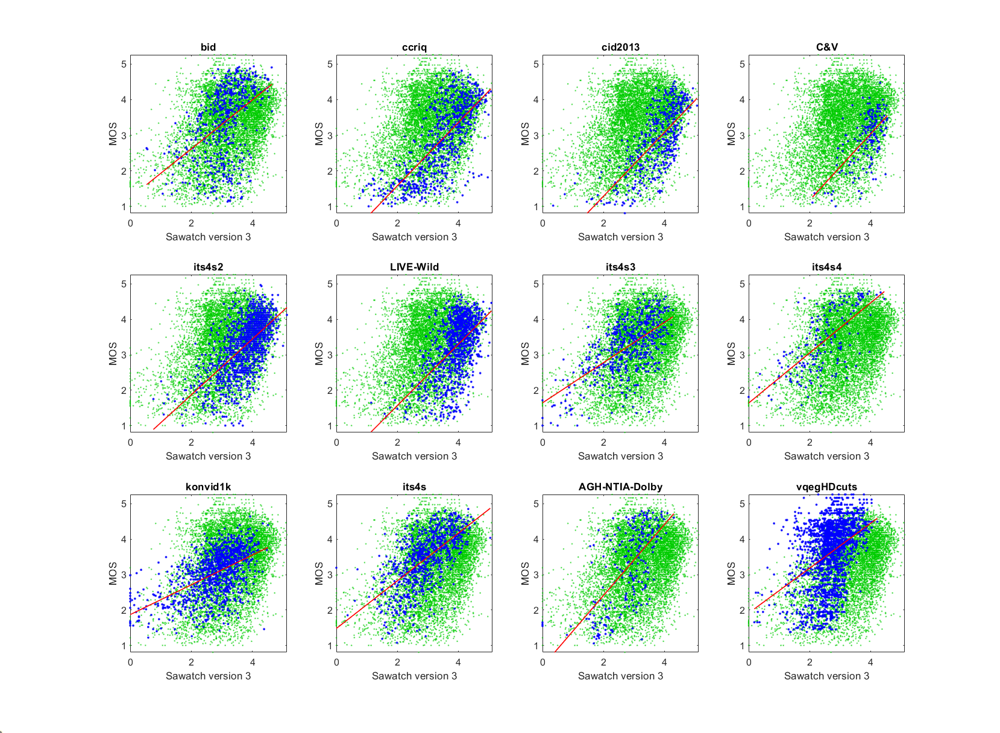
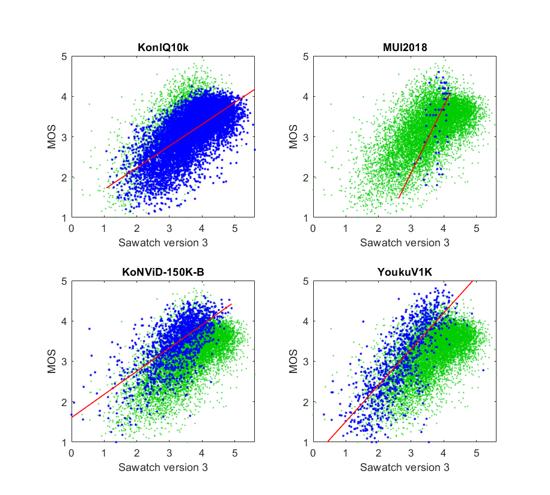

# Report on NR metric Sawatch Version 3

_This is a self-assessment._

_Go to [Report.md](Report.md) for an introduction to this series of NR metric reports, including their purpose, important warnings, the rating scale, and details of the statistical analysis._ 

Function `nrff_sawatch.m` calculates NR Metric Sawatch, which was developed by [Institute for Telecommunication Sciences (ITS)](https://www.its.bldrdoc.gov). Sawatch is a series of NR metrics that provide RCA, open source, and fast run speed. The intention is that Sawatch will be updated regularly instead of remaining a fixed, static algorithm. Sawatch is intended for a broad range of modern camera systems and video content. Sawatch assesses image quality and video quality but not transmission errors. 

The Sawatch mountain range in central Colorado contains eight of the 20 highest peaks in the Rocky Mountains. Similarly, the Sawatch metric is a collection of NR metrics and RCA algorithms. Mountain climbers tackle increasingly difficult mountains. Similarly, NR metric development is a difficult challenge, and our goal is steady improvement until we achieve the highest levels of performance. ITS welcomes collaboration on improving Sawatch. 

Goal|Metric Name|Rating
----|-----------|------
MOS|Sawatch version 3|:star: :star: :star:

Goal|Metric Name|Rating
----|-----------|------
RCA|S-BlackLevel|:star: :star:
RCA|S-Blockiness|:star: :star:
RCA|S-Blur|:star: :star:
RCA|S-ColorNoise|:star: :star:
RCA|S-FineDetail|:star: :star: :star:
RCA|S-Pallid|:star: :star:
RCA|S-SuperSaturated|:star: :star:
RCA|S-WhiteLevel|:star: :star: :star:
RCA|S-PanSpeed2|:star: :star:
RCA|S-Jiggle|:star: :star:
RCA|S-dipIQ|:star: :star: :star:


## Algorithm Summary

In addition to predicting the overall quality (MOS) on a [1..5] scale, Sawatch contains NR parameters that provide RCA. These parameters have been scaled to [0..1], where zero indicates no impairment (high quality) and one indicates maximum impairment (low quality). Thus, the values reported by `nrff_sawatch.m` differ from the values computed by their original functions.

### Sawatch Version 3

Sawatch version 3 contains ten parameters that provide RCA. The parameters are weighted and summed, to produced values in the ranges from [5..1]. However, outliers may range from [0..6]. See `nrff_sawatch.m` for details. Sawatch version 3 does not contain machine learning. 

Sawatch can be easily adjusted for target applications that wish to ignore one or more of these parameters. For example, the DIQA datasets indicate that noise does not impact optical character recognition. To ignore a parameter, set its weight to zero.

Weight|Parameter|Root Cause Analysis 
------|---------|-------------------
2.40|S-Blur|The most in-focus regions are too blurry
1.50|S-FineDetail|Fine details have been lost
0.75|S-WhiteLevel|The picture is too dark; white level is too low
0.75|S-BlackLevel|The picture is too light; black level too high
1.05|S-ColorNoise|Color problems including sampling noise, color clipping, and post-processing
0.15|S-SuperSaturated|Colors are too saturated
0.15|S-Pallid|Colors are too unsaturated
2.40|S-PanSpeed|The camera pans too quickly
2.40|S-Blockiness|Blocking artifacts visible throughout the image
1.50|S-Jiggle|Camera jiggle
1.80|S-dipIQ|Compression artifacts

Where 
* S-dipIQ is the [dipIQ](ReportdipIQ.md) NR metric, scaled to [0..1] and used for RCA instead of MOS assessment.
* S-dipIQ = - dipIQ / 30, clipped at 0 minimum and 1 maximum

The weighted parameter values are subtracted from 6.2. This yields estimated MOS that occasionally stray outside of the target [1..5] range. The impact of any impairment may be eliminated from the model by setting the associated RCA metric weight to zero. 


## Speed and Conformity
The underlying algorithms were selected for fast run-speed. Conformity is ensured by running the code provided by this repository. 

NR parameter dipIQ runs slowly enough to be problematic (__9×__ as long to run as the benchmark metric, [nrff_blur.m](ReportBlur.md)).
We created the [VCRDCI dataset](SubjectiveDatasets.md) to provide training data for a replacement metric. 

## Analysis

### Training Datas

Sawatch was trained using four types of datasets:
* Image quality datasets with camera impairments (BID, CCRIQ, CID2013, C&V, ITS4S2, and LIVE-Wild)
* Video quality datasets with camera impairments (ITS4S3, ITS4S4, and KonViD-1K)
* Video quality datasets with broadcast content and compression (ITS4S, AGh-NTIA-Dolby, and vqegHDcuts) 

Sawatch version 3 is less accurate than a one person ad-hoc test [[7]](Publications.md). The complex blurring impairments in the BID dataset are problematic. The main problem is differentiating between aesthetically pleasing blur, for example a blurred background, and objectionable blur. 

Sawatch version 3 is a substantial improvement over Sawatch version 2 (see the Release of [NR Metric Framework Version 2](https://github.com/NTIA/NRMetricFramework/releases)). Changes include: 
- Prefix "S-" added to the name of each RCA metric that feeds into Sawatch  
- [PanSpeed](ReportPanIPS.md) split into separate estimates of S-PanSpeed and S-Jiggle
- Each RCA metric inherently use the [0..1] scale
- [S-Blur](ReportBlur.md) is a single algorithm based on the unsharp filter (instead of averaging two blur estimation)
- Add S-[dipIQ](ReportDipIQ.md) to estimate compression artifacts
- [False decision](FalseDecisions.md) statistic is reported below.

Notice that the blue dots show the same overall shape as the green dots (a loose scattering round the red fit line) but some datasets have a different linear fit (offset and gain). This phenomenon occurs because all MOSs are presented on a [1..5] ACR scale, but differences between how dataset use the [1..5] ACR scale are retained. See the **Subjective Ratings** section of (Dataset Structure)[DatasetStructure.md] for more information. 

Sawatch version 3 is equivalent to a one person ad-hoc test for the following datasets: CCRIQ, CID2013, ITS4S2, ITS4S4, and ITS4S4.
```text
12) Sawatch version 3 
bid              corr =  0.46  rmse =  0.90  false decisions =  20%  percentiles [ 0.54, 2.75, 3.12, 3.50, 4.64]
ccriq            corr =  0.73  rmse =  0.69  false decisions =  11%  percentiles [ 0.76, 2.97, 3.61, 4.10, 5.07]
cid2013          corr =  0.72  rmse =  0.63  false decisions =  12%  percentiles [ 0.35, 3.38, 3.94, 4.28, 5.07]
C&V              corr =  0.62  rmse =  0.56  false decisions =  14%  percentiles [ 2.10, 3.71, 4.02, 4.19, 4.55]
its4s2           corr =  0.64  rmse =  0.57  false decisions =  11%  percentiles [ 0.76, 3.45, 3.89, 4.19, 5.13]
LIVE-Wild        corr =  0.55  rmse =  0.69  false decisions =  17%  percentiles [ 1.14, 3.68, 4.00, 4.26, 5.09]
its4s3           corr =  0.63  rmse =  0.59  false decisions =  14%  percentiles [ 0.00, 2.37, 2.90, 3.42, 4.28]
its4s4           corr =  0.69  rmse =  0.64  false decisions =  12%  percentiles [ 0.00, 1.87, 2.38, 3.02, 4.45]
konvid1k         corr =  0.55  rmse =  0.54  false decisions =  13%  percentiles [ 0.00, 2.40, 2.90, 3.31, 4.51]
its4s            corr =  0.64  rmse =  0.59  false decisions =  12%  percentiles [ 0.00, 2.43, 2.91, 3.44, 5.05]
AGH-NTIA-Dolby   corr =  0.66  rmse =  0.84  false decisions =  15%  percentiles [ 0.00, 2.30, 2.98, 3.33, 4.31]
vqegHDcuts       corr =  0.40  rmse =  0.82  false decisions =  21%  percentiles [ 0.19, 2.43, 2.71, 3.06, 4.23]

average          corr =  0.61  rmse =  0.67
pooled           corr =  0.35  rmse =  0.82  percentiles [ 0.00, 2.63, 3.21, 3.85, 5.13]
```



### Evaluation Datasets
We evaluated the performance of Sawatch Version 3 on two new IQA datasets with camera impairments (KonIQ-10K and MUI2018), one new VQA dataset with camera impairments (KoNViD-150K-B) and one new VQA dataset with compression artifacts (YokuV1K).
Averaged over these four evaluation datasets, the accuracy of Sawatch version 3 is 0.68 Person correlation. 
Sawatch version 3 performs similarly on the 12 training dataset (0.61 correlation average).
This similarity between training performance (0.61 correlation) and evaluation performance (0.68 correlation) demonstrates a desirable level of stability.

MUI2018 examines a medical use case (greyscale ultrasound images).
While MUI2018 has the lowest accuracy of the evaluated datasets (0.56 correlation), this is within the range of correlations for the training datasets (0.40 to 0.73).
Medical and other niche use cases may require a different parameter weighting to calculate MOS. 
```
12) Sawatch version 3 
KonIQ10k         corr =  0.69  rmse =  0.40  false decisions =   6%  percentiles [ 1.07, 3.25, 3.82, 4.26, 5.61]
MUI2018          corr =  0.56  rmse =  0.68  false decisions =  16%  percentiles [ 2.62, 3.74, 3.93, 4.03, 4.18]
KoNViD-150K-B    corr =  0.68  rmse =  0.44  false decisions =   8%  percentiles [ 0.00, 2.85, 3.34, 3.72, 4.90]
YoukuV1K         corr =  0.77  rmse =  0.58  false decisions =   8%  percentiles [ 0.33, 2.08, 2.72, 3.25, 5.21]

average          corr =  0.68  rmse =  0.52
                 corr =  0.62  rmse =  0.48  percentiles [ 0.00, 3.09, 3.67, 4.16, 5.61]
```


## Confidence Intervals

_See [[7]](Publications.md) for information on (confidence intervals)[ConfidenceIntervals.md] for objective metrics._

This analysis limits the scope of Sawatch version 3 to **camera impairments** and **broadcast bitrate compression**. 

The practical confidence interval (CI) for Sawatch version 3 is **0.65**. When this CI is used for decision making, Sawatch version 3 will have error rates similar to a 15 person subjective test. Estimated classification incident rates are as follows:
* 29% correct ranking
* 4% false ranking
* 12% false distinction
* 32% false ties
* 23% correct ties

**How to make decisions with practical CI:** If the MOSs for two media differ by less than **0.60**, then the media have identical quality. 

When CI are not used, estimated classification rates change as follows: 
* 49% correct ranking
* 15% false ranking
* 35% false distinction

The false tie and correct tie rates drop to approximately 0%, because any difference in estimated MOS is actionable. 

