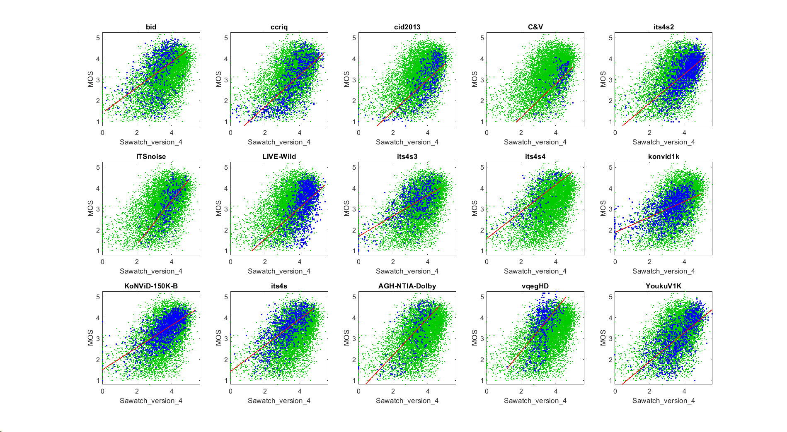

# Report on NR metric Sawatch Version 4

_This is a self-assessment._

_Go to [Report.md](Report.md) for an introduction to this series of NR metric reports, including their purpose, important warnings, the rating scale, and details of the statistical analysis._ 

Function `nrff_sawatch.m` calculates NR Metric Sawatch, which was developed by [Institute for Telecommunication Sciences (ITS)](https://www.its.bldrdoc.gov). Sawatch is a series of NR metrics that provide RCA, open source, and fast run speed. The intention is that Sawatch will be updated regularly instead of remaining a fixed, static algorithm. Sawatch is intended for a broad range of modern camera systems and video content. Sawatch assesses image quality and video quality but not transmission errors. 

The Sawatch mountain range in central Colorado contains eight of the 20 highest peaks in the Rocky Mountains. Similarly, the Sawatch metric is a collection of NR metrics and RCA algorithms. Mountain climbers tackle increasingly difficult mountains. Similarly, NR metric development is a difficult challenge, and our goal is steady improvement until we achieve the highest levels of performance. ITS welcomes collaboration on improving Sawatch. 

Goal|Metric Name|Rating
----|-----------|------
MOS|Sawatch version 4|:star: :star: :star:

Goal|Metric Name|Rating
----|-----------|------
RCA|S-BlackLevel|:star: :star:
RCA|S-Blockiness|:star: :star:
RCA|S-Blur|:star: :star: :star:
RCA|S-ColorNoise|:star: :star:
RCA|S-FineDetail|:star: :star: :star:
RCA|S-Pallid|:star: :star:
RCA|S-SuperSaturated|:star: :star:
RCA|S-WhiteLevel|:star: :star: :star:
RCA|S-PanSpeed|:star: :star: :star:
RCA|S-Jiggle|:star: :star: :star:
RCA|S-dipIQ|:star: :star: :star:
RCA|S-Noise|:star: :star: 
RCA|S-Clipped|:star: :star: :star:
RCA|S-Texture|:star: :star: :star:


## Algorithm Summary

In addition to predicting the overall quality (MOS) on a [1..5] scale, Sawatch contains NR parameters that provide RCA. These parameters have been scaled to [0..1], where zero indicates no impairment (high quality) and one indicates maximum impairment (low quality). Thus, the values reported by `nrff_sawatch.m` differ from the values computed by their original functions.

### Sawatch Version 4

Sawatch version 4 contains 14 parameters that provide RCA. The parameters are weighted and summed, to produced values in the ranges from [5..1]. However, outliers may range from [0..5]. See `nrff_sawatch.m` for details. Only RCA metric S-dipIQ uses machine learning. 

Sawatch can be easily adjusted for target applications that wish to ignore one or more of these parameters. For example, the DIQA datasets indicate that noise does not impact optical character recognition. To ignore a parameter, set its weight to zero.

Weight|Parameter|Root Cause Analysis 
------|---------|-------------------
2.40|S-Blur|The most in-focus regions are too blurry
1.30|square(S-FineDetail)|Fine details have been lost
0.75|S-WhiteLevel|The picture is too dark; white level is too low
0.60|square(S-WhiteLevel)|The picture is too dark; white level is too low
0.75|S-BlackLevel|The picture is too light; black level too high
1.80|S-ColorNoise|Color problems including sampling noise, color clipping, and post-processing
0.15|S-SuperSaturated|Colors are too saturated
0.15|S-Pallid|Colors are too unsaturated
2.40|S-PanSpeed|The camera pans too quickly
2.40|S-Blockiness|Blocking artifacts visible throughout the image
1.50|S-Jiggle|Camera jiggle
3.00|square(S-dipIQ)|Compression artifacts
1.80|S-Noise|Camera capture noise in smooth areas
0.75|S-Clipped|Image is completely flat and featureless
-0.25|S-Texture|Aesthetically pleasing edges---8\% to 16\% of luma range

Where 
* S-dipIQ is the [dipIQ](ReportdipIQ.md) NR metric, scaled to [0..1] and used for RCA instead of MOS assessment.
* S-dipIQ = - dipIQ / 30, clipped at 0 minimum and 1 maximum
* S-Texture measures quality _improvement_ RCA, thus the negative weight. 

The weighted parameter values are subtracted from 6.2. This yields estimated MOS that occasionally stray outside of the target [1..5] range. The impact of any impairment may be eliminated from the model by setting the associated RCA metric weight to zero. 

## Speed and Conformity
The underlying algorithms were selected for fast run-speed. Conformity is ensured by running the code provided by this repository. 

NR parameter dipIQ runs slowly enough to be problematic (__9×__ as long to run as the benchmark metric, [nrff_blur.m](ReportBlur.md)).
We created the [VCRDCI dataset](SubjectiveDatasets.md) to provide training data for a replacement metric. 

## Analysis

This analysis uses three types of datasets:
* Image quality datasets with camera impairments (BID, CCRIQ, CID2013, C&V, ITS4S2, ITSnoise, and LIVE-Wild)
* Video quality datasets with camera impairments (ITS4S3, ITS4S4, KonViD-1K, and KoNViD-150K-B)
* Video quality datasets with broadcast content and compression (ITS4S, AGH-NTIA-Dolby, vqegHD, and YoukuV1K)
  
All of these datasets were used to train Sawatch version 4.

Sawatch version 4 is a minor improvement over Sawatch version 3. Changes include: 
- Added S-Noise for improved accuracy on camera noise (compliments S-ColorNoise)
- Added S-Clipped for improved accuracy on flat, clipped regions
- Added S-Texture to compensate for one aspect of good aesthetics, which increase MOS
- Removed non-linearities from S-FineDetail, S-WhiteLevel, and S-dipIQ
- Udated model weights

In the scatter plots below, notice that the blue dots show the same overall shape as the green dots (a loose scattering round the red fit line) but some datasets have a different linear fit (offset and gain). This phenomenon occurs because all MOSs are presented on a [1..5] ACR scale, but differences between how datasets use the [1..5] ACR scale are retained. See the **Subjective Ratings** section of [Dataset Structure](DatasetStructure.md) for more information. 

Sawatch version 4 is equivalent to a one person ad-hoc test for 7 of 15 datasets: CCRIQ, CID2013, ITS4S2, ITSnoise, ITS4S4, KoNViD-150K-B, and ITS4S. For a definition of equivalence to a one person ad-hoc test, see [[7]](Publications.md). 
Sawatch version 4 performs best on modern cameras operated with default settings, which was the original design goal. 

Sawatch version 4 performs worst on old datasets &mdash; BID (2011), LIVE-Wild (2015), and vqegHD (2010) &mdash; which may reflect a change in compression artifacts in the modern video systems. 
LIVE-Wild was designed by a PhD student and contains low resolution images (500 x 500 pixel) of unknown origin. From these clues and visual inspection, we infer that LIVE-Wild probably used pre-existing photographs from 2005 to 2014.
LIVE-Wild also contains atypical images that would require complex object recognition to distinguished from impairments.
The complex blurring impairments in the BID dataset are problematic. The main problem is differentiating between aesthetically pleasing blur, for example a blurred background, and objectionable blur. 

```text
15) Sawatch_version_4 
bid              corr =  0.486  rmse =  0.89  false decisions =  19%  percentiles [ 0.17, 2.79, 3.34, 3.75, 4.87]
ccriq            corr =  0.727  rmse =  0.70  false decisions =  11%  percentiles [ 0.00, 3.08, 3.71, 4.27, 5.38]
cid2013          corr =  0.722  rmse =  0.62  false decisions =  11%  percentiles [ 0.00, 3.47, 4.00, 4.42, 5.05]
C&V              corr =  0.611  rmse =  0.57  false decisions =  14%  percentiles [ 1.72, 3.91, 4.30, 4.53, 5.00]
its4s2           corr =  0.652  rmse =  0.56  false decisions =  11%  percentiles [ 0.00, 3.63, 4.12, 4.51, 5.25]
ITSnoise         corr =  0.699  rmse =  0.57  false decisions =  11%  percentiles [ 2.08, 3.56, 3.88, 4.18, 4.99]
LIVE-Wild        corr =  0.515  rmse =  0.70  false decisions =  18%  percentiles [ 1.24, 3.96, 4.32, 4.60, 5.48]
its4s3           corr =  0.637  rmse =  0.58  false decisions =  15%  percentiles [ 0.00, 2.66, 3.34, 3.89, 4.78]
its4s4           corr =  0.699  rmse =  0.63  false decisions =  11%  percentiles [ 0.00, 2.14, 2.79, 3.29, 4.97]
konvid1k         corr =  0.562  rmse =  0.53  false decisions =  13%  percentiles [ 0.00, 2.70, 3.33, 3.76, 5.02]
KoNViD-150K-B    corr =  0.686  rmse =  0.44  false decisions =   8%  percentiles [ 0.00, 3.33, 3.83, 4.20, 5.36]
its4s            corr =  0.681  rmse =  0.56  false decisions =  11%  percentiles [ 0.00, 2.66, 3.29, 3.84, 4.84]
AGH-NTIA-Dolby   corr =  0.669  rmse =  0.84  false decisions =  15%  percentiles [ 0.00, 2.63, 3.38, 3.76, 4.70]
vqegHD           corr =  0.548  rmse =  0.75  false decisions =  17%  percentiles [ 1.20, 2.95, 3.25, 3.49, 4.61]
YoukuV1K         corr =  0.672  rmse =  0.67  false decisions =  13%  percentiles [ 0.00, 3.04, 3.65, 4.34, 5.63]

average          corr =  0.638  rmse =  0.64
pooled           corr =  0.528  rmse =  0.71  percentiles [ 0.00, 3.09, 3.71, 4.24, 5.63]
```



## Confidence Intervals

_See [[7]](Publications.md) for information on (confidence intervals)[ConfidenceIntervals.md] for objective metrics._

This analysis limits the scope of Sawatch version 4 to **camera impairments** and **broadcast bitrate compression**. 

The practical confidence interval (CI) for Sawatch version 3 is **0.72**. When this CI is used for decision making, Sawatch version 3 will have error rates similar to a 15 person subjective test. Estimated classification incident rates are as follows:
* 31% correct ranking
* 3% false ranking
* 12% false distinction
* 29% false ties
* 24% correct ties

**How to make decisions with practical CI:** If the MOSs for two media differ by less than **0.60**, then the media have identical quality. 

When CI are not used, estimated classification rates change as follows: 
* 51% correct ranking
* 13% false ranking
* 37% false distinction

The false tie and correct tie rates drop to approximately 0%, because any difference in estimated MOS is actionable. 

## Code
Function `run_sawatch.m` calculates NR metric Sawatch on a list of video files. See [RunSawatch](RunSawatch.md).

The following MATLAB code was used to calculate these statistics and plots. Update `load_vars.m` with the location of the dataset media before running. 
```
load_vars;
want =  [bid_dataset ccriq_dataset cid2013_dataset cv_dataset its4s2_dataset itsnoise_dataset livewild_dataset its4s3_dataset its4s4_dataset konvid1k_dataset konvid150kb_dataset its4s_dataset and_dataset vqegHD_dataset youkuv1k_dataset];

calculate_NRpars(want, data_dir, 'all', @nrff_blur);
calculate_NRpars(want, data_dir, 'all', @nrff_auto_enhancement);
calculate_NRpars(want, data_dir, 'all', @nrff_fine_detail);
calculate_NRpars(want, data_dir, 'all', @nrff_peculiar_color);
calculate_NRpars(want, data_dir, 'all', @nrff_blockiness);
calculate_NRpars(want, data_dir, 'all', @nrff_panIPS);
calculate_NRpars(want, data_dir, 'none', @nrff_dipIQ);

calculate_NRpars(want, data_dir, 'all', @metric_sawatch);

analyze_NRpars( want, data_dir, @metric_sawatch, 'plot', 'false');
ci_NRpars( want, data_dir, @metric_sawatch);
```
