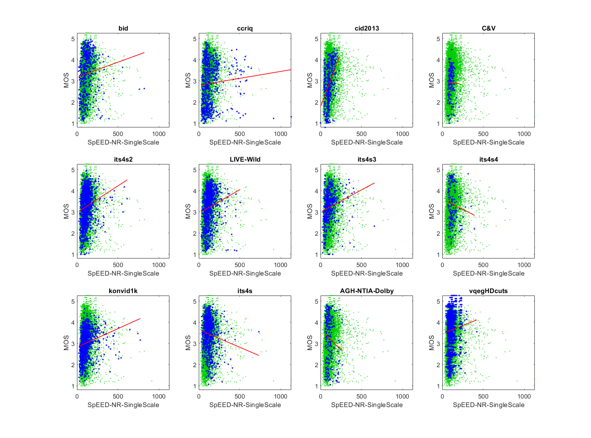
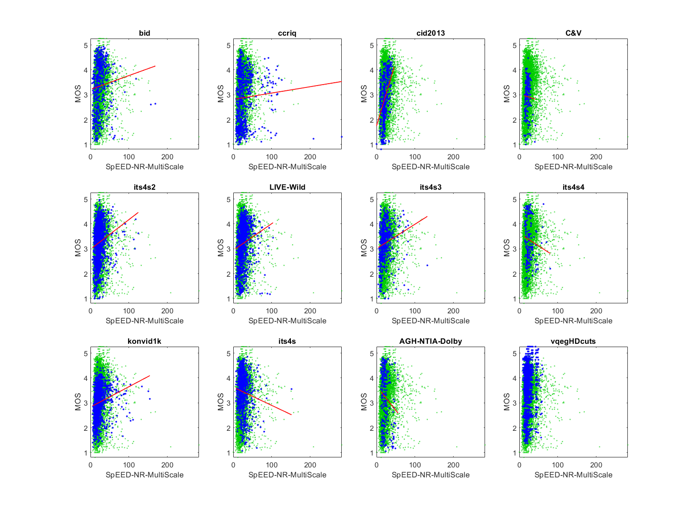

# Report on Spatial Efficient Entropic Differencing for Quality Assessment (SpEED-QA), NR Constrained (SpEED-NR)

_Go to [Report.md](Report.md) for an introduction to this series of NR metric reports, including their purpose, important warnings, the rating scale, and details of the statistical analysis._ 

The spatial efficient entropic differencing for quality assessment (SpEED-QA) metric is presented in [[39]](Publications.md) and distributed in [[40]](Publications.md) and [on GitHub](https://github.com/christosbampis/SpEED-QA_release). SpEED-QA is a reduced reference (RR) metric.
Function `nrff_spEED_NR.m` implements an NR constrained variant of SpEED-QA, which we refer to as SpEED-NR. This NR constrained variant shows promise but produces outliers that must be investigated and eliminated.

Goal | Metric Name|Rating
-----|------------|------
MOS  | SpEED-NR-SingleScale | :star: :star:
MOS  | SpEED-NR-MultiScale | :star: :star:

## Algorithm Summary
The algorithm centers around the function `est_params.m` which works around the eigenvalues of whatever block of the image the entire feature function is currently focused on. The image block is rearranged into column vectors and then a full matrix is built based on the column vectors and the means of those column vectors. Once the matrix is built, it is multiplied by its transpose and divided by the column size to fully build the matrix that the eigenvalues will be taken from, which is referred to as `cu` in the code. If there are any eigenvalues in the matrix that are greater than zero, the first return value is then calculated by solving the matrix equation between the `cu` matrix and the column vectors of the image block, multiplying the resulting values by the image vectors' values, dividing the resulting matrix by the number of elements, and lastly reshaping the matrix to follow the initial dimensions if it doesn't already. Otherwise the matrix of the first output is just zeros. The second output is based on a logarithmic sum of the matrix of the first output. 

The above is calculated once for the down-scaled image to calculate the SingleScale variant and at five different down-scaled sizes for the MultiScale variant. The GitHub repository for SpEED-QA suggests two other variants, which we do not calculate. 

Another difference between the SingleScale and MultiScale variants is that the MultiScale statistics are multiplied by predetermined weights that are referenced in the paper.

The SpEED-QA metric was converted from an RR metric to an NR metric by eliminating the difference between original and distorted image results. Thus, SpEED-NR calculates results for one image rather than calculating on both original and distorted images and then taking the difference. Compare [the GitHub release](https://github.com/christosbampis/SpEED-QA_release) with `nrff_spEED_NR.m` for details. 

## Speed and Conformity
SpEED-QA took __1.5×__ as long to run as the benchmark metric, [nrff_blur.md](ReportBlur.md).

In terms of Big-O notation, this is a tricky method since the image itself is changing its size while the algorithm is running and calculating eigenvalues around it. Assuming n is the largest diagonal value of the image, this algorithm runs in O(n) since it loops a constant number of times around an algorithm that loops through the eigenvalues of a shrunken image. 

The main issue in terms of conformity is that this algorithm was originally a reduced reference algorithm, which means the algorithm needed the original image as well as a distorted version of the image.

## Analysis

The authors analyze SpEED-QA on four image datasets: 2006 LIVE Image Quality Assessment Database [[31]](Publications.md), CSIQ [[33]](Publications.md), TID2008 Dataset [[32]](Publications.md), TID2013 [[34]](Publications.md). The overall results for each scale (1 to 5) range from 0.6287 to 0.8362 Pearson correlation. The authors also analyze SpEED-QA on five video datasets, with Pearson correlation values ranging from 0.7273 to 0.9123. 

Our analysis focus on our NR constrained variant, SpEED-NR. We expect inferior performance.

All four variants of SpEED-NR have frequent outliers that mar the NR metric's performance. See the scatter plots below. The performance of the four SpEED-NR variants are similar and work best on the CID2013, which probably shows the intended response. SpEED-NR shows promise. Also, if these outliers could be eliminated, the performance of SpEED-QA would probably improve. 
```
1) SpEED-NR-SingleScale 
bid              corr =  0.11  rmse =  1.01  false decisions =  27%  percentiles [18.93,79.28,109.05,147.42,822.50]
ccriq            corr =  0.07  rmse =  1.02  false decisions =  31%  percentiles [31.26,79.66,108.79,163.70,1129.30]
cid2013          corr =  0.43  rmse =  0.81  false decisions =  21%  percentiles [ 0.00,81.57,99.01,132.96,227.55]
C&V              corr =  0.02  rmse =  0.72  false decisions =  27%  percentiles [60.18,85.95,101.84,119.40,205.29]
its4s2           corr =  0.19  rmse =  0.73  false decisions =  23%  percentiles [24.11,83.12,108.16,133.48,613.87]
LIVE-Wild        corr =  0.16  rmse =  0.81  false decisions =  24%  percentiles [26.80,94.12,116.48,150.47,507.00]
its4s3           corr =  0.19  rmse =  0.74  false decisions =  22%  percentiles [21.24,68.94,94.85,133.49,657.65]
its4s4           corr =  0.11  rmse =  0.87  false decisions =  38%  percentiles [58.67,92.97,113.10,143.79,391.79]
konvid1k         corr =  0.21  rmse =  0.63  false decisions =  19%  percentiles [22.70,74.01,101.21,132.97,773.22]
its4s            corr =  0.13  rmse =  0.76  false decisions =  35%  percentiles [31.36,90.39,118.33,150.76,734.07]
AGH-NTIA-Dolby   corr =  0.16  rmse =  1.11  false decisions =  39%  percentiles [54.86,78.33,101.53,124.77,264.31]
vqegHDcuts       corr =  0.07  rmse =  0.89  false decisions =  30%  percentiles [41.55,82.22,102.47,121.62,419.78]

average          corr =  0.15  rmse =  0.84
pooled           corr =  0.08  rmse =  0.87  percentiles [ 0.00,82.30,106.25,136.30,1129.30]
```


```
2) SpEED-NR-MultiScale 
bid              corr =  0.09  rmse =  1.01  false decisions =  28%  percentiles [ 4.23,16.47,22.20,29.92,168.78]
ccriq            corr =  0.06  rmse =  1.02  false decisions =  31%  percentiles [ 7.41,16.33,21.90,32.75,282.05]
cid2013          corr =  0.44  rmse =  0.81  false decisions =  21%  percentiles [ 0.00,17.28,20.35,27.52,45.92]
C&V              corr =  0.03  rmse =  0.72  false decisions =  27%  percentiles [12.61,17.35,20.80,24.25,41.97]
its4s2           corr =  0.18  rmse =  0.73  false decisions =  23%  percentiles [ 5.18,17.12,21.98,27.21,124.39]
LIVE-Wild        corr =  0.16  rmse =  0.81  false decisions =  24%  percentiles [ 5.75,19.33,23.89,31.12,103.46]
its4s3           corr =  0.18  rmse =  0.75  false decisions =  22%  percentiles [ 4.57,14.15,19.34,27.22,132.10]
its4s4           corr =  0.12  rmse =  0.87  false decisions =  38%  percentiles [12.51,19.38,23.11,29.03,80.30]
konvid1k         corr =  0.20  rmse =  0.63  false decisions =  19%  percentiles [ 5.48,15.39,20.79,27.44,154.38]
its4s            corr =  0.12  rmse =  0.76  false decisions =  35%  percentiles [ 6.69,18.18,24.02,30.31,151.55]
AGH-NTIA-Dolby   corr =  0.16  rmse =  1.11  false decisions =  39%  percentiles [11.35,16.18,20.79,25.26,55.93]
vqegHDcuts       corr =  0.07  rmse =  0.89  false decisions =  30%  percentiles [ 8.76,16.65,20.92,24.66,  Inf]

average          corr =  0.15  rmse =  0.84
pooled           corr =  0.07  rmse =  0.87  percentiles [ 0.00,16.90,21.68,27.84,  Inf]
```

```

