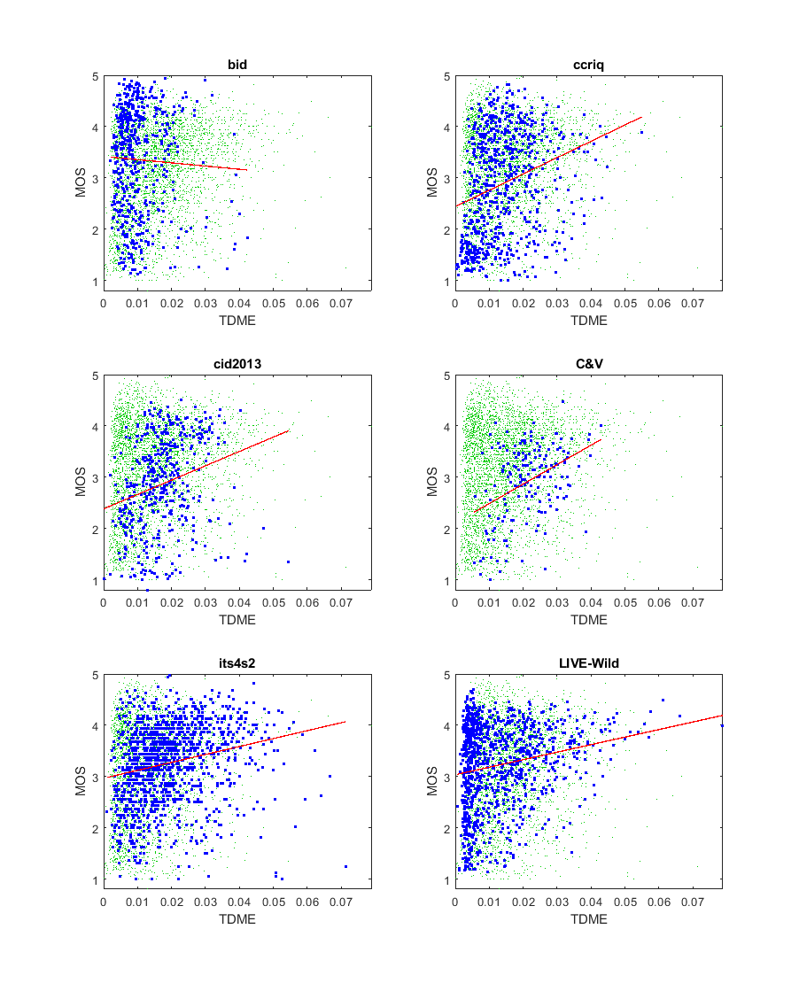

# Report on Transform Domain Measure of Enhancement (TDME)

_Go to [Report.md](Report.md) for an introduction to this series of NR metric reports, including their purpose, important warnings, the rating scale, and details of the statistical analysis._ 

Function `nrff_tdme.m` implements the discrete cosine transform (DCT) Transform Domain Measure of Enhancement (TDME) algorithm presented in [[11]](Publications.md), which says that TDME is "based on the idea that enhancing the contrast of an image would create more high frequency content in the enhanced image compared to the original image." 

Goal|Metric Name|Rating
----|-----------|------
RCA|TDME|:star: :star: :star:

__R&D Potential__: TDME is promising for the detection of contrast enhancement. The MATLAB® run-time is too slow for TDME to be viable. Software solutions to this problem exist. 

## Algorithm Summary
This algorithm is centered around the discrete cosine transform. The image is first divided into blocks of m x m pixels with the aim of increasing the accuracy of the statistics. The article recommends using m = 8 since that is the value used for compression of JPEG and JPEG2000 images. Using whatever m value selected, for each block a sum of a fraction of 2 two-dimensional sums is taken. All of the sums are relative to the m value selected, which increases the importance of selecting a value for m. After this summation is complete, the result is an array of individual TDME values, from which an overarching average TDME value is obtained.

## Speed and Conformity
TDME took __20×__ as long to run as the benchmark metric, [nrff_blur.m](ReportBlur.md). The problem is that the author's code contains five nested for-loops, and for-loops run slowly in MATLAB. Speed improvements may be possible by replacing some of these for-loops with MATLAB matrix operations.

TDME is O(n) in Big-O notation, where n is the number of pixels in the image.  

Due to this slow run speed, TDME could not be evaluated on video datasets.

With respect to conformity, code was provided by the author. 

## Analysis
The authors do not provide an overall Pearson correlation indicating the accuracy of TDME for the training dataset, the 2006 LIVE Image Quality Assessment Database [[31]](Publications.md).

This report evaluates TDME using six image quality datasets that contain camera impairments.
[[11]](Publications.md) is somewhat ambiguous on whether TDME predicts MOS or RCA. We conclude that TDME is an RCA parameter, based on the motives for algorithm development (see above) and the scatter plots. The scatter plots have a well defined upper triangle shape (i.e., narrow range of values for low quality, wide range of values for high quality). Compare the scatter of blue dots (for the current dataset) with the green dots (that show the overall response of all datasets). We expect this shape when the RCA parameter detects a characteristic of some (but not all) high quality images or videos.  
```
1) TDME 
bid              corr =  0.04  rmse =  1.01  percentiles [ 0.00, 0.01, 0.01, 0.01, 0.04]
ccriq            corr =  0.27  rmse =  0.98  percentiles [ 0.00, 0.01, 0.01, 0.02, 0.05]
cid2013          corr =  0.25  rmse =  0.87  percentiles [ 0.00, 0.01, 0.02, 0.02, 0.05]
C&V              corr =  0.41  rmse =  0.66  percentiles [ 0.01, 0.02, 0.02, 0.03, 0.04]
its4s2           corr =  0.23  rmse =  0.72  percentiles [ 0.00, 0.01, 0.02, 0.03, 0.07]
LIVE-Wild        corr =  0.20  rmse =  0.80  percentiles [ 0.00, 0.00, 0.01, 0.02, 0.08]

average          corr =  0.23  rmse =  0.84
pooled           corr =  0.17  rmse =  0.87  percentiles [ 0.00, 0.01, 0.01, 0.02, 0.08]
```
