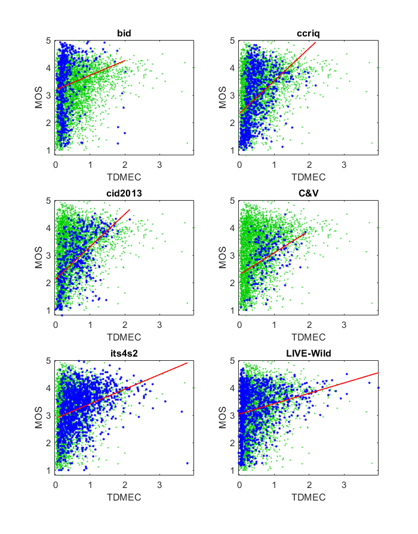

# Report on Transform Domain Measure of Enhancement Color(TDMEC)

_Go to [Report.md](Report.md) for an introduction to this series of NR metric reports, including their purpose, important warnings, the rating scale, and details of the statistical analysis._ 

Function `nrff_tdmec.m` implements the Transform Domain Measure of Enhancement Color (TDMEC) as presented in [[44]](Publications.md). This is a color variant of [TDME](ReportTdme.md), which is "based on the idea that enhancing the contrast of an image would create more high frequency content in the enhanced image compared to the original image." [[11]](Publications.md)

Goal | Metric Name|Rating
-----|------------|------
RCA  | TDMEC | :star: :star: :star:

## Algorithm Summary
The algorithm starts by takings all of the `y`, `cb` , and `cr` components and putting them into matrices of floating point values (decimal values). The algorithm then resizes the image into a multiple of 8 to make it possible to run 8 x 8 pixel blocks with no issue. The algorithm then loops through the 8 x 8 blocks. Within each 8 x 8 block, the algorithm loops from 1 to 7 using the variable `k` and takes the two-dimensional discrete cosine transform (DCT) of the blocks for the `y`, `cb`, and `cr` components. Within the 1 to 7 loops, there is another nested for loop that traverses each pixel and, based on the current value of the outer loop variable `k`, categorizes the pixels as low or high. If the pixel has a row or column value in the block that is greater than the current `k` value it is categorized as high; otherwise it is categorized as low. The pixels categorized as high then have each DCT value of `y`, `cb`, and `cr` added to their respective high sum, and, conversely, the low pixels have their respective DCT values added to their respective low sum. After that summation process is complete, each high sum is divided by the sum of the high sum and the low sum. If those values result in any value except `NaN`, they are stored into arrays, otherwise 0 is used instead. The mean of each component array is taken, and this is followed by calculating the root mean square (RMS) value for the `y` component of the block and the negative RMS values for the `cb` and `cr` components of the block. The `y` mean and RMS value are then multiplied together to give a luminescence measure, and the average of the `cb` and `cr` means times their respective negative RMS values gives a `ch` value. The average of the luminescence value and the `ch` value gives one data value for the set. Once the loop concludes, the mean of that set is taken as the final measure. 

## Speed and Conformity
TDMEC took __36×__ as long to run as the benchmark metric, [nrff_blur.m](ReportBlur.md). The problem is that the author's code contains five nested for-loops, and for-loops run slowly in MATLAB. Speed improvements may be possible by replacing some of these for-loops with MATLAB matrix operations.

Due to this slow run speed, TDMEC could not be evaluated on video datasets.

TDMEC is O(n) in Big-O notation, where n is the number of pixels in the image.  

In terms of conformity, the author provided us with code. The only change made was using the `y`, `cb`, and `cr` values directly since the framework provides those values rather than converting them from RGB values. 

## Performance
The authors report 0.98679 Pearson correlation between TDMEC and MOS for the TID2008 Dataset [[32]](Publications.md).

This report evaluates TDMEC using six image quality datasets that contain camera impairments. 
The scatter plots have an upper triangle shape (i.e., narrow range of values for low quality, wide range of values for high quality). This is an unusual shape for RCA metrics, only occurring when the metric detects a characteristic of high quality images. Most RCA metrics we have developed or analyzed produce either a lower triangle shape (like [HVS-MaxPol](ReportHVSMaxPol.md)) or a scattering of data around a line (like [nrff_blur.m](ReportBlur.md)). Users should compare TDMEC values with images to confirm the impairments that trigger high TDMEC values. 

We did not calculate TDMEC on the video datasets, due to its slow run speed.
```
--------------------------------------------------------------
1) tdmec
bid              corr =  0.15  rmse =  1.00  percentiles [ 0.04, 0.17, 0.22, 0.35, 2.02]
ccriq            corr =  0.41  rmse =  0.93  percentiles [ 0.00, 0.24, 0.40, 0.62, 2.19]
cid2013          corr =  0.55  rmse =  0.75  percentiles [ 0.00, 0.26, 0.60, 0.89, 2.14]
C&V              corr =  0.42  rmse =  0.65  percentiles [ 0.05, 0.52, 0.76, 1.04, 1.90]
its4s2           corr =  0.35  rmse =  0.70  percentiles [ 0.05, 0.36, 0.62, 0.93, 3.80]
LIVE-Wild        corr =  0.25  rmse =  0.79  percentiles [-0.03, 0.10, 0.28, 0.69, 3.99]

average          corr =  0.36  rmse =  0.80
pooled           corr =  0.29  rmse =  0.84  percentiles [-0.03, 0.21, 0.44, 0.79, 3.99]
```

