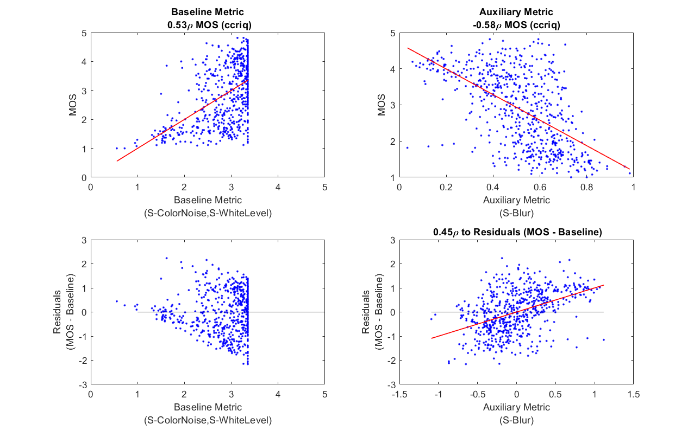
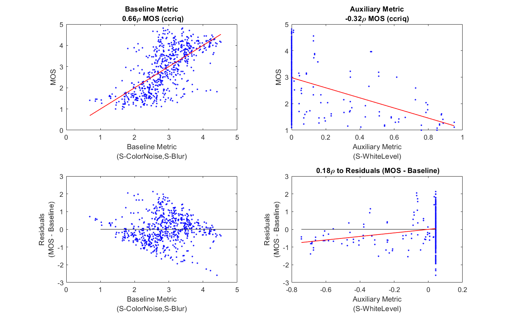
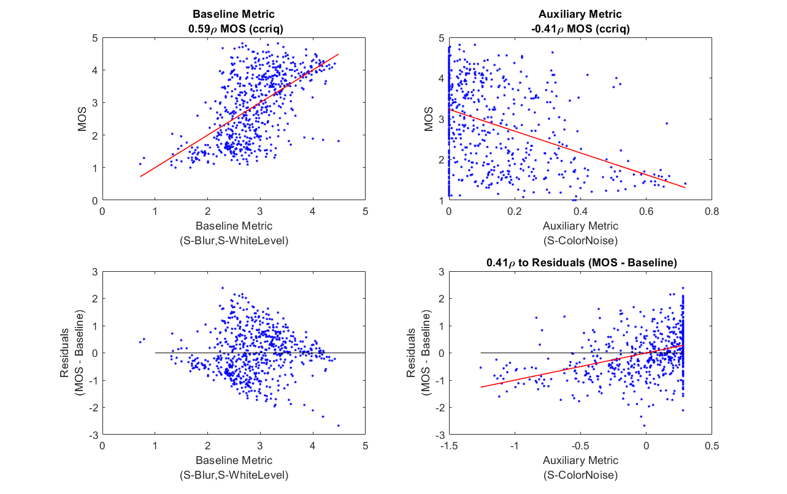

# MATLAB function `residual_NRpars.m`

## Usage
Provides deeper understanding of an NR metric by comparing it to the residuals of a linear model built from other NR metrics. 

## Motivation
Effective use of this function requires some knowledge of linear regression.

Using linear regression, we will calculate optimal weights for a model that predicts MOS (referred to as _Y_). 
The linear model will have the form (_Yhat_ = A + B1 * X1 + B2 * X2 + ... + BN * XN), 
where [X1, X2, ..., XN] are NR metrics. 
_Residuals_ refers to the difference between the MOS training data (_Y_), and the predicted model values (_Yhat_). Thus, the residuals are (_Y_ - _Yhat_). 

By comparing an NR metric to residuals, we understand how much of the linear model's error can be explained by the new NR metric. 
The residual plots remove known factors from the NR metric's scatter. 
This reveals trends and patterns that are not visible on conventional (MOS vs metric) plots. 

## Details
This function assumes that multiple NR metrics will be combined with linear regression, to form a model that assesses MOS. 

Given two or more NR metrics, one is chosen as the **auxiliary metric**.
A linear model is trained using the remaining NR metrics. This is referred to as the **baseline model**. 
Create one figure for each possible auxiliary metric. 
These figures contain the following four sub-plots:

Subplot | Y-Axis | X-Axis | Extra Information |
--------|--------|--------|-------------------|
upper left |  MOS | baseline model values | Fit line (red), Pearson correlation ($\rho$) |
lower left | baseline model residuals | baseline model values | Zero residual line (grey) |
upper right | MOS | auxiliary values | Fit line (red), Pearson correlation ($\rho$) |
lower right | baseline model residuals | auxiliary metric values | Fit line (red), Pearson correlation ($\rho$) |

Additional information is printed, such as the model weights for each baseline model. 

## Inline Documentation
```
  residual_NRpars
    Compare an NR metric with the residuals of a baseline NR metric.
  SYNTAX
    residual_NRpars(nr_dataset, base_dir, feature_function1, feature_num1, ...
        feature_function2, feature_num2, ..., feature_functionN, feature_numN);
  SEMANTICS
    The following analysis is performed for all combinations of a set of
    features. One NR metric is specified as the auxiliary metric. The other
    NR metrics are combined into a baseline model. Analyze the added value 
    of the auxiliary metric, by compariing it to the residuals of the 
	baseline model. 
 
    This analysis intentionally omits stimuli marked for verification
    purposes only.
 
  Input Parameters:
    nr_dataset          Data structure. Each array element describes an entire dataset
						with fields "name", "file_location", etc.
    base_dir            Path to directory where NR features and NR parameters are stored.
    feature_functionX   The Xth pointer to a no-reference feature function (NRFF) that must 
                        adhere to the interface specified in calculate_NRpars.
    feature_numX        The Xth NR metric's parameter number (feature_functionX).
 
    1) Train model using all baseline NRFF NRFF listed.
    2) Calculate residuals between MOS and this baseline model
    3) Compare auxiliary metric to the residuals between MOS and the
       baseline model
    4) Plot results, with supplemental information printed
 
    These calculations are performed for each dataset separately.
 
  Warning:
    Currently only works for one dataset.
```
## Examples
These examples use the CCRIQ dataset to analyze three NR metrics: [S-Blur](ReportBlur.md), [S-ColorNoise](ReportPeculiarColor.md), and [S-WhiteBalance](ReportAutoEnhancement.md).
These root cause analysis (RCA) metrics detect the presence of one specific impairment, as the metric value approaches 1.0.

Example #1 compares auxiliary metric S-Blur with a baseline model of S-ColorNoise and S-WhiteBalance. 
The baseline model and auxiliary metric have unappealing shapes and moderate accuracy (0.53 $\rho$ and -0.58 $\rho$ to MOS respecively). 
The spread of the auxilary metric's data around the fit line is highly erratic for MOS (upper right subplot).
The spread tightens when comparing to residuals (lower right subplot), because some of the error has been removed.
The Pearson correlation is lower for the residuals (0.45 $\rho$) than for MOS (-0.58 $\rho$). 
S-Blur explains about 20% of the baseline model's error ($\rho ^2$). 

Examples #2 and #3 show similar trends when S-WhiteLevel is compared to a baseline model of S-Blur and S-ColorNoise, and
when S-ColorNoise is compared to a baseline model of S-Blur and S-WhiteBalance. 
These auxiliary metric vs MOS plots have strong lower triangle shapes (upper right).
This shape is slightly reduced in the auxiliary metric vs baseline model's residual plots (lower right). 
Compare the vertical spread of data on the upper right plot to the vertical spread of data on the lower right plot.

The CCRIQ dataset contains other types of impairments that cannot be detected by these three RCA metrics. 
The residual plots allow us to remove some error from the scatter plots, which makes it easier to visualize trends.
As more RCA metrics are added to the baseline model, each detecting a new impairment, the residual plots should look increasingly like an even scatter of data around a fit line. 

The baseline residual plots (lower left) can be used to see if there are any non-linearities in the baseline model.
This would appear as a rounded shape (e.g., positive bias in the middle, negative bias on the left and right).
This problem could be fixed by applying a square or square root to the NR metric that has this problem.
None of the examples show such a non-linearity.

### Example #1

### Example #2

### Example #3

