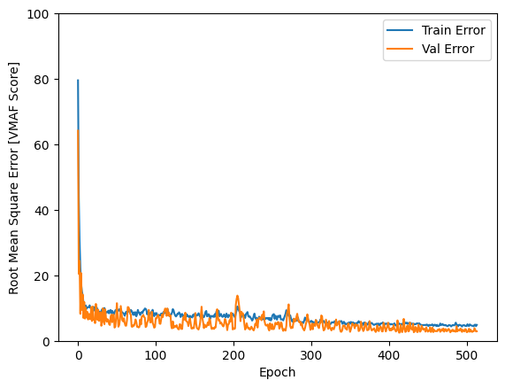

# Predicting image or video quality with a Machine Learning model developed with TensorFlow, Keras, and MATLAB®

This page acts as a guide through the process of training a machine learning model with TensorFlow and Keras, on the Google CoLaboratory™ data analysis platform (Google Colab), and then exporting the trained model and using it in MATLAB®. These tools were chosen for the convenience of the authors of this workflow. The use of the chosen tools does not imply recommendation or endorsement by the National Telecommunications and Information Administration (NTIA), and does not imply that the tools used are necessarily the best available for the particular purpose.
The goal of this model is to predict image and video quality, and it will be used as a part of the NRMetricFramework.

### Definitions

- **Data file** is a spreadsheet of numeric data consisting of a number of features and a label desired  predict
- **Dataset** refers to datasets as they are [defined in the NRMetricFramework](https://github.com/NTIA/NRMetricFramework-dev/blob/master/documentation/DatasetStructure.md)
- **TF** stands for TensorFlow
- **ML** stands for Machine Learning
- **VMAF** refers to Netflix’s ["Video Multi-Method Assessment Fusion"](https://github.com/Netflix/vmaf) tool. It is a full-reference tool/metric that predicts compression quality/encoding artifacts of a video, from the human perspective.
- **VMAF score** refers to the output of running the VMAF tool/metric on any piece of media
- **SFS** stands for sequential feature selection

### Notes and assumptions

- The instructions in this guide are geared towards usage in the Google Colab platform. If running this locally, there will need to be minor adjustments in the workflow throughout. We trust the reader to recognize the need and make those adjustments.
- This guide will use the terms `raw_mos` [(see here)](#data-for-this-example) and `VMAF score` interchangeably, given we are in the context of the VCRDCI data file. This is not the case for other data files.
- There has not been a process created to use per-frame features to train a ML model; there is only a workflow that allows per-media features. If such a workflow were created, the data for each media file could increase by a factor of 100. For example, a 4-second–long 24 fps video would result in 96 more rows of data for every piece of media.
- This guide will use one example data file, to be consistent and make these instructions easier to follow. If using a different data file, make the necessary changes throughout the code. Our example data file is called `vcrdci_123_all_data_eg_no_nans.csv` and can be found in this github repository.
  - Note that in this data file, the "EgCategory" feature column is filler data with no predictive value. It exists purely as an example.
  - Details about how this data file was made can be found [here](#exporting-data-from-the-nrmetricframework). This section also notes changes made to the output of the commands detailed in this document.
- To aid the reader, we have prepared example Jupyter Notebooks (along with their equivalent Python files) that can be run either locally or uploaded to Google Colab. The notebooks can be found in this github repository.
  - Example files without sequential feature selection: `vcrdci_ml_nosfs_eg.ipynb`, `vcrdci_ml_nosfs_eg.py` and `matlab_import_tf_nosfs_eg.m`
  - Example files with sequential feature selection: `vcrdci_ml_sfs_eg.ipynb`, `vcrdci_ml_sfs_eg.py`, and `matlab_import_tf_sfs_eg.m`
- These instructions are incompatible with any version of TensorFlow greater than 2.10. As of August 2023 MATLAB has not updated its support for imported TF models beyond 2.10.
- There are many ways to implement ML. The workflow laid out here may not necessarily be the best approach, it is simply a hands-on introduction to some of the main concepts. See [here](#different-types-of-ml-models-and-frameworks) for information.

## Step 1. Set up the data file

Prepare a spreadsheet (`.csv`) that contains feature data desired to input and data that desired to predict based off those features. 

### Export data from the NRMetricFramework

Clone the NRMetricFramework and open the folder in MATLAB.

1. First, load in the dataset variables for the data desired to export.  
For the VCRDCI data, click on `simulated.mat` in the file explorer on the left-hand side and then load the three VCRDCI datasets that show up underneath it. Or, run the following commands:
    ```matlab
    load('simulated.mat', 'vcrdci1_dataset')
    load('simulated.mat', 'vcrdci2_dataset')
    load('simulated.mat', 'vcrdci3_dataset')
    ```

2. Define the folder where the framework can find the calculated features, as below. If this feature data is unavailable, these commands will calculate it, but beware: It will take an extremely long time! ITS employees can retrieve this information from the internal servers.  
   ```matlab 
   base_dir = "C:\Users\johndoe\Desktop\NRforAnalytics\vcrdci_ml"
   ```

3. Finally, using the `export_NRpars` function, export the selected datasets into a single data file with your selected features.

    Example using the VCRDCI data:

    ```matlab
    export_NRpars([vcrdci1_dataset vcrdci2_dataset vcrdci3_dataset], base_dir, {@nrff_panIPS @nrff_fine_detail @nrff_auto_enhancement @nrff_blur @nrff_nr_iqa_cdi @nrff_motion_search}, base_dir + '\vcrdci_123_all_data_eg_no_nans.csv');
    ```

    Replace the first parameter with the list of datasets selected to export data from. Replace the second parameter with a cell array of feature functions you want from each dataset. Finally, provide the file address of the path for the exported data. If no file exists, a new file will be generated at the path provided.

In this guide, we use the output of this command as an example data file. Prior to usage, however, there were two changes made to the output of this command. First, the rows with NaN values were removed; and, second, an additional feature called `EgCategory` was added. This is a feature with filler data, void of any predictive value. It was added only to serve as an example of how one can work with categorical data.  
Find this file at `vcrdci_123_all_data_eg_no_nans.csv` in this repository.

Some notes:
- If the `@nrff_nr_iqa_cdi` feature function is selected, add the `reports/` folder to path by right clicking the folder in the file explorer on the left and press "Add to Path."
- When given a list of datasets, the `export_NRpars()` function will output one data file that has every single feature for every single dataset, with entries for different datasets concatenated one after another.
  - If separate data files are desired for separate datasets, the `export_NRpars()` function must be run multiple times with only one dataset variable provided.
  - Note the specifics of this functionality might change in the future if the `export_NRpars()` function is modified.
- At the time of writing, the `export_NRpars()` function does not support exporting categorical data.
- `export_NRpars()` only exports information marked as “"training.” In most datasets, roughly 10% of the media files are marked as “verification” and reserved to be used only for the author’s final model verification (e.g., the accuracy reported in a conference paper). They are not to be used during the training of any metric.
- If there are any NaN values in the data file, the machine learning will **not work**. You **must remove** the rows with the NaN values manually.
  - In the future, it is likely a better long-term solution will be found, e.g., changing the features exported, changing the export function so NaNs are not exported, implementing [masking](https://www.tensorflow.org/guide/keras/understanding_masking_and_padding), or something else. For now, however, the NaNs must be manually removed.

### Data for this example

As noted [at the starting](#notes-and-assumptions), we will be using our example data file called `vcrdci_123_all_data_eg_no_nans.csv`

Here are the first few lines of that data file, as an example:

|    media     |   mos    | raw_mos  | EgCategory | S-PanSpeed | S-Jiggle | S-FineDetail | S-WhiteLevel | S-BlackLevel | WhiteClipping |  S-Blur  | viqet-sharpness | NR-IQA-CDI mean | NR-IQA-CDI std | NR-IQA-CDI entropy | NR-IQA-CDI kurtosis | NR-IQA-CDI skewness |   bps    |   eps    | mean_error |  Ifrac   |  Pfrac   | Bfrac | mean_countP_countI_ratio | bps_pixels | max_relational_error | mean_relational_error | std_raw_vs_all_error | mean_raw_vs_all_error | max_relational_bits | mean_relational_bits | std_raw_vs_all_bits | mean_raw_vs_all_bits | max_relational_countP | mean_relational_countP | std_raw_vs_all_countP | mean_raw_vs_all_countP | mean_error_vs_mean_bits | mean_countP_vs_mean_bits | max_bps  | max_to_mean_bits_per_frame |
| :----------: | :------: | :------: | :--------: | :--------: | :------: | :----------: | :----------: | :----------: | :-----------: | :------: | :-------------: | :-------------: | :------------: | :----------------: | :-----------------: | :-----------------: | :------: | :------: | :--------: | :------: | :------: | :---: | :----------------------: | :--------: | :------------------: | :-------------------: | :------------------: | :-------------------: | :-----------------: | :------------------: | :-----------------: | :------------------: | :-------------------: | :--------------------: | :-------------------: | :--------------------: | :---------------------: | :----------------------: | :------: | :------------------------: |
| VCRDCI_1_... | 4.912783 | 97.81957 |    abcd    |  0.047511  | 0.020164 |   0.818884   |   0.446972   |      0       |   4.75E-07    | 0.876288 |    0.845368     |    27.44497     |    15.62459    |      4.343385      |      6.687483       |      1.976957       | 235404.9 | 102812.6 |  13396.94  | 0.979533 | 0.020467 |   0   |         0.020978         |  0.113525  |       0.42643        |       \-0.41973       |       0.006592       |       0.020294        |      0.896002       |       \-0.5237       |      0.315234       |       0.605692       |       0.735889        |       \-0.39309        |       0.146649        |        0.465829        |        0.436748         |         0.005445         | 2316.022 |          1.09647           |
| VCRDCI_1_... | 4.762209 | 94.05522 |    abcd    |  0.047465  | 0.020924 |   0.825544   |   0.446584   |      0       |   1.83E-07    | 0.889687 |    0.864915     |    27.45344     |    15.62876    |      4.341584      |       6.67986       |       1.97573       | 220130.5 | 101435.2 |  13217.46  | 0.984107 | 0.015893 |   0   |         0.016177         |  0.106159  |       0.426449       |       \-0.41984       |       0.006495       |       0.020022        |      0.877802       |      \-0.57589       |      0.250107       |       0.566391       |       0.735889        |        \-0.4697        |       0.085482        |        0.361718        |        0.460796         |         0.004521         | 1934.891 |          0.916032          |
| VCRDCI_1_... | 4.748574 | 93.71434 |    abcd    |  0.043001  | 0.020779 |   0.827875   |   0.446661   |      0       |   2.62E-07    | 0.891675 |    0.867845     |    27.45403     |    15.6269     |      4.340693      |      6.677647       |      1.975534       | 215601.9 | 101062.6 |  13168.91  | 0.985668 | 0.014332 |   0   |         0.014563         |  0.103975  |       0.426457       |       \-0.41988       |       0.006468       |       0.019949        |      0.874969       |      \-0.59137       |      0.235759       |       0.554739       |       0.735889        |       \-0.49584        |       0.077319        |        0.326201        |        0.468746         |         0.004163         | 1871.286 |          0.88592           |
| VCRDCI_1_... | 4.622401 | 90.56003 |    abcd    |  0.041531  | 0.019893 |   0.845253   |   0.446196   |      0       |       0       | 0.903246 |     0.87811     |    27.46056     |    15.62535    |      4.333433      |      6.665955       |      1.974491       | 176803.3 | 98706.36 |  12861.88  | 0.993773 | 0.006227 |   0   |         0.00627          |  0.085264  |       0.426493       |       \-0.42008       |        0.0063        |       0.019484        |      0.885276       |      \-0.72396       |      0.117968       |       0.454911       |       0.735889        |        \-0.6316        |        0.03527        |        0.141719        |        0.558283         |         0.002205         | 1311.352 |          0.620831          |

For reference, below is a table cross referencing the NRpars feature functions that created the ML features in the table above.
<table class="tg"><thead>  <tr>    <th class="tg-8d8j" colspan="2">@nrff_panIPS </th>    <th class="tg-8d8j">@nrff_fine_detail </th>    <th class="tg-8d8j" colspan="3">@nrff_auto_enhancement</th>    <th class="tg-8d8j" colspan="2">@nrff_blur</th>    <th class="tg-8d8j" colspan="5">@nrff_nr_iqa_cdi</th>    <th class="tg-8d8j" colspan="26">@nrff_motion_search</th>  </tr></thead><tbody>  <tr>    <td class="tg-8d8j">S-PanSpeed</td>    <td class="tg-8d8j">S-Jiggle</td>    <td class="tg-8d8j">S-FineDetail</td>    <td class="tg-8d8j">S-WhiteLevel</td>    <td class="tg-8d8j">S-BlackLevel</td>    <td class="tg-8d8j">WhiteClipping</td>    <td class="tg-8d8j">S-Blur</td>    <td class="tg-8d8j">viqet-sharpness</td>    <td class="tg-8d8j">NR-IQA-CDI mean</td>    <td class="tg-8d8j">NR-IQA-CDI std</td>    <td class="tg-8d8j">NR-IQA-CDI entropy</td>    <td class="tg-8d8j">NR-IQA-CDI kurtosis</td>    <td class="tg-8d8j">NR-IQA-CDI skewness</td>    <td class="tg-8d8j">bps</td>    <td class="tg-8d8j">eps</td>    <td class="tg-8d8j">mean_error</td>    <td class="tg-8d8j">Ifrac</td>    <td class="tg-8d8j">Pfrac</td>    <td class="tg-8d8j">Bfrac</td>    <td class="tg-8d8j">mean_countP_countI_ratio</td>    <td class="tg-8d8j">bps_pixels</td>    <td class="tg-8d8j">max_relational_error</td>    <td class="tg-8d8j">mean_relational_error</td>    <td class="tg-8d8j">std_raw_vs_all_error</td>    <td class="tg-8d8j">mean_raw_vs_all_error</td>    <td class="tg-8d8j">max_relational_bits</td>    <td class="tg-8d8j">mean_relational_bits</td>    <td class="tg-8d8j">std_raw_vs_all_bits</td>    <td class="tg-8d8j">mean_raw_vs_all_bits</td>    <td class="tg-8d8j">max_relational_countP</td>    <td class="tg-8d8j">mean_relational_countP</td>    <td class="tg-8d8j">std_raw_vs_all_countP</td>    <td class="tg-8d8j">mean_raw_vs_all_countP</td>    <td class="tg-8d8j">mean_error_vs_mean_bits</td>    <td class="tg-8d8j">mean_countP_vs_mean_bits</td>    <td class="tg-8d8j">max_bps</td>    <td class="tg-8d8j" colspan="3">max_to_mean_bits_per_frame</td>  </tr></tbody></table>

In this example table, we are going to use all 38 features to predict the `raw_mos` label (`media` is irrelevant; we will get rid of it in a future step. We are also choosing to predict `raw_mos` rather than `mos`, so we will get rid of the latter).
- Along these lines, to create your own dataset, you would want to make sure there is one column that is your label – i.e., what you're trying to predict — and then as many columns of features as desired. 

**Note:** When using a dataset consisting of data exported from the NRMetricFramework, there will most likely be the columns `mos` as well as `raw_mos` in the export. `raw_mos` is the MOS as produced by the people who created the dataset, and different datasets have different scales, such 1–5, 0–100, or 0–10. The `mos` column normalizes all these different scales to `1–5`, letting us compare the root-mean square error (RMSE) between different datasets. Here, we are only using the VCRDCI dataset, so it does not matter if we choose to predict `mos` or `raw_mos`. To train with data from numerous different datasets, you will most likely have to use the `mos` column as a label. For this example, we will choose to predict `raw_mos` instead of `mos`.

**Note:** These four entries are provided as examples. When training a model, you will want a data file with thousands of entries.

## Step 2. Set up the environment

In a new Google Colab notebook, connect a new runtime. A GPU or a TPU (a Tensor Processing Unit) runtime configuration is desired. To configure the runtime, go to `Runtime --> Change runtime type` and select `Python 3` and `TPU`. Then, press `Save`.

In case the `TPU` is not available, a `GPU` can be used as well. For this example, we did find TPUs to be faster, but that may not always be the case.

Once that is done, upload to Colab the `requirements.txt` file found in this repository. This will be used to install all the dependencies. First, download `requirements.txt` from this repository to your local machine. Then, go to Colab, press on the `Files` icon on the left, and in that menu press the Upload button signified by an icon with a file and an up arrow. Then, select the file from your local file system and upload it.

Once that is done, run the following command to prepare your environment. This will take a few minutes. It is possible to encounter some warnings/errors about some dependency conflicts, but for this guide, you can ignore them.

```bash
!pip3 install -r requirements.txt
```

Finally, you will have to restart your runtime so that the newly installed packages can be used. To do this, go to `Runtime --> Restart runtime`. Once that is done, continue on.


## Step 3. Upload the data file to Colab

At this point, you can now upload the data to Colab. Go to the Upload menu as in the last step, and upload your data table from your local file system.

## Step 4. Write code, train the model

Make a new code cell and write all of the following code in it. Remember that an example notebook is provided for reference.

### Import packages

```py
import tensorflow as tf
import pandas as pd
import numpy as np
from sklearn.model_selection import train_test_split
from sklearn.preprocessing import OneHotEncoder
from sklearn.compose import ColumnTransformer
from matplotlib import pyplot as plt
```

### Set up a Pearson correlation loss metric

Metrics are used to assess the performance of a model. TF/Keras come with numerous built-in metrics, but in addition to seeing those, we also wanted to see the Pearson correlation value. Add the following code to calculate the Pearson correlation value..

```py
from tensorflow.keras import backend as K
def pearson_r(y_true, y_pred):
    x = y_true
    y = y_pred
    mx = K.mean(x, axis=0)
    my = K.mean(y, axis=0)
    xm, ym = x - mx, y - my
    r_num = K.sum(xm * ym)
    x_square_sum = K.sum(xm * xm)
    y_square_sum = K.sum(ym * ym)
    r_den = K.sqrt(x_square_sum * y_square_sum)
    r = r_num / r_den
    return K.mean(r)
```

The `pearson_r` function will be used later on in the code to show the Pearson correlation performance of our model.

### Load the csv data
```py
vcrdci_all_data = pd.read_csv(
    "vcrdci_123_all_data_eg_no_nans.csv",
    skiprows=1,
    names=[
        "media",
        "mos",
        "raw_mos",
        "EgCodecCategory",
        "S-PanSpeed",
        "S-Jiggle",
        "S-FineDetail",
        "S-WhiteLevel",
        "S-BlackLevel",
        "WhiteClipping",
        "S-Blur",
        "viqet-sharpness",
        "NR-IQA-CDI mean",
        "NR-IQA-CDI std",
        "NR-IQA-CDI entropy",
        "NR-IQA-CDI kurtosis",
        "NR-IQA-CDI skewness",
        "bps",
        "eps",
        "mean_error",
        "Ifrac",
        "Pfrac",
        "Bfrac",
        "mean_countP_countI_ratio",
        "bps_pixels",
        "max_relational_error",
        "mean_relational_error",
        "std_raw_vs_all_error",
        "mean_raw_vs_all_error",
        "max_relational_bits",
        "mean_relational_bits",
        "std_raw_vs_all_bits",
        "mean_raw_vs_all_bits",
        "max_relational_countP",
        "mean_relational_countP",
        "std_raw_vs_all_countP",
        "mean_raw_vs_all_countP",
        "mean_error_vs_mean_bits",
        "mean_countP_vs_mean_bits",
        "max_bps",
        "max_to_mean_bits_per_frame",
    ],
)
vcrdci_all_data.pop("media")
vcrdci_all_data.pop("mos")
```

Replace `vcrdci_123_all_data_eg_no_nans.csv` with the filename of the data sheet uploaded, and the list in `names` with the names of all the columns in the data sheet.

Here, we `pop`ed the `name` and `mos` columns because they were irrelevant to our ML model.

### Filter data by VMAF score

In our example, we did not want to train on entries with VMAF scores below 60 because we received advice from the VMAF model developers that when scores were lower than 60, the media is not representative of modern video services.

Primarily this step is included to demonstrate how filtering of the data can be done. Our choice of what to filter is not necessarily an impactful or important choice.

Here, we filter based off VMAF scores and retain only entries with a score of 60 or higher.

```py
vcrdci_60 = vcrdci_all_data[vcrdci_all_data["raw_mos"] >= 60]
```

### Create a subset of data 

To speed up the training of the model, take a subset of the first 500 entries of the data file. A full, finished metric would train on the full data file, not on the subset.

**Note:** When developing a real model, it is desired to take a random subset while iterating. In this instance, we take the first 500 entries for the sake of simplicity. Here is [one such method](https://pandas.pydata.org/docs/reference/api/pandas.DataFrame.sample.html) to take a random subset.

```py
vcrdci_60_small = vcrdci_60.iloc[:500]
```

### Set up labels and features

```py
vcrdci_all_features = vcrdci_60_small.copy()
vcrdci_all_labels = vcrdci_all_features.pop("raw_mos")
```

### One-hot encode any categories

If you have any columns of data that are categories rather than numbers -- such as our Category 3, which is resolution, you will have to do what is known as ["one-hot encoding."](https://machinelearningmastery.com/why-one-hot-encode-data-in-machine-learning/).

```py
categorical_features = ["EgCodecCategory"]
one_hot = OneHotEncoder()
transformer = ColumnTransformer([("one_hot", one_hot, categorical_features)], remainder = "passthrough")

transformed_features = transformer.fit_transform(vcrdci_all_features)
vcrdci_all_features = pd.DataFrame(transformed_features)
```

Here, the `ColumnTransformer` object is created to transform the columns in `categorical_features` into one-hot–encoded columns. Any columns in the data file (here, `vcrdci_all_features`) that are not specified, will be `passthrough`ed and output exactly as they were input.

### Make a train-test split

```py
feature_train, feature_test, label_train, label_test = train_test_split(vcrdci_all_features, vcrdci_all_labels, test_size = 0.2, random_state = 1)

feature_test.to_csv("feature_test_vcrdci123_small.csv", index=False)
```

This splits the data file into 80% training data and 20% testing data.

By setting `random_state = 1`, we ensure that we will train/test on the same split of data each time we train the model during our iterative development process. If you want a random split each time, set it equal to `None`.

We also save the `feature_test` data to a CSV file that we will use later on in the process when validating our imported model in MATLAB.

Next, for compatibility, we convert the data frames into numpy arrays
```py
feature_train = np.array(feature_train)
label_train = np.array(label_train)
feature_test = np.array(feature_test)
label_test = np.array(label_test)
```

### Make an input normalization layer

```py
norm_features = tf.keras.layers.Normalization()
norm_features.adapt(vcrdci_all_features)
```

Each Column of data adheres to a different scale, so to address this, we need to normalize the data. Here, we make a normalization layer that will later be built into the model.

### Build the model

```py
def build_model():
    model = tf.keras.Sequential(
        [
            norm_features,
            tf.keras.layers.Dense(
                500,
                activation="relu",
                input_shape=[len(feature_train[0])],
                kernel_regularizer=tf.keras.regularizers.l2(0.001),
            ),
            tf.keras.layers.Dropout(0.2),
            tf.keras.layers.Dense(
                500,
                activation="relu",
                kernel_regularizer=tf.keras.regularizers.l2(0.001),
            ),
            tf.keras.layers.Dropout(0.2),
            tf.keras.layers.Dense(1),
        ]
    )

    model.compile(
        optimizer="adam",
        loss=tf.keras.losses.MeanSquaredError(),
        metrics=["mse", pearson_r],
    )
    return model

model = build_model()
```

This makes a model with two layers of 500 neurons each, plus one more output layer of one neuron (representing the single number predicting the VMAF score we want as output).

Some notes:
- The first layer is the normalization layer because we want to normalize the input before beginning to train on it.
- The first layer with neurons has an `input_shape` parameter. This is equal to the number of features we are training on. 
- The `kernel_regularizer` parameter is employed to reduce overfitting. See [this TensorFlow guide](https://www.tensorflow.org/tutorials/keras/overfit_and_underfit#add_weight_regularization) for more information.
- The `Dropout` layer is employed to reduce overfitting. See [this TensorFlow guide](https://www.tensorflow.org/tutorials/keras/overfit_and_underfit#add_dropout) for more information.
- Neither of the above methods were thoroughly, rigorously tested during the development of this proof-of-concept model. When making a full model, it is preferable to chart and compare the performances of models with different configurations.
- it is also preferable to alter the number of layers (2 in this model) and how many neurons are in each later (500 in this example).
- Choosing a different activation method (instead of `relu`) and a different optimizer (instead of `adam`) is also another option to try out and adjust.
- If creating  a classification neural net (rather than a regression neural net, shown in this guide), change the number of neurons in the output layer to the number of classes needed to predict, and also choose a [different loss function](https://www.tensorflow.org/api_docs/python/tf/keras/losses).
- There are [different loss metrics](https://www.tensorflow.org/api_docs/python/tf/keras/metrics). Compared to a loss function, these do not inform the model as it trains, but they do give more information to you. Add more metrics as desired. If making a classifier neural net, something other than the mean squared error (MSE) is needed. Here, we also added a [custom-implemented Pearson correlation metric](https://discuss.tensorflow.org/t/creating-pearson-correlation-metrics-using-tensorflow-tensor/10333).
- See [here](#different-types-of-ml-models-and-frameworks) for notes on different routes we could have taken with the type of model we created.

### Train the model

```py
class PrintDot(tf.keras.callbacks.Callback):
    def on_epoch_end(self, epoch, logs):
        if epoch % 100 == 0: print('')
        print('.', end='')
early_stop = tf.keras.callbacks.EarlyStopping(monitor='val_loss', patience=100, restore_best_weights=True)

history = model.fit(
    feature_train,
    label_train,
    epochs=1000,
    batch_size=64,
    validation_split=0.2,
    callbacks=[early_stop, PrintDot()],
    verbose=0,
)
```

There is a lot going on here.

1. We pass in the training data to our fit() function.   

2. We choose to train it for `1000` epochs. This value was arbitrary, and it may be desired to try different options and tune the parameter. The `EarlyStopping()` callback could reduce the number of epochs, more on that later.  

3. We further split the training data into 20% validation and 80% training. More about the uses of the training data will come later in this guide.

4. We have two callbacks. The first is the `early_stop` callback, which will be discussed later. The second is the `PrintDot()` callback. This is simple: It prints a `.` for every epoch we train. At every hundredth epoch, it makes a newline. By printing a dot instead of the specific details of each epoch, we are able to show progress while reducing verbosity. 

5. We set `verbose=0` because, as described above, we print out our own information.

6. We set the `batch_size = 64`. To better understand what a batch is, check out [this article](https://machinelearningmastery.com/difference-between-a-batch-and-an-epoch/). This is a parameter you will want to adjust, and will generally be one of the following numbers: `32, 64, 128, 256`.

Back to the validation and `EarlyStopping()`-

We split the data into a training and validation set. So, now, after every epoch, once the model has updated its internal parameters, it will test it against the validation data. The model is never trained on the validation data; it is only tested on it. This gives the model an idea of how accurate it is while it is training, without running the risk of the model overfitting to the training data.

The `EarlyStopping()` callback monitors the MSE loss on the validation data after every epoch. If that loss stops improving, then it stops the training of the model at whatever point it is, because beyond that, it may only be overfitting the model to the training data.  
The `patience` parameter allows adjustment of how many epochs  should complete before stopping the training data, if no improvement is noticed. You will want to try different options and adjust this.  
The `restore_best_weights` parameter restores the version of the model with the lowest loss, once the model stops training.

**Note:** You may receive warnings about invalid divides and  the incorrect amount of degrees of freedom. You should perform at least a cursory inspection of the data to ensure that invalid values aren’t being provided to the model. That said, we believe these occur when there are values of zero or values very close to zero that get rounded down in the data file. In our experience, we have been able to safely ignore these warnings.

### Save the history and test the model

Now that you have a fully trained model, it is time to save its training history (to be plotted later) and test its performance:

```py
hist = pd.DataFrame(history.history)
hist['epoch'] = history.epoch

val_rmse = np.sqrt(float(hist['val_mse'].min()))
val_pearson = float(hist["val_pearson_r"].min())
print('\nFinal Root Mean Square Error on validation set: {}'.format(round(val_rmse, 3)))
print("Final Pearson Correlation Error on validation set: {}".format(round(val_pearson, 3)))

print("\nEvaluating...")
scores = model.evaluate(feature_test, label_test, verbose=0)
test_loss_mse, test_metric_mse, test_metric_pearson = scores

test_loss_rmse = np.sqrt(test_loss_mse)

print("Loss: RMSE on test set: {}".format(round(test_loss_rmse, 3)))
print("Metric: Pearson on test set: {}".format(round(test_metric_pearson, 3)))
```

We get something like this as output:

```
Final Root Mean Square Error on validation set: 0.327
Final Pearson Correlation Error on validation set: -0.404

Evaluating...
Loss: RMSE on test set: 1.224
Metric: Pearson on test set: 0.852
```

### Plot the history

After this, if you are interested, you can plot the training history of the model!

```py
def plot_history():
    plt.figure()
    plt.xlabel('Epoch')
    plt.ylabel('Root Mean Square Error [VMAF Score]')
    plt.plot(hist['epoch'], np.sqrt(hist['mse']), label='Train Error')
    plt.plot(hist['epoch'], np.sqrt(hist['val_mse']), label = 'Val Error')
    plt.legend()
    plt.ylim([0,100])
    plt.show()

plot_history()
```

You might see an output similar to this:



Note that your validation loss might be less than your training loss -- [this StackExchange question](https://stats.stackexchange.com/questions/187335/validation-error-less-than-training-error) may shed some more light on that. Generally, ensure your data split well and that the “difficulty” of predictions isn’t skewed one way or another. But, know that this may be caused by our addition of dropout layers -- refer to [this answer](https://stats.stackexchange.com/a/205831).

Also notice here how our `EarlyStopping()` callback stopped the training after around 600 epochs, rather than going all the way to 1000 epochs.

## Step 5. Tune the performance of the model 

There are a lot of knobs and dials to adjust with training a model; listed are a couple. The goal is to get your error to as close to 0 as possible (you may also refer to metrics such as Pearson correlation to assess accuracy of your model).

- number of layers
- neurons in each layer
- number of epochs the model is trained for
- ratio of the train-validation-test split
- activation method
- [batch size](https://machinelearningmastery.com/difference-between-a-batch-and-an-epoch/)
- measures to [prevent overfitting](https://www.tensorflow.org/tutorials/keras/overfit_and_underfit)
  - kernel regularization
  - dropout
- `patience` parameter for EarlyStopping()
- [loss function](https://www.tensorflow.org/api_docs/python/tf/keras/losses)

**Note 1:** In addition to these hyperparameters, options to be tuned include the architecture of the neural network as a whole; here, we use primarily Dense layers, but there are also other options to layer onto them, including recurrent, attention, and pooling layers. These should be explored and taken into account.

**Note 2:** In addition to tuning the performance of this neural network, it's also important to keep in mind that there are many other types of ML models that can be used. See [this section](#different-types-of-ml-models-and-frameworks) for more.

## Step 6. Export the model from TF/Colab

The model is exported from TF/Keras to the Colab file system as a full folder with numerous files in it; we must then download the folder and import it into MATLAB.

To do this, zip it and download it.

Run the following code:

```py
model.save("/content/vcrdci123_small_model", save_format="tf")
!zip -r vcrdci123_small_model.zip vcrdci123_small_model/
```

**Note:** Documentation online may recommend using the `tf.saved_model.save()` function. **Do not use that.** Use the keras method instead, as shown in the example.

Once this is done, right-click on the newly-created zip file called `vcrdci123_small_model` in the file explorer on the left, and download it. Extract its contents to a MATLAB working directory.

## Step 7. Compute and export all predictions

Like saving the `feature_test` variable towards the starting of this document, we perform this step so that we can validate our model once we import it into MATLAB.

### Optional: Load the model from file

If your runtime expired and the model is no longer saved in Colab's memory, you are developing this locally. If you do not want to undergo the lengthy process of re-training the model, for this or any other reason, you may load the model into Python from the folder you saved it into in the previous step and then run the following code:

```py
model = tf.keras.models.load_model('/content/vcrdci123_small_model_test', custom_objects={"pearson_r": pearson_r})
```

Note how we had to specify the custom Pearson correlation metric we implemented. Without that parameter, the import will fail.

---

Now that the model is present in memory, we can move forward with computing and exporting all of its predictions.

First, load in the exported csv with the test data:

```py
feature_test = pd.read_csv("feature_test_vcrdci123_small.csv")
feature_test = np.array(feature_test)
```

Compute predictions:

```py
predictions = model.predict(feature_test)
```

And then write those predictions to a file:

```py
with open("tf_predictions.txt", "w+") as f:
  f.write(str(predictions))
```

From there, save the file to your local system in the folder where you will begin working with MATLAB.

**Note:** If you would like to use the model within TensorFlow to make predictions on a set of data, you would follow these same steps.

## Step 8. Import the data into MATLAB

Now, we are going to switch over to MATLAB and begin working there. Our goal is to ultimately make a ML model and tie it into the existing NRMetricFramework and Sawatch, both of which are in MATLAB, so this is a necessary step.

The first step is to import the data and do some of the initial pre-processing. Some of this is the same work we did back in TensorFlow, so it is duplicative processing, but it's unfortunately necessary.

Make a new MATLAB file and write the following code

### Load data

```matlab
all_data = readtable('vcrdci_123_all_data_eg_no_nans.csv');

% filter for raw mos values over 60
all_data = all_data(all_data.raw_mos >= 60, :); 

% first 500 values
% note: As mentioned earlier in the workflow, taking a random subset would be better. This is just for simplicity!
all_data = head(all_data, 500);
```

Note that we need to do the same filtering here as we did back in TensorFlow. If you filtered based off a different value instead of 60 VMAF score in TF, you must do the same here, whether or not you took a subset of data.

### One-hot encode

Now to one-hot encode the data, as we did in TF.

```matlab
all_data.EgCodecCategory = categorical(all_data.EgCodecCategory);

encData = table();

% in case you are using a different data file, change these indices accordingly
categoricalStart = 4;
categoricalEnd = 4;

for i=categoricalStart:categoricalEnd
 encData = [encData onehotencode(all_data(:,i))];
end

all_data = [all_data(:, 1:categoricalStart - 1) encData all_data(:, categoricalStart + 1:end)];

% in case you are using a different data file, change these indices accordingly
labels = all_data(:, 3);
features = all_data(:, 4:end);
```

### Find number of features, mean, and standard deviation

The number of features is needed as input when re-building the model, and the mean and stddev are needed to normalize the input data. We need to calculate these manually because of the way the importing works.

```matlab
numFeatures = width(features);

data_mean = zeros(1, numFeatures);
data_std = zeros(1, numFeatures);

for j = 1:numFeatures
    data_col = table2array(features(:, j));
    data_mean(j) = mean(data_col);
    data_std(j) = std(data_col);
end
```

## Step 9. Build the model in MATLAB

### Import saved network layers

In an ideal situation, we would be able to import the entire trained network. However, this is not possible because not every TensorFlow layer has an easy 1-to-1 equivalent in MATLAB. In that case, which is the situation in our example, we need to adjust the layers manually. That is also the reason we needed to calculate the mean and std dev of the data manually earlier.

So, in lieu of importing the entire network, import the layers of the network:

```matlab
modelFolder = "vcrdci123_small_model";

netLayers = importTensorFlowLayers(modelFolder, "OutputLayerType","regression");
```

### Install TensorFlow add-on

After running that command, it might ask you install this add-on: [Deep Learning Toolbox Converter for TensorFlow Models](https://www.mathworks.com/matlabcentral/fileexchange/64649-deep-learning-toolbox-converter-for-tensorflow-models?s_tid=srchtitle_tensorflow_1)

That add-on is required in order to perform the rest of the steps. Do that, and re-run the command.

### Replace placeholder layers

You will notice, when importing the model, that MATLAB might mention that it made a few "placeholder layers".

As described before, MATLAB's Deep Learning toolbox does not have a 1-to-1 equivalent for every layer that could be used in TensorFlow. In those cases, it creates a placeholder layer, and we must fix it before we "connect" the neural network and use it.

In this example, it replaces the input layer and the normalization layer with placeholder layers. Note that when building the network we did not explicitly make an input layer; we only made a normalization layer. But in the first Dense layer, we pass a `input_shape` parameter, which quietly makes an input layer. This is why that is shown as a different layer in MATLAB that we have to deal with.

In our case, MATLAB does have a input layer that we can use, we just need to do some setup of it. MATLAB's input layer also has the option of doing normalization -- so we can do both operations in one layer, and delete the placeholder normalization layer.

```matlab
placeholders = findPlaceholderLayers(netLayers);

norm1 = placeholders(1);
norm2 = placeholders(2);

matInputLayer = featureInputLayer(numFeatures, "Normalization","zscore", "Mean", data_mean, "StandardDeviation", data_std);
matNormLayer = layerNormalizationLayer();

% note: the names of these layers might be different. To print out all the layers, run the following command (no semicolon):
% netLayers.Layers
% then, replace the names of the layers in the code with the names of the first three layers
netLayers = replaceLayer(netLayers, "normalization_input", matInputLayer);
netLayers = removeLayers(netLayers, 'normalization');
netLayers = connectLayers(netLayers,'input','dense');
```

__Side note:__ in case you are interested, it normalizes the data by doing the following: `(input - mean) / standard deviation`

### Assemble network

The final step - assemble all the individual layers into a fully connected neural network!

Note that we exported a fully-trained model from TF with all of the appropriate weights and biases, so this command does not go through any of the training process. It essentially flips a switch and turns the network "on".

```matlab
net = assembleNetwork(netLayers);
```

## Step 10. Validate the MATLAB network gives the same predictions

Now, we should confirm that the network we have assembled gives the same predictions as the network we trained in TF. We can validate this using the test data and predictions we had exported earlier.

### Load in test data

Load in the CSV file with the feature test data we had exported near the beginning of the process.

```matlab
featureTestData = readtable("feature_test_vcrdci123_small.csv");
featureTestData = featureTestData(2:end,:);
```

### Load in and parse TF predictions

Load in the predictions made by our model trained and assembled in TF/Keras.

```matlab
tf_predictions = fileread("predictions.txt");
```

From there, parse the string to get the predictions as doubles
```matlab
tf_predictions = erase(erase(tf_predictions, "["), "]");
tf_predictions = sscanf(tf_predictions, "%f");
```

### Generate predictions from MATLAB model

Use the model assembled in MATLAB to generate a set of predictions

```matlab
predictions = predict(net, featureTestData);    
```

### Compute difference, mean, and maxim

Now, we can easily compute the difference between the two sets of predictions, and from there, the average difference, as well as the max difference (and other statistics, if you so wish).

```matlab
prediction_differences = tf_predictions - predictions;

mean(prediction_differences)
max(prediction_differences)
```

Here, the mean difference was `0.0760`, with the maximum difference being `0.0916`. Both of those are extremely small differences, and thus we can safely say that that the model imported into MATLAB is, for all intents and purposes, virtually the same as the model trained in TensorFlow, and ready for our usage.

Note that we cannot expect the numbers to match up exactly the same, because of expected differences in the floating point precision employed by the different languages as well as their implementation of math down in the assembly level. But we have been able to accomplish a level of agreement as detailed above, which should serve as a guiding point as you develop your own model.

## Step 11. Use the model on additional data in the NRMetricFramework

At a later point, we will create a second file that will describe how to validate any obtained model by connecting it with the NRMetricFramework and testing it on other datasets. 

Using [this MATLAB function](https://www.mathworks.com/help/stats/compactregressionensemble.loss.html) may come in handy at that point.
 

## Additional Info

### Resources
The following links are good resources to learn about ML/AI, to access documentation, or to find answers to common issues:

- [Towards Data Science](https://towardsdatascience.com/)
- [Machine Learning Mastery](https://machinelearningmastery.com/)
- [TensorFlow Overview](https://www.tensorflow.org/overview)
- [scikit-learn API Reference](https://scikit-learn.org/stable/modules/classes.html)
- [neptune.ai's blog](https://neptune.ai/blog)
- [3Blue1Brown Explainer Series on Neural Networks](https://www.youtube.com/watch?v=aircAruvnKk&list=PLZHQObOWTQDNU6R1_67000Dx_ZCJB-3pi) – We highly recommend watching the full series!

- [More ways of dealing with files in Colab](https://neptune.ai/blog/google-colab-dealing-with-files)

- Guides that we followed:
  - [TF Housing Price Prediction Guide](https://www.kaggle.com/code/arunkumarramanan/tensorflow-tutorial-and-housing-price-prediction/notebook)
  - [Predicting House Prices With Tensorflow](https://github.com/TahaSherif/Predicting-House-Prices-with-Regression-Tensorflow/blob/master/Predicting%20House%20Prices%20with%20Regression%20-%20Tensorflow%20.ipynb)

### Different types of ML models and frameworks

There are lots of different ways to do machine learning. 

There was no strong reasoning behind our decision to use TensorFlow specifically — other frameworks, such as [scikit-learn](https://scikit-learn.org) and [PyTorch](https://pytorch.org), are viable options. In fact, as we discovered during this process, choosing to go with TensorFlow/Keras resulted in compatibility problems when we implemented feature selection and attempted to implement cross validation. In those instances, using scikit would have been easier. This is something to keep in mind when exploring the idea of developing a ML model yourself.

There was also no strong reasoning behind our decision to implement a neural network specifically; it was simply what was the easiest at the time and what we had the most familiarity with. There are many different ML models that could be employed. For instance, look [here at the scikit-learn website](https://scikit-learn.org/stable/user_guide.html).

And, as mentioned earlier, our particular combination of epochs, layers, neurons, etc., was not landed upon through rigorous testing. There is significant room for change and improvement in the details of the example model shown here.

### Areas for future investigation

During our development process, we came across some areas that merited further investigation and experimentation but that we were unable to explore. They are listed here for future reference:

- Implementing feature groups in the feature selection process
  - This would treat one-hot-encoded features as one, making the model more logical and easier to understand.
  - [Relevant docs](https://rasbt.github.io/mlxtend/user_guide/feature_selection/SequentialFeatureSelector/#example-13-working-with-feature-groups)
- Feature importance
  - Aside from feature selection, which selects the best features relatively opaquely, we briefly explored the idea of establishing a method to see which features were the most important.
  - Briefly experimented with [SHAP](https://shap-lrjball.readthedocs.io/en/latest/examples.html#kernel-explainer-examples), but using [mlxtend](https://rasbt.github.io/mlxtend/user_guide/evaluate/feature_importance_permutation/) is a promising area to explore.
- Structured method of tuning hyperparameters
  - In this development process, all the hyperparameters, as listed [here,](#step-5-tune-performance-of-model) were chosen arbitrarily. This was because the development focused on establishing a workflow rather than making a tuned, accurate model. However, to achieve that, eventually, a structured way to tune the hyperparameters must be established.
  - TensorFlow has some docs regarding this topic, which deserve to be perused and tried out.
  - [Hyperparameter Tuning with the HParams Dashboard](https://www.tensorflow.org/tensorboard/hyperparameter_tuning_with_hparams)
  - [Keras Tuner docs](https://www.tensorflow.org/tutorials/keras/keras_tuner)
  - [Hyperparameter tuning with Keras Tuner](https://blog.tensorflow.org/2020/01/hyperparameter-tuning-with-keras-tuner.html)
- Native Pearson correlation
  - We implemented a custom method of Pearson correlation, but we discovered later in the process that there is a natively-implemented way of doing this. The details for that are available [here](https://www.tensorflow.org/probability/api_docs/python/tfp/stats/correlation).
  - Implementing this might improve performance, but it might also take some time to figure out how this would interact with the import/export of the model, etc.
- Using different tooling
  - Here, we simply used `pip install` to get up and running, but it is worth exploring a more structured way of setting up a Python environment. One such system to do that, popular in the Python ML world, is [Conda](https://docs.conda.io/en/latest/). This makes Python environments more easily replicable across different machines.
- More thorough saving of different models over time
  - As you train different models with different hyperparameters, sets of data, etc., it is a good idea to systematically save every single model along the way, documenting its related information. This will make fine-tuning later in the process.
  - This was outside the scope of this document, but it is something to be explored and implementing if developing a full-fledged model.
