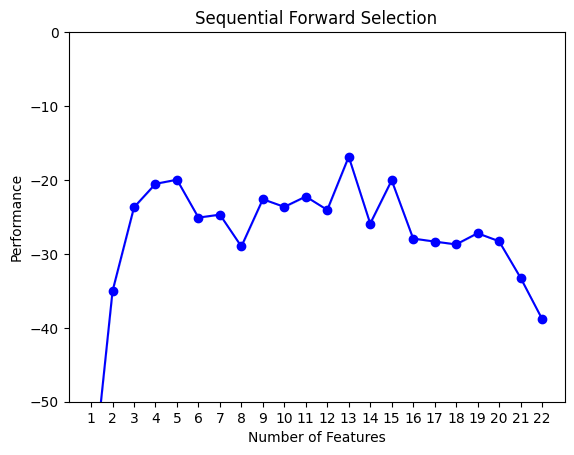

# Predicting image or video quality with a Machine Learning model developed with TensorFlow, Keras, and MATLAB® 
# Continuation: Feature Selection
This page details the process of training a machine learning model with TensorFlow and Keras, on the Google CoLaboratory™ data analysis platform (Google Colab), and then exporting the trained model and using it in MATLAB®. These tools were chosen for the convenience of the authors of this workflow. The use of the chosen tools does not imply recommendation or endorsement by the National Telecommunications and Information Administration (NTIA), and does not imply that the tools used are necessarily the best available for the particular purpose.
The goal of this model is to predict image and video quality, and it will be used as a part of the NRMetricFramework.

## Introduction
This guide is a continuation of "Predicting image or video quality with a Machine Learning model developed with TensorFlow, Keras, and MATLAB®" located in this github repository. This file details the process of feature selection, where the machine learning algorithm determines the most powerful factors when training the model. This guide builds on the work performed in the "MachineLearningWorkflow.md" file and expects the reader to use the previous guide for context.

### Definitions

- **Data file** is a spreadsheet of numeric data consisting of a number of features and a label desired  predict
- **Dataset** refers to datasets as they are [defined in the NRMetricFramework](https://github.com/NTIA/NRMetricFramework-dev/blob/master/documentation/DatasetStructure.md)
- **TF** stands for TensorFlow
- **ML** stands for Machine Learning
- **VMAF** refers to Netflix’s ["Video Multi-Method Assessment Fusion"](https://github.com/Netflix/vmaf) tool. It is a full-reference tool/metric that predicts compression quality/encoding artifacts of a video, from the human perspective.
- **VMAF score** refers to the output of running the VMAF tool/metric on any piece of media
- **SFS** stands for sequential feature selection

### Notes and assumptions

- The instructions in this guide are geared towards usage in the Google Colab platform. If running this locally, there will need to be minor adjustments in the workflow throughout. We trust the reader to recognize the need and make those adjustments.
- This guide will use the terms `raw_mos` [(see here)](MachineLearningWorkflow.md/#data-for-this-example) and `VMAF score` interchangeably, given we are in the context of the VCRDCI data file. This is not the case for other data files.
- There has not been a process created to use per-frame features to train a ML model; there is only a workflow that allows per-media features. If such a workflow were created, the data for each media file could increase by a factor of 100. For example, a 4-second–long 24 fps video would result in 96 more rows of data for every piece of media.
- This guide will use one example data file, to be consistent and make these instructions easier to follow. If using a different data file, make the necessary changes throughout the code. Our example data file is called `vcrdci_123_all_data_eg_no_nans.csv` and can be found in this github repository.
  - Note that in this data file, the "EgCategory" feature column is filler data with no predictive value. It exists purely as an example.
  - Details about how this data file was made can be found [here](MachineLearningWorkflow.md/#exporting-data-from-the-nrmetricframework). This section also notes changes made to the output of the commands detailed in this document.
- To aid the reader, we have prepared example Jupyter Notebooks (along with their equivalent Python files) that can be run either locally or uploaded to Google Colab. The notebooks can be found in this github repository.
  - Example files without sequential feature selection: `vcrdci_ml_nosfs_eg.ipynb`, `vcrdci_ml_nosfs_eg.py` and `matlab_import_tf_nosfs_eg.m`
  - Example files with sequential feature selection: `vcrdci_ml_sfs_eg.ipynb`, `vcrdci_ml_sfs_eg.py`, and `matlab_import_tf_sfs_eg.m`
- These instructions are incompatible with any version of TensorFlow greater than 2.10. As of August 2023 MATLAB has not updated its support for imported TF models beyond 2.10.
- There are many ways to implement ML. The workflow laid out here may not necessarily be the best approach, it is simply a hands-on introduction to some of the main concepts. See [here](MachineLearningWorkflow.md/#different-types-of-ml-models-and-frameworks) for information.

## Feature Selection   

At this point, we have a model trained on numerous features. Having a large number of features isn't always optimal, because not all of the features contribute significantly to an accurate prediction, and having more features than needed slows down training and might contribute to overfitting. It may also contribute to the presence of [multicollinearity](https://archive.ph/hdbwo) in the model, which will decrease performance.

Reducing the number of features trained on to only the most important ones will reduce overfitting and speed up training times, and is a process known as feature selection. 

What follows is an introduction to SFS and how to modify our existing code to implement it. To get started, duplicate the current code/notebook and make the following changes and additions.

There are numerous [different types of feature selection](https://archive.md/9zxuv), but here we will employ [sequential feature selection (SFS)](https://rasbt.github.io/mlxtend/user_guide/feature_selection/SequentialFeatureSelector/#sequentialfeatureselector-the-popular-forward-and-backward-feature-selection-approaches-including-floating-variants)

### Import required packages

The additional packages required for sequential feature selection are included as a part of `requirements.txt`, and thus should already be installed in your machine.

Add these imports at the top of your file, underneath the existing imports
```py
import mlxtend
from scikeras.wrappers import KerasRegressor
from mlxtend.feature_selection import SequentialFeatureSelector as SFS
from mlxtend.plotting import plot_sequential_feature_selection as plot_sfs
```

### Make a SFS model

It is desired to create a sequential feature selection model after [creating a train_test_split](MachineLearningWorkflow.md/#make-a-train-test-split), and before [making an input normalization layer](MachineLearningWorkflow.md/#make-an-input-normalization-layer). From this point onwards, all of the existing code  will be disregarded, in favor of the new code shown here onwards.

**Note:** When creating a train_test split, the no-SFS code saves `feature_test` to a CSV file. For SFS, this line must be removed, a CSV is generated later in the process.

After modifying that code, add the following code:

```py
def build_model_sfs(train_input):
    model = tf.keras.Sequential([
    tf.keras.layers.Dense(500, activation='relu', input_shape=((train_input.shape[1]),), kernel_regularizer=tf.keras.regularizers.l2(0.001)),
    tf.keras.layers.Dropout(0.2),
    tf.keras.layers.Dense(500, activation='relu', kernel_regularizer=tf.keras.regularizers.l2(0.001)),
    tf.keras.layers.Dropout(0.2),
    tf.keras.layers.Dense(1)
    ])

    model.compile(optimizer='adam',
                  loss=tf.keras.losses.MeanSquaredError(),
                  metrics=['mse', pearson_r])
    return model
```

The main difference here compared to the normal build_model() function is the accepting of a `train_input` parameter, and the removal of a normalization layer.

During sequential feature selection, the model is repeatedly fitted on data files of different shapes — i.e., different amounts of features. So, to accommodate for that, the `input_shape` of the model must be variable. That is why we pass in the input to this function — so that we can variably define the `input_shape`.

Similarly, a different number of features will mean we will need to normalize each combination of features differently. Thus, instead of making one fixed normalization layer, we individually normalize every different combination of features passed in (this happens later on).

Also, do notice how we don't call `build_model()` directly here; that is done elsewhere.

### Define epochs and callbacks

```py
tf.keras.backend.clear_session()

class PrintDotSFS(tf.keras.callbacks.Callback):
    def on_epoch_end(self, epoch, logs):
        if epoch % 100 == 0:
            print("")
        print(".", end="")
early_stop_sfs = tf.keras.callbacks.EarlyStopping(monitor='val_loss', patience=100, restore_best_weights=True)
```

This is some basic code to set things up. We define constants for some of the hyperparameters and we set up the PrintDot() and EarlyStopping() callbacks the same way as last time.

### Create a SFS object

```py
class MakeModel(object):
    def __init__(self, X=None, y=None):
        pass

    def predict(self, X):
        y_pred = self.model.predict(X)
        return y_pred
    
    def fit(self, X, y):
        skwrapped_model = KerasRegressor(
            model=build_model_sfs,
            train_input=X,
            epochs=1000,
            batch_size=64,
            validation_split=0.2,
            verbose=0,
            callbacks=[early_stop_sfs, PrintDotSFS()],
        )
        self.model = skwrapped_model
        self.model.fit(X, y)
        return self.model

sffs = SFS(
    MakeModel(),
    k_features=(1, feature_train.shape[1]),
    forward=True,
    floating=False,
    clone_estimator=False,
    cv=0,
    n_jobs=1,
    scoring="neg_mean_squared_error",
    verbose=0,
)
```

We start off by defining a `MakeModel` class. Because we are using a TensorFlow/Keras ML model with a tool from the scikit-learn library to perform feature selection, we have to jump through a few hoops to make everything work.

We wrap our Keras model in `KerasRegressor`, a wrapper provided by `scikeras` that enables us to scikit-learn features on Keras models. There, we also pass in the hyperparameters, which we notice are the same as we passed into the .fit() function earlier.

Then, we set up the SFS. Passing a tuple into `k_features` will try every combination of features from 1 to `feature_train.shape[1]` and return the set of features that are the best.

We set `forward=True` to perform sequential forward selection; however, if we wanted to perform sequential backward selection instead, we can easily change `forward=False`. 

Note that we set `floating=False`. Floating feature selection is a slight spin on normal forward/backward feature selection, where the number of features is "floating" and conditionally increases and decreases during the process, instead of strictly increasing or decreasing. However, when experimenting with it, we found it to take much longer, without much improvement in results. We decided to keep it off, but can be toggled on to try it out. Learn more about it on [this page](https://rasbt.github.io/mlxtend/user_guide/feature_selection/SequentialFeatureSelector/). 

It is also important to set `clone_estimator=False`, `cv=0`, and `n_jobs=1`. These three only work if we are using a sci-kit model, but here we are using a Keras model. As mentioned earlier, we have to jump through a few hoops to make things work, and in some cases, like this one, there is not full compatibility. We cannot use features such as [k-fold cross validation](https://neptune.ai/blog/cross-validation-in-machine-learning-how-to-do-it-right), which is what the `cv` parameter enables, nor numerous parallel jobs, which is what the `n_jobs` parameter enables.. Changing any of these options will lead to errors.

Consistent with the rest of our work so far, we set the scoring to mean squared error, and we also set the verbosity to 0, given we have implemented our own.

You may reference the [API documentation](https://rasbt.github.io/mlxtend/api_subpackages/mlxtend.feature_selection/#sequentialfeatureselector) for more information on these parameters and others not specified here.

### Normalize data and perform feature selection

There is one last step: We have to normalize the data before passing it in. In steps 1 through 5 of this guide, we would pass in raw data and the model would normalize it during the fitting process. Using the feature selection method is a bit different because we pass in already normalized data. 

```py
norm_features = tf.keras.layers.Normalization()
norm_features.adapt(vcrdci_all_features)
norm_train = pd.DataFrame(norm_features(feature_train))
```

With that done, begin fitting the feature selector to the data. Note that this step can take multiple hours.

```py
sffs = sffs.fit(norm_train, label_train)
```

### Plot best indices

```py
print('Best accuracy score: %.2f' % sffs.k_score_)
print('Best subset (indices):', sffs.k_feature_idx_)

fig1 = plot_sfs(sffs.get_metric_dict())
lowest_val = pd.DataFrame.from_dict(sffs.get_metric_dict())["avg_score"].min()
plt.ylim([lowest_val, 0])
plt.title('Sequential Forward Selection')
plt.show()
```

The first two lines here will print out what set of features gave the best score, and what that score was. After that, it displays a plot showing the loss of the model for different numbers of features. It might look something like this:



### Train (or re-train) the model using subset of best indices

With the best features identified, we can now train/re-train the model using the selected indices.

```py
feature_train_sfs = sffs.transform(feature_train)
feature_train_sfs = np.array(feature_train_sfs)
feature_test_sfs = sffs.transform(feature_test)
feature_test_sfs.to_csv("feature_test_vcrdci123_sfs_small.csv", index=False)
feature_test_sfs = np.array(feature_test_sfs)

norm_features_sfs = tf.keras.layers.Normalization()
norm_features_sfs.adapt(sffs.transform(vcrdci_all_features))
```

The `.transform()` feature here selects the identified indices from the whole data file.

### Build, train, and evaluate the model

From here, the process is the same as described for a [model with no SFS](MachineLearningWorkflow.md/#build-the-model), with three changes:
- We use the newly made normalization layer
- We use the `feature_train_sfs` variable for the `input_shape` argument
- We train on the `feature_train_sfs` variable

The code for this example can be found in the Jupyter Notebook provided.

As before, you will receive an output of the error in VMAF points and a graph displaying error over time. The Pearson correlation error will also be made available.

If you trained the model without feature selection before, you will notice that it is now significantly faster.

### Export to MATLAB

Exporting the model from TF and importing it into MATLAB will be very similar to the process [as described before](MachineLearningWorkflow.md/#step-6-export-model-from-tfcolab), but with a few changes.

After loading in the data and conducting one-hot encoding, you need to extract the column of labels and table of features, and then from the latter, the specific columns that were identified as the best.

First, manually copy and paste the set of the best indices (obtained by running `sffs.k_feature_idx_` earlier) and paste it into MATLAB. After that, **increment them all by 1** because Python is 0-indexed but MATLAB is 1-indexed. Once that is done, you will want to run the following code, making the appropriate changes for your project:

```matlab
% these three lines are unchanged
all_data = [all_data(:, 1:categoricalStart - 1) encData all_data(:, categoricalStart + 1:end)];	

labels = all_data(:, 3);
features = all_data(:, 4:end);

% replace these indices with the indices obtained from the feature selection
features = features(:, [6, 7, 10, 11, 16, 22, 24, 38, 39]);
```

Once that is done, you might have to change the names of the layers at the end of the [code block here](MachineLearningWorkflow.md/#replace-placeholder-layers). After that, it should be able to run and receive an output.

Confirm the predictions are the same in TF and MATLAB, [as described here](MachineLearningWorkflow.md/#step-10-validate-network-gives-the-same-predictions), and if all looks good, you should be done.
